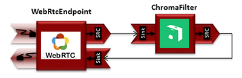
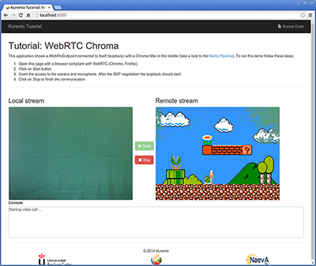

%%%%%%%%%%%%%%%%%%%%%%%%%%%%%%%%%
JavaScript Module - Chroma Filter
%%%%%%%%%%%%%%%%%%%%%%%%%%%%%%%%%

This web application consists of a `WebRTC`:term: video communication in mirror
(*loopback*) with a chroma filter element.

.. note::

   Web browsers require using *HTTPS* to enable WebRTC, so the web server must use SSL and a certificate file. For instructions, check :ref:`features-security-js-https`.

   For convenience, this tutorial already provides dummy self-signed certificates (which will cause a security warning in the browser).

Running this example
====================

First of all, install Kurento Media Server: :doc:`/user/installation`. Start the media server and leave it running in the background.

Install :term:`Node.js`, :term:`Bower`, and a web server in your system:

.. code-block:: shell

   curl -sL https://deb.nodesource.com/setup_8.x | sudo -E bash -
   sudo apt-get install -y nodejs
   sudo npm install -g bower
   sudo npm install -g http-server

Here, we suggest using the simple Node.js ``http-server``, but you could use any other web server.

You also need the source code of this tutorial. Clone it from GitHub, then start the web server:

.. code-block:: shell

    git clone https://github.com/Kurento/kurento-tutorial-js.git
    cd kurento-tutorial-js/kurento-chroma/
    git checkout |VERSION_TUTORIAL_JS|
    bower install
    http-server -p 8443 --ssl --cert keys/server.crt --key keys/server.key

When your web server is up and running, use a WebRTC compatible browser (Firefox, Chrome) to open the tutorial page:

* If KMS is running in your local machine:

  .. code-block:: text

     https://localhost:8443/

* If KMS is running in a remote machine:

  .. code-block:: text

     https://localhost:8443/index.html?ws_uri=ws://{KMS_HOST}:8888/kurento

.. note::

   By default, this tutorial works out of the box by using non-secure WebSocket (``ws://``) to establish a client connection between the browser and KMS. This only works for ``localhost``. *It will fail if the web server is remote*.

If you want to run this tutorial from a **remote web server**, then you have to do 3 things:

1. Configure **Secure WebSocket** in KMS. For instructions, check :ref:`features-security-kms-wss`.

2. In *index.js*, change the ``ws_uri`` to use Secure WebSocket (``wss://`` instead of ``ws://``) and the correct KMS port (TCP 8433 instead of TCP 8888).

3. As explained in the link from step 1, if you configured KMS to use Secure WebSocket with a self-signed certificate you now have to browse to ``https://{KMS_HOST}:8433/kurento`` and click to accept the untrusted certificate.

.. note::

   By default, this tutorial assumes that Kurento Media Server can download the overlay image from a ``localhost`` web server. *It will fail if the web server is remote* (from the point of view of KMS). This includes the case of running KMS from Docker.

If you want to run this tutorial with a **remote Kurento Media Server** (including running KMS from Docker), then you have to provide it with the correct IP address of the application's web server:

* In *index.js*, change ``bg_uri`` to the correct one where KMS can reach the web server.

Understanding this example
==========================

This application uses computer vision and augmented reality techniques to detect
a chroma in a WebRTC stream based on color tracking.

The interface of the application (an HTML web page) is composed by two HTML5
video tags: one for the video camera stream (the local client-side stream) and
other for the mirror (the remote stream). The video camera stream is sent to
Kurento Media Server, which processes and sends it back to the client as a
remote stream. To implement this, we need to create a `Media Pipeline`:term:
composed by the following `Media Element`:term: s:

   *WebRTC with Chroma filter Media Pipeline*

The complete source code of this demo can be found in
`GitHub <https://github.com/Kurento/kurento-tutorial-java/tree/master/kurento-chroma>`_.

This example is a modified version of the
:doc:`Magic Mirror <./tutorial-magicmirror>` tutorial. In this case, this
demo uses a **Chroma** instead of **FaceOverlay** filter.

In order to perform chroma detection, there must be a color calibration stage.
To accomplish this step, at the beginning of the demo, a little square appears
in upper left of the video, as follows:

.. figure:: ../../images/kurento-module-tutorial-chroma-screenshot-01.png
   :align:   center
   :alt:     Chroma calibration stage

   *Chroma calibration stage*

In the first second of the demo, a calibration process is done, by detecting the
color inside that square. When the calibration is finished, the square
disappears and the chroma is substituted with the configured image. Take into
account that this process requires lighting condition. Otherwise the chroma
substitution will not be perfect. This behavior can be seen in the upper right
corner of the following screenshot:

   *Chroma filter in action*

.. note::

   Modules can have options. For configure these options, you need get the constructor to them.
   In JavaScript and Node.js, you have to use *kurentoClient.getComplexType('qualifiedName')* . There is
   an example in the code.

The media pipeline of this demo is is implemented in the JavaScript logic as
follows:

.. sourcecode:: javascript

    ...
    kurentoClient.register('kurento-module-chroma')
    const WindowParam = kurentoClient.getComplexType('chroma.WindowParam')
    ...

    kurentoClient(args.ws_uri, function(error, client) {
      if (error) return onError(error);

      client.create('MediaPipeline', function(error, _pipeline) {
        if (error) return onError(error);

        pipeline = _pipeline;

        console.log("Got MediaPipeline");

        pipeline.create('WebRtcEndpoint', function(error, webRtc) {
          if (error) return onError(error);

          setIceCandidateCallbacks(webRtcPeer, webRtc, onError)

          webRtc.processOffer(sdpOffer, function(error, sdpAnswer) {
            if (error) return onError(error);

            console.log("SDP answer obtained. Processing...");

            webRtc.gatherCandidates(onError);
            webRtcPeer.processAnswer(sdpAnswer);
          });

          console.log("Got WebRtcEndpoint");

          var options =
          {
            window: WindowParam({
              topRightCornerX: 5,
              topRightCornerY: 5,
              width: 30,
              height: 30
            })
          }

          pipeline.create('chroma.ChromaFilter', options, function(error, filter) {
            if (error) return onError(error);

            console.log("Got Filter");

            filter.setBackground(args.bg_uri, function(error) {
              if (error) return onError(error);

              console.log("Set Image");
            });

            client.connect(webRtc, filter, webRtc, function(error) {
              if (error) return onError(error);

              console.log("WebRtcEndpoint --> filter --> WebRtcEndpoint");
            });
          });
        });
      });
    });

.. note::

   The :term:`TURN` and :term:`STUN` servers to be used can be configured simple adding
   the parameter ``ice_servers`` to the application URL, as follows:

   .. sourcecode:: bash

      https://localhost:8443/index.html?ice_servers=[{"urls":"stun:stun1.example.net"},{"urls":"stun:stun2.example.net"}]
      https://localhost:8443/index.html?ice_servers=[{"urls":"turn:turn.example.org","username":"user","credential":"myPassword"}]

Dependencies
============

The dependencies of this demo has to be obtained using `Bower`:term:. The
definition of these dependencies are defined in the
`bower.json <https://github.com/Kurento/kurento-tutorial-js/blob/master/kurento-chroma/bower.json>`_
file, as follows:

.. sourcecode:: js

   "dependencies": {
      "kurento-client": "|VERSION_CLIENT_JS|",
      "kurento-utils": "|VERSION_UTILS_JS|"
      "kurento-module-pointerdetector": "|VERSION_CLIENT_JS|"
   }

To get these dependencies, just run the following shell command:

.. sourcecode:: bash

   bower install

.. note::

   You can find the latest versions at `Bower <https://bower.io/search/>`_.
