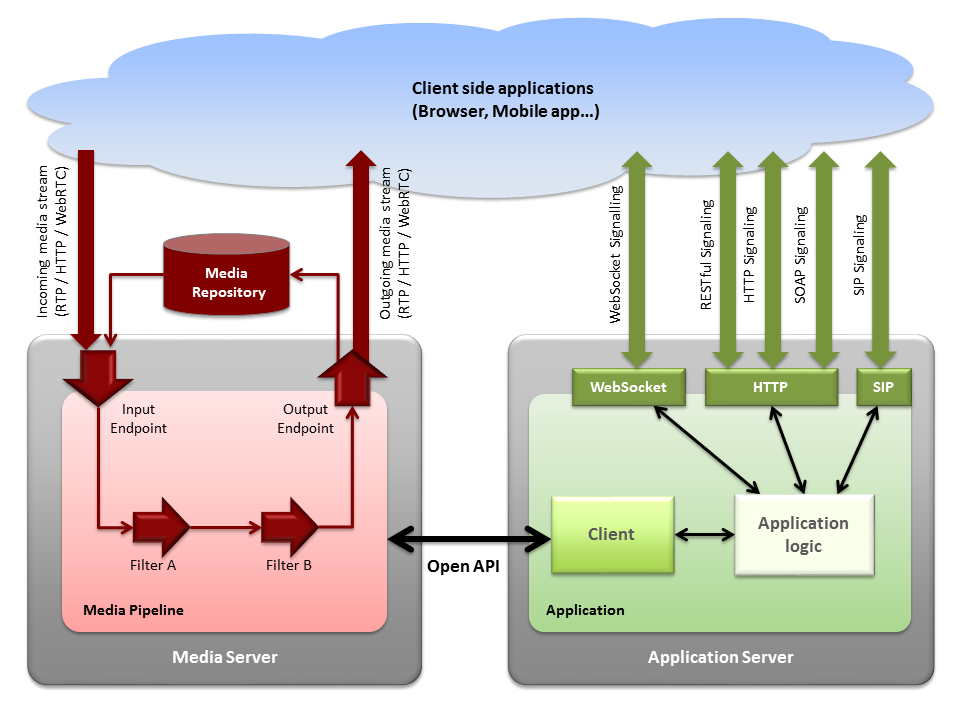
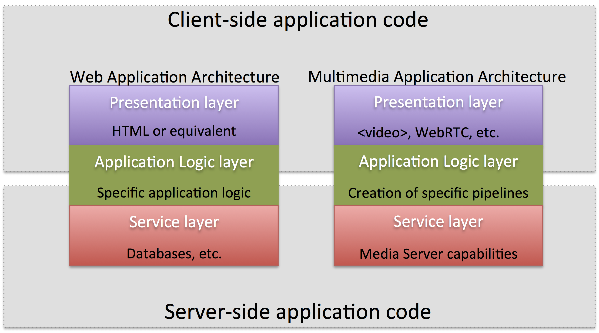
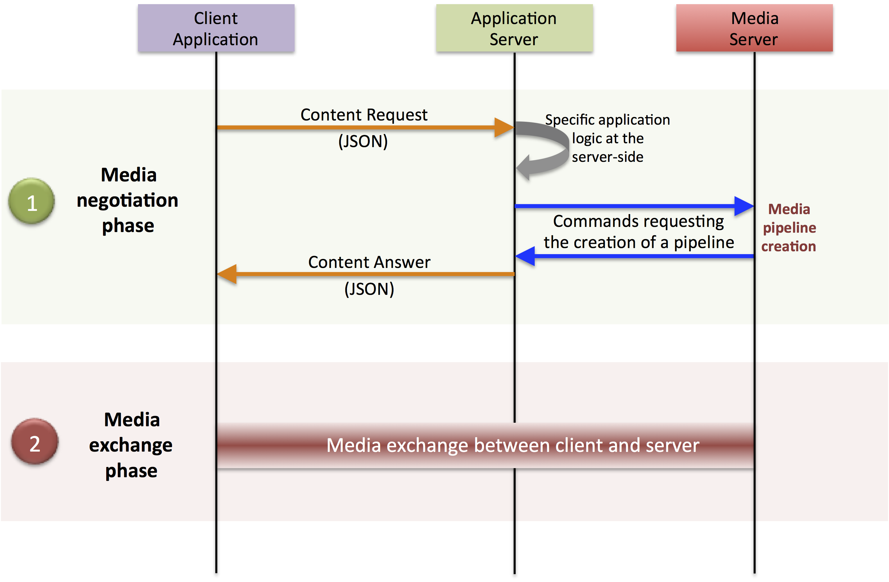
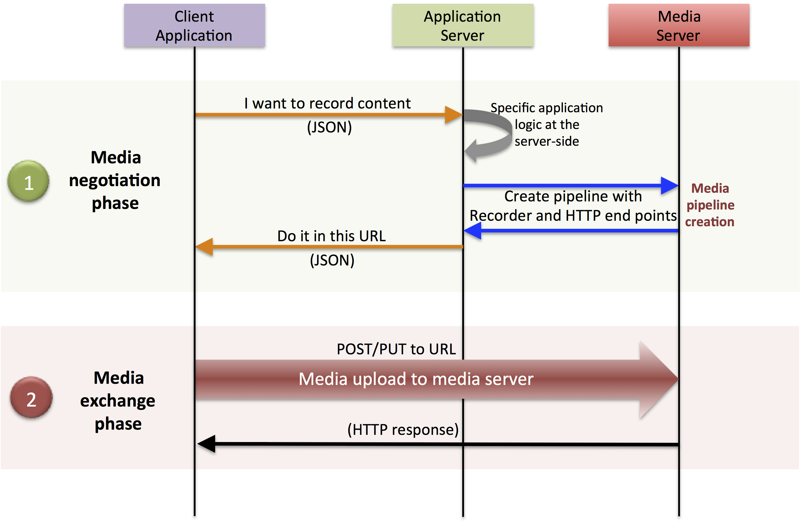

FIWARE Stream Oriented Generic Enabler - Architecture Description
_________________________________________________________________

.. raw:: mediawiki

   {{TOCright}}

Copyright
=========

Copyright © 2010-2015 by `Unversidad Rey Juan Carlos <https://www.urjc.es/>`__.
All Rights Reserved.

Legal Notice
============

Please check the following
`Legal Notice <http://forge.fiware.org/plugins/mediawiki/wiki/fiware/index.php/FI-WARE_Open_Specification_Legal_Notice_(implicit_patents_license)>`__
to understand the rights to use these specifications.

Overview
========

The Stream Oriented GE provides a framework devoted to simplify the development
of complex interactive multimedia applications through a rich family of APIs
and toolboxes. It provides a media server and a set of client APIs making
simple the development of advanced video applications for WWW and smartphone
platforms. The Stream Oriented GE features include group communications,
transcoding, recording, mixing, broadcasting and routing of audiovisual flows.
It also provides advanced media processing capabilities involving computer
vision, video indexing, augmented reality and speech analysis.

The Stream Oriented GE modular architecture makes simple the integration of
third party media processing algorithms (i.e. speech recognition, sentiment
analysis, face recognition, etc.), which can be transparently used by
application developers as the rest of built-in features.

The Stream Oriented GE’s core element is a Media Server, responsible for media
transmission, processing, loading and recording. It is implemented in low level
technologies based on GStreamer to optimize the resource consumption. It
provides the following features:

-   Networked streaming protocols, including HTTP (working as client and
    server), RTP and WebRTC.

-   Group communications (MCUs and SFUs functionality) supporting both media
    mixing and media routing/dispatching.

-   Generic support for computational vision and augmented reality filters.

-   Media storage supporting writing operations for WebM and MP4 and playing
    in all formats supported by GStreamer.

-   Automatic media transcodification between any of the codecs supported by
    GStreamer including VP8, H.264, H.263, AMR, OPUS, Speex, G.711, etc.

Main Concepts
=============

Signaling and media planes
--------------------------

The Stream Oriented GE, as most multimedia communication technologies out there,
is built upon two concepts that are key to all interactive communication
systems:

-   **Signaling Plane**. Module in charge of the management of
    communications, that is, it provides functions for media negotiation, QoS
    parametrization, call establishment, user registration, user presence, etc.
-   **Media Plane**. Module in charge of the media itself. So,
    functionalities such as media transport, media encoding/decoding and media
    processing are part of it.

Media elements and media pipelines
----------------------------------

The Stream Oriented GE is based on two concepts that act as building blocks for
application developers:

- **Media Elements**:. A Media element is a functional unit performing a
  specific action on a media stream. Media elements are a way of every
  capability is represented as a self-contained “black box” (the media element)
  to the application developer, who does not need to understand the low-level
  details of the element for using it. Media elements are capable of receiving
  media from other elements (through media sources) and of sending media to
  other elements (through media sinks). Depending on their function, media
  elements can be split into different groups:

    - **Input Endpoints**: Media elements capable of receiving media and
      injecting it into a pipeline. There are several types of input endpoints.
      File input endpoints take the media from a file, Network input endpoints
      take the media from the network, and Capture input endpoints are capable
      of capturing the media stream directly from a camera or other kind of
      hardware resource.

    - **Filters**: Media elements in charge of transforming or analyzing
      media. Hence there are filters for performing operations such as mixing,
      muxing, analyzing, augmenting, etc.

    - **Hubs**: Media Objects in charge of managing multiple media flows
      in a pipeline. A Hub has several hub ports where other media elements are
      connected. Depending on the Hub type, there are different ways to control
      the media. For example, there are a Hub called Composite that merge all
      input video streams in a unique output video stream with all inputs in a
      grid.

    - **Output Endpoints**: Media elements capable of taking a media
      stream out of the pipeline. Again, there are several types of output
      endpoints specialized in files, network, screen, etc.

.. figure:: resources/Media_element.png
   :align: center
   :alt: Media Element

   *A media element is a functional unit providing a specific media capability,
   which is exposed to application developers as a "black box"*

- **Media Pipeline**: A Media Pipeline is a chain of media elements, where the
  output stream generated by one element (source) is fed into one or more other
  elements input streams (sinks). Hence, the pipeline represents a “machine”
  capable of performing a sequence of operations over a stream.

.. figure:: resources/Media_pipeline_example.png
   :align: center
   :alt: Media Pipeline Example

   *Example of a Media Pipeline implementing an interactive multimedia
   application receiving media from a WebRtcEndpoint, overlaying and image on
   the detected faces and sending back the resulting stream*

Agnostic media adapter
----------------------

Using the Stream Oriented GE APIs, developers are able to compose the available
media elements, getting the desired pipeline. There is a challenge in this
scheme, as different media elements might require different input media formats
than the output produced by their preceding element in the chain. For example,
if we want to connect a WebRTC (VP8 encoded) or a RTP (H.264/H.263 encoded)
video stream to a face recognition media element implemented to read raw RGB
format, a transcoding is necessary.

Developers, specially during the initial phases of application development,
might want to simplify development and abstract this heterogeneity, the Stream
Oriented GE provides an automatic converter of media formats called the
*agnostic media adapter*. Whenever a media element’s source is connected to
another media element’s sink, our framework verifies if media adaption and
transcoding is necessary and, in case it is, it transparently incorporates the
appropriate transformations making possible the chaining of the two elements
into the resulting pipeline.

Hence, this *agnostic media adapter* capability fully abstracts all the
complexities of media codecs and formats. This may significantly accelerate the
development process, specially when developers are not multimedia technology
experts. However, there is a price to pay. Transcoding may be a very CPU
expensive operation. The inappropriate design of pipelines that chain media
elements in a way that unnecessarily alternate codecs (e.g. going from H.264,
to raw, to H.264 to raw again) will lead to very poor performance of
applications.

.. figure:: resources/AgnosticMediaAdaptor.png
   :align: center
   :alt: Agnostic Media Adaptor

   *The agnostic media capability adapts formats between heterogeneous media
   elements making transparent for application developers all complexities of
   media representation and encoding.*

Generic Architecture
====================

High level architecture
-----------------------

The conceptual representation of the GE architecture is shown in the following
figure.

   *The Stream Oriented GE architecture follows the traditional separation between
   signaling and media planes.*

The right side of the picture shows the application, which is in charge of the
signaling plane and contains the business logic and connectors of the
particular multimedia application being deployed. It can be build with any
programming technology like Java, Node.js, PHP, Ruby, .NET, etc. The
application can use mature technologies such as HTTP and SIP Servlets, Web
Services, database connectors, messaging services, etc. Thanks to this, this
plane provides access to the multimedia signaling protocols commonly used by
end-clients such as SIP, RESTful and raw HTTP based formats, SOAP, RMI, CORBA
or JMS. These signaling protocols are used by client side of applications to
command the creation of media sessions and to negotiate their desired
characteristics on their behalf. Hence, this is the part of the architecture,
which is in contact with application developers and, for this reason, it needs
to be designed pursuing simplicity and flexibility.

On the left side, we have the Media Server, which implements the media plane
capabilities providing access to the low-level media features: media transport,
media encoding/decoding, media transcoding, media mixing, media processing,
etc. The Media Server must be capable of managing the multimedia streams with
minimal latency and maximum throughput. Hence the Media Server must be
optimized for efficiency.

APIs and interfaces exposed by the architecture
-----------------------------------------------

The capabilities of the media plane (Media Server) and signaling plane
(Application) are exposed through a number of APIs, which provide increasing
abstraction levels. Following this, the role of the different APIs can be
summarized in the following way:

-   Stream Oriented GE Open API: Is a network protocol exposing the Media
    Server capabilities through WebSocket (read more in the
    :doc:`Stream Oriented Open API <open_spec>` page).

-   Java Client: Is a Java SE layer which consumes the Stream Oriented GE
    Open API and exposes its capabilities through a simple-to-use modularity
    based on Java POJOs representing media elements and media pipelines. This
    API is abstract in the sense that all the inherent complexities of the
    internal Open API workings are abstracted and developers do not need to
    deal with them when creating applications. Using the Java Client only
    requires adding the appropriate dependency to a maven project or to
    download the corresponding jar into the application developer CLASSPATH. It
    is important to remark that the Java Client is a media-plane control API.
    In other words, its objective is to expose the capability of managing media
    objects, but it does not provide any signaling plane capabilities.

-   JavaScript Client: Is a JavaScript layer which consumes the Stream
    Oriented GE Open API and exposes its capabilities to JavaScript developers.
    It allow to build Node.js and browser based applications.

From an architectural perspective, application developers can use clients or the
Open API directly for creating their multimedia enabled applications. This
opens a wide spectrum of potential usage scenarios ranging from web
applications (written using the JavaScript client), desktop applications
(written using the Java Client), distributed applications (written using the
Open API), etc.

Creating applications on top of the Stream Oriented GE Architecture
===================================================================

The Stream Oriented GE Architecture has been specifically designed following the
architectural principles of the WWW. For this reason, creating a multimedia
applications basing on it is a similar experience to creating a web application
using any of the popular web development frameworks.

At the highest abstraction level, web applications have an architecture
comprised of three different layers:

- **Presentation layer**: Here we can find all the application code which is
  in charge of interacting with end users so that information is represented in
  a comprehensive way user input is captured. This usually consists on HTML
  pages.

- **Application logic**: This layer is in charge of implementing the specific
  functions executed by the application.

- **Service layer**: This layer provides capabilities used by the application
  logic such as databases, communications, security, etc.

Following this parallelism, multimedia applications created using the Stream
Oriented GE also respond to the same architecture:

- **Presentation layer**: Is in charge of multimedia representation and
  multimedia capture. It is usually based on specific build-in capabilities of
  the client. For example, when creating a browser-based application, the
  presentation layer will use capabilities such as the <video> tag or the
  WebRTC PeerConnection and MediaStreams APIs.

- **Application logic**: This layer provides the specific multimedia logic. In
  other words, this layer is in charge of building the appropriate pipeline (by
  chaining the desired media elements) that the multimedia flows involved in
  the application will need to traverse.

- **Service layer**: This layer provides the multimedia services that support
  the application logic such as media recording, media ciphering, etc. The
  Media Server (i.e. the specific media elements) is the part of the Stream
  Oriented GE architecture in charge of this layer.

   *Applications created using the Stream Oriented GE (right) have an
   equivalent architecture to standard WWW applications (left). Both types of
   applications may choose to place the application logic at the client or at the
   server code.*

This means that developers can choose to include the code creating the specific
media pipeline required by their applications at the client side (using a
suitable client or directly with the Open API) or can place it at the server
side.

Both options are valid but each of them drives to different development styles.
Having said this, it is important to note that in the WWW developers usually
tend to maintain client side code as simple as possible, bringing most of their
application logic to the server. Reproducing this kind of development
experience is the most usual way of using this GE. That is, by locating the
multimedia application logic at the server side, so that the specific media
pipelines are created using the the client for your favorite language.

Main Interactions
=================

Interactions from a generic perspective
---------------------------------------

A typical Stream Oriented GE application involves interactions among three main
modules:

-   **Client Application**: which involves the native multimedia
    capabilities of the client platform plus the specific client-side
    application logic. It can use Clients designed to client platforms (for
    example, JavaScript Client).

-   **Application Server**: which involves an application server and the
    server-side application logic. It can use Clients designed to server
    platforms (for example, Java Client for Java EE and JavaScript Client for
    Node.js).

-   **Media Server**: which receives commands for creating specific
    multimedia capabilities (i.e. specific pipelines adapted to the needs of
    specific applications)

The interactions maintained among these modules depend on the specificities of
each application. However, in general, for most applications they can be
reduced to the following conceptual scheme:

   *Main interactions occur in two phases: negotiation and media exchange. Remark
   that the color of the different arrows and boxes is aligned with the
   architectural figures presented above, so that, for example, orange arrows show
   exchanges belonging to the Open API, blue arrows show exchanges belonging to
   the Thrift API, red boxes are associated to the Media Server and green boxes
   with the Application Server.*

Media negotiation phase
~~~~~~~~~~~~~~~~~~~~~~~

As it can be observed, at a first stage, a client (a browser in a computer, a
mobile application, etc.) issues a message requesting some kind of capability
from the Stream Oriented GE. This message is based on a JSON RPC V2.0
representation and fulfills the Open API specification. It can be generated
directly from the client application or, in case of web applications,
indirectly consuming the abstract HTML5 SDK. For instance, that request could
ask for the visualization of a given video clip.

When the Application Server receives the request, if appropriate, it will carry
out the specific server side application logic, which can include
Authentication, Authorization and Accounting (AAA), CDR generation, consuming
some type of web service, etc.

After that, the Application Server processes the request and, according to the
specific instructions programmed by the developer, commands the Media Server to
instantiate the suitable media elements and to chain them in an appropriate
media pipeline. Once the pipeline has been created successfully the server
responds accordingly and the Application Server forwards the successful
response to the client, showing it how and where the media service can be
reached.

During the above mentioned steps no media data is really exchanged. All the
interactions have the objective of negotiating the whats, hows, wheres and
whens of the media exchange. For this reason, we call it the negotiation phase.
Clearly, during this phase only signaling protocols are involved.

Media exchange phase
~~~~~~~~~~~~~~~~~~~~

After that, a new phase starts devoted to producing the actual media exchange.
The client addresses a request for the media to the Media Server using the
information gathered during the negotiation phase. Following with the
video-clip visualization example mentioned above, the browser will send a GET
request to the IP address and port of the Media Server where the clip can be
obtained and, as a result, an HTTP request with the media will be received.

Following the discussion with that simple example, one may wonder why such a
complex scheme for just playing a video, when in most usual scenarios clients
just send the request to the appropriate URL of the video without requiring any
negotiation. The answer is straightforward. The Stream Oriented GE is designed
for media applications involving complex media processing. For this reason, we
need to establish a two-phase mechanism enabling a negotiation before the media
exchange. The price to pay is that simple applications, such as one just
downloading a video, also need to get through these phases. However, the
advantage is that when creating more advanced services the same simple
philosophy will hold. For example, if we want to add augmented reality or
computer vision features to that video-clip, we just need to create the
appropriate pipeline holding the desired media element during the negotiation
phase. After that, from the client perspective, the processed clip will be
received as any other video.

Specific interactions for commonly used services
------------------------------------------------

Regardless of the actual type of session, all interactions follow the pattern
described in section above. However, most common services respond to one of the
following two main categories:

RTP/WebRTC
~~~~~~~~~~

The Stream Oriented GE allows the establishment of real time multimedia session
between a peer client and the Media Server directly through the use of RTP/RTCP
or through WebRTC. In addition, the Media Server can be used to act as media
proxy for making possible the communication among different peer clients, which
are mediated by the Stream Oriented GE infrastructure. Hence, the GE can act as
a conference bridge (Multi Conference Unit), as a machine-to-machine
communication system, as a video call recording system, etc. As shown in the
picture, the client exposes its media capabilities through an SDP (Session
Description Protocol) payload encapsulated in a JSON object request. Hence, the
Application Server is able to instantiate the appropriate media element (either
RTP or WebRTC end points), and to require it to negotiate and offer a response
SDP based on its own capabilities and on the offered SDP. When the answer SDP
is obtained, it is given back to the client and the media exchange can be
started. The interactions among the different modules are summarized in the
following picture

.. figure:: resources/RTC_session.png
   :align: center
   :alt: Main interactions in a WebRTC session

   *Interactions taking place in a Real Time Communications (RTC) session. During
   the negotiation phase, a SDP message is exchanged offering the capabilities of
   the client. As a result, the Media Server generates an SDP answer that can be
   used by the client for establishing the media exchange.*

As with the rest of examples shown above, the application developer is able to
create the desired pipeline during the negotiation phase, so that the real time
multimedia stream is processed accordingly to the application needs. Just as an
example, imagine that we want to create a WebRTC application recording the
media received from the client and augmenting it so that if a human face is
found, a hat will be rendered on top of it. This pipeline is schematically
shown in the figure below, where we assume that the Filter element is capable
of detecting the face and adding the hat to it.

.. figure:: resources/RTC_session_pipeline.png 
   :align: center
   :alt: Example pipeline for a WebRTC session

   *During the negotiation phase, the application developer can create a pipeline
   providing the desired specific functionality. For example, this pipeline uses a
   WebRtcEndpoint for communicating with the client, which is connected to a
   RecorderEndpoint storing the received media stream and to an augmented
   reality filter, which feeds its output media stream back to the client. As a
   result, the end user will receive its own image filtered (e.g. with a hat added
   onto her head) and the stream will be recorded and made available for further
   recovery into a repository (e.g. a file).*

HTTP recorder
~~~~~~~~~~~~~

HTTP recording sessions are equivalent to playing sessions although, in this
case, the media goes from the client to the server using POST HTTP method. The
negotiation phase hence starts with the client requesting to upload the content
and the Application Server creating the appropriate pipeline for doing it. This
pipeline will always start with an *HttpPostEndpoint* element. Further elements
can be connected to that endpoint for filtering media, processing it or storing
it into a media repository. The specific interactions taking place in this type
of session are shown in the figure below

   
   *Example of pipeline for an HTTP recorder*
   
Basic Design Principles
-----------------------

The Stream Oriented GE is designed based on the following main principles:

-   *Separate Media and Signaling Planes*. Signaling and media are two
    separate planes and therefore the Stream Oriented GE is designed in a way
    that applications can handle separately those facets of multimedia
    processing.

-   *Distribution of Media and Application Services*. Media Server and
    applications can be collocated, escalated or distributed among different
    machines. A single application can invoke the services of more than one
    Media Servers. The opposite also applies, that is, a Media Server can
    attend the requests of more than one application.

-   *Suitable for the Cloud*. The Stream Oriented GE is suitable to be
    integrated into cloud environments to act as a PaaS (Platform as a Service)
    component.

-   *Media Pipelines*. Chaining Media Elements via Media Pipelines is an
    intuitive approach to challenge the complexity of multimedia processing.

-   *Application development*. Developers do not need to be aware of
    internal Media Server complexities, all the applications can deployed in
    any technology or framework the developer like, from client to server. From
    browsers to cloud services.

-   *End-to-end Communication Capability*. The Stream Oriented GE provides
    end-to-end communication capabilities so developers do not need to deal
    with the complexity of transporting, encoding/decoding and rendering media
    on client devices.

-   *Fully Processable Media Streams*. The Stream Oriented GE enables not
    only interactive interpersonal communications (e.g. Skype-like with
    conversational call push/reception capabilities), but also human-to-machine
    (e.g. Video on Demand through real-time streaming) and machine-to-machine
    (e.g. remote video recording, multisensory data exchange) communications.

-   *Modular Processing of Media*. Modularization achieved through media
    elements and pipelines allows defining the media processing functionality
    of an application through a “graph-oriented” language, where the
    application developer is able to create the desired logic by chaining the
    appropriate functionalities.

-   *Auditable Processing*. The Stream Oriented GE is able to generate rich
    and detailed information for QoS monitoring, billing and auditing.

-   *Seamless IMS integration*. The Stream Oriented GE is designed to
    support seamless integration into the IMS infrastructure of Telephony
    Carriers.

-   *Transparent Media Adaptation Layer*. The Stream Oriented GE provides a
    transparent media adaptation layer to make the convergence among different
    devices having different requirements in terms of screen size, power
    consumption, transmission rate, etc. possible.
