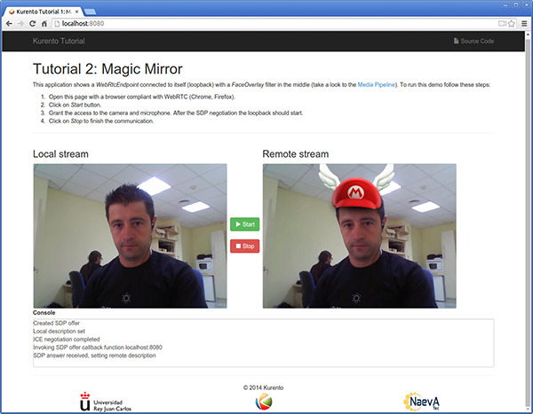
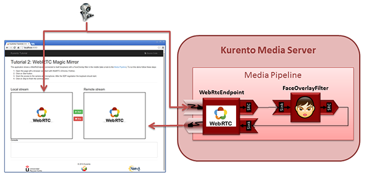

FIWARE Stream Oriented Generic Enabler - Programmers Guide
__________________________________________________________

Introduction
============

The *Stream Oriented GE Kurento* is a multimedia platform aimed to help
developers to add multimedia capabilities to their applications. The core
element is the *Kurento Media Server* (KMS), a
`Gstreamer <http://gstreamer.freedesktop.org/>`__ based multimedia engine that
provides the following features:

-   Networked streaming protocols, including *HTTP*, *RTP* and *WebRTC*.
-   Media transcodification between any of the codecs currently supported by
    Gstreamer.
-   Generic support for computational vision and augmented reality filters.
-   Media storage supporting writing operations for *WebM* and *MP4* and
    reading operations for any of *Gstreamer's* muxers.

Kurento *Java* and *JavaScript* clients are available for developers. These
clients are libraries to connect to KMS and this way incorporate the above
features in applications.

Background and Detail
---------------------

This User and Programmers Guide relates to the Stream Oriented GE which is part
of the *Data/Context Management* chapter. Please find more information about
this Generic Enabler in the following :doc:`Open Specification <open_spec>`.

Programmer Guide
================

The *Stream Oriented GE Kurento* software is released under
`LGPL version 2.1 <http://www.gnu.org/licenses/lgpl-2.1.html>`__ license. This
is quite a convenient license for programmers, but it is still recommended you
check if it actually fits your application needs.

Basic Setup
-----------

First of all, developers must install Kurento Media Server. Please review the
:doc:`installation guide <admin_guide>`. In short, KMS can be installed in an
Ubuntu 14.04 machine as follows:

::

	echo "deb http://ubuntu.kurento.org trusty kms6" | sudo tee /etc/apt/sources.list.d/kurento.list
	wget -O - http://ubuntu.kurento.org/kurento.gpg.key | sudo apt-key add -
	sudo apt-get update
	sudo apt-get install kurento-media-server-6.0

Once a Kurento Media Server is installed, you need a *Kurento Client* to create
your own applications with advanced media capabilities. A Kurento Client is a
programming library used to control the Kurento Media Server from an
application. Communication between a Kurento Client and the Kurento Media
Server is implemented by the :doc:`Stream Oriented GE Open API <open_spec>`.
This communication beetween Kurento Clients and Kurento Media Server is done by
means of a *WebSocket*.

There are available Kurento Client libraries in *Java* and *JavaScript*. These
libraries are based on the concept of *Media Element*. A Media Element holds a
specific media capability. For example, the media element called
`WebRtcEndpoint` holds the capability of sending and receiving WebRTC media
streams, the media element called `RecorderEndpoint` has the capability of
recording into the file system any media streams it receives, the
`FaceOverlayFilter` detects faces on the exchanged video streams and adds a
specific overlaid image on top of them, etc. Kurento exposes a rich toolbox of
media elements as part of its APIs.

The following sections provides information for create web applications with the
Stream Oriented GE using Java and JavaScript.

Programming with the Stream Oriented GE in Java
-----------------------------------------------

The Kurento Java Client is provided as `Maven <http://maven.apache.org/>`__
dependency in
`Maven Central repository <http://search.maven.org/#search%7Cga%7C1%7Ckurento-client>`__.
To use it in a Maven application you have to include the following dependencies
in your `pom.xml`:

::

	<dependencies>
	   <dependency>
	      <groupId>org.kurento</groupId>
	      <artifactId>kurento-client</artifactId>
	      <version>6.1.0</version>
	   </dependency>
	</dependencies>

`KurentoClient` is the Java class used to connect to Kurento Media Server. This
class has several static factory methods to create instances from it. In the
following code snippet you can see how to create a `KurentoClient` instance:

::

	KurentoClient kurento = KurentoClient.create("ws://localhost:8888/kurento");

A `MediaPipeline` object is required to build media services. The method
`createMediaPipeline()` of a `KurentoClient` object can be used for this
purpose:

::

	MediaPipeline pipeline = kurento.createMediaPipeline();

Media elements within a pipeline can be connected to build services, but they
are isolated from the rest of the system. Media elements are created using the
builder pattern allowing a flexible initialization. Mandatory parameters must
be provided in the builder constructor. Optional parameters are set to defaults
unless the application overrides their values using setter methods in the
builder object. When the builder is configured, the object can be created using
its `build()` method. In the following snippet, several media elements are
created:

::

	// Protocols and codecs
	WebRtcEndpoint webRtcEndpoint = new WebRtcEndpoint.Builder(pipeline).build();

	HttpPostEndpoint httpPostEndpoint = new HttpPostEndpoint.Builder(pipeline).build();

	RtpEndpoint rtpEndpoint = new RtpEndpoint.Builder(pipeline).build();

	// Media repository
	PlayerEndpoint playerEndpoint = new PlayerEndpoint.Builder(pipeline, "http://files.kurento.org/video/filter/fiwarecut.mp4").build();

	RecorderEndpoint recorderEndpoint = new RecorderEndpoint.Builder(pipeline, "file:///tmp/recording.webm").build();

	// Filters
	FaceOverlayFilter faceOverlayFilter = new FaceOverlayFilter.Builder(pipeline).build();

	ZBarFilter zBarFilter = new ZBarFilter.Builder(pipeline).build();

	GStreamerFilter gstreamerFilter = new GStreamerFilter.Builder(pipeline, "videoflip method=4").build();

	// Group communications
	Composite composite = new Composite.Builder(pipeline).build();

	Dispatcher dispatcher = new Dispatcher.Builder(pipeline).build();

	DispatcherOneToMany dispatcherOneToMany = new DispatcherOneToMany.Builder(pipeline).build();

From the application developer perspective, Media Elements are like Lego pieces:
you just need to take the elements needed for an application and connect them
following the desired topology. Hence, when creating a pipeline, developers
need to determine the capabilities they want to use (the media elements) and
the topology determining which media elements provide media to which other
media elements (the connectivity). The connectivity is controlled through the
`connect` primitive, exposed on all Kurento Client APIs. This primitive is
always invoked in the element acting as *source* and takes as argument the
*sink* element following this scheme:

::

	sourceMediaElement.connect(sinkMediaElement);

Programming with the Stream Oriented GE in JavaScript
-----------------------------------------------------

The Kurento JavaScript Client is provided as `Bower <http://bower.io/>`__
dependency in `Bower repository <http://bower.io/search/?q=kurento-client>`__.
To use it in a Bower application you have to include the following dependencies
in your `bower.json`:

::

	"dependencies": {
	   "kurento-client": "6.1.0",
	}

First, you need to create an instance of the `KurentoClient` class that will
manage the connection with the Kurento Media Server, so you need to provide the
URI of its WebSocket:

::

	kurentoClient(ws_uri, function(error, kurentoClient) {
	   if (error) {
	      // Error connecting to KMS
	   }

	  // Success connecting to KMS

	});

The second step is to create a pipeline using the previously created
`kurentoClient`, as follows:

::

	kurentoClient.create('MediaPipeline', function(error, pipeline) {
	   if (error) {
	      // Error creating MediaPipeline
	   }

	  // Success creating MediaPipeline
	});

Then we should create the media elements. The following snippet shows how to
create several media elements:

::

	// Protocols and codecs
	pipeline.create('WebRtcEndpoint', function(error, webRtcEndpoint) {
	   if (error) {
	      // Error creating WebRtcEndpoint
	   }

	  // Success creating WebRtcEndpoint
	});

	pipeline.create('HttpPostEndpoint', function(error, httpPostEndpoint) {
	   if (error) {
	      // Error creating HttpPostEndpoint
	   }

	  // Success creating HttpPostEndpoint
	});

	pipeline.create('RtpEndpoint', function(error, rtpEndpoint) {
	   if (error) {
	      // Error creating RtpEndpoint
	   }

	  // Success creating RtpEndpoint
	});

	// Media repository
	pipeline.create('PlayerEndpoint', {uri : 'http://files.kurento.org/video/filter/fiwarecut.mp4'}, function(error, playerEndpoint) {
	   if (error) {
	      // Error creating PlayerEndpoint
	   }

	  // Success creating PlayerEndpoint
	});

	pipeline.create('RecorderEndpoint', {uri : 'file:///tmp/recording.webm'}, function(error, recorderEndpoint) {
	   if (error) {
	      // Error creating RecorderEndpoint
	   }

	  // Success creating RecorderEndpoint
	});

	// Filters
	pipeline.create('FaceOverlayFilter', function(error, faceOverlayFilter) {
	   if (error) {
	      // Error creating FaceOverlayFilter
	   }

	  // Success creating FaceOverlayFilter
	});

	pipeline.create('ZBarFilter', function(error, zBarFilter) {
	   if (error) {
	      // Error creating ZBarFilter
	   }

	  // Success creating WebRtcEndpoint
	});

	pipeline.create('GStreamerFilter', {command : 'videoflip method=4'}, function(error, recorderEndpoint) {
	   if (error) {
	      // Error creating GStreamerFilter
	   }

	  // Success creating GStreamerFilter
	});

	// Group communications
	pipeline.create('Composite', function(error, composite) {
	   if (error) {
	      // Error creating Composite
	   }

	  // Success creating Composite
	});

	pipeline.create('Dispatcher', function(error, dispatcher) {
	   if (error) {
	      // Error creating Dispatcher
	   }

	  // Success creating Dispatcher
	});

	pipeline.create('DispatcherOneToMany', function(error, dispatcherOneToMany) {
	   if (error) {
	      // Error creating DispatcherOneToMany
	   }

	  // Success creating DispatcherOneToMany
	});

Finally, media elements can be connected. The method `connect()` of the Media
Elements is always invoked in the element acting as *source* and takes as
argument the as *sink* element. For example a `WebRtcEndpoint` connected to
itself (loopback):

::

	webRtc.connect(webRtc, function(error) {
	   if (error) {
	      // Error connecting media elements
	   }

	  // Success connecting media elements
	});

Magic-Mirror Example
--------------------

The *Magic-Mirror* web application is a good example to introduce the principles
of programming with Kurento. This application uses computer vision and
augmented reality techniques to add a funny hat on top of faces.The following
picture shows a screenshot of the demo running in a web browser:

The interface of the application (an HTML web page) is composed by two HTML5
video tags: one showing the local stream (as captured by the device webcam) and
the other showing the remote stream sent by the media server back to the client.

The logic of the application is quite simple: the local stream is sent to the
Kurento Media Server, which returns it back to the client with a filter
processing. This filtering consists in faces detection and overlaying of an
image on the top of them. To implement this behavior we need to create a Media
Pipeline composed by two Media Elements: a `WebRtcEndpoint` connected to an
`FaceOverlayFilter`. This filter element is connected again to the
`WebRtcEndpoint`'s *sink* and then the stream is send back (to browser). This
media pipeline is illustrated in the following picture:

This demo has been implemented in Java, Javascript, and also Node.js. *Java*
implementation uses the *Kurento Java Client*, while *JavScript* and *Node.js*
uses the *Kurento JavaScript Client*. In addition, these three demos use
*Kurento JavaScript Utils* library in the client-side. This is an utility
JavaScript library aimed to simplify the development of WebRTC applications. In
these demos, the function `WebRtcPeer.startSendRecv` is used to abstract the
WebRTC internal details (i.e. `PeerConnection` and `getUserStream`) and makes
possible to start a full-duplex WebRTC communication.

The *Java* version is hosted on
`GitHub <https://github.com/Kurento/kurento-tutorial-java>`__. To run this demo
in an Ubuntu machine, execute the following commands in the shell:

::

	git clone https://github.com/Kurento/kurento-tutorial-java.git
	cd kurento-tutorial-java/kurento-magic-mirror
	git checkout 6.1.0
	mvn compile exec:java

The pre-requisites to run this Java demo are `Git <http://git-scm.com/>`__,
`JDK 7 <http://openjdk.java.net/projects/jdk7/>`__, and
`Maven <http://maven.apache.org/>`__. To install these tools in Ubuntu please
execute these commands:

::

	sudo apt-get install git
	sudo apt-get install openjdk-7-jdk
	sudo apt-get install maven

The *JavaScript* version is hosted on
`GitHub <https://github.com/Kurento/kurento-tutorial-js>`__. To run this demo
in an Ubuntu machine, execute the following commands in the shell:

::

	git clone https://github.com/Kurento/kurento-tutorial-js.git
	cd kurento-tutorial-js/kurento-magic-mirror
	git checkout 6.1.0
	bower install
	http-server

The pre-requisites to run this JavaScript demo are
`Git <http://git-scm.com/>`__, `Node.js <http://nodejs.org/>`__,
`Bower <http://bower.io/>`__, and a HTTP Server, for example a
`Node.js http-servert <https://www.npmjs.org/package/http-server/>`__:

::

	sudo apt-get install git
	curl -sL https://deb.nodesource.com/setup | sudo bash -
	sudo apt-get install -y nodejs
	sudo npm install -g bower
	sudo npm install http-server -g

The *Node.js* version is hosted on
`GitHub <https://github.com/Kurento/kurento-tutorial-node>`__. To run this demo
in an Ubuntu machine, execute the following commands in the shell:

::

	git clone https://github.com/Kurento/kurento-tutorial-node.git
	cd kurento-tutorial-node/kurento-magic-mirror
	git checkout 6.1.0
	npm install
	npm start

The pre-requisites to run this Node.js demo are `Git <http://git-scm.com/>`__,
`Node.js <http://nodejs.org/>`__, and `Bower <http://bower.io/>`__:

::

	sudo apt-get install git
	curl -sL https://deb.nodesource.com/setup | sudo bash -
	sudo apt-get install -y nodejs
	sudo npm install -g bower

Finally, open the demo (Java, JavaScript or Node.js) in the URL
http://localhost:8080/ with a capable WebRTC browser, for example,
`Google Chrome <https://www.google.com/chrome/browser/>`__. To install it in
Ubuntu (64 bits):

::

	sudo apt-get install libxss1
	wget https://dl.google.com/linux/direct/google-chrome-stable_current_amd64.deb
	sudo dpkg -i google-chrome*.deb

More Examples
-------------

There are another sample applications that can be used to learn how to use the
*Stream Oriented GE Kurento*, namely:

* `Hello-world <http://www.kurento.org/docs/current/tutorials.html#tutorial-1-hello-world>`__
  application. This is one of the simplest WebRTC application you can create
  with Kurento. It implements a WebRTC loopback (a WebRTC media stream going
  from client to Kurento and back to the client). You can check out the source
  code on GitHub for
  `Java <https://github.com/Kurento/kurento-tutorial-java/tree/master/kurento-hello-world>`__,
  `Browser JavaScript <https://github.com/Kurento/kurento-tutorial-js/tree/master/kurento-hello-world>`__
  and
  `Node.js <https://github.com/Kurento/kurento-tutorial-node/tree/master/kurento-hello-world>`__.

* `One to many video call <http://www.kurento.org/docs/current/tutorials.html#tutorial-3-webrtc-one-to-many-broadcast>`__
  application. This web application consists video broadcasting with WebRTC.
  One peer transmits a video stream and N peers receives it. This web
  application is a videophone (call one to one) based on WebRTC. You can check
  out the source code on GitHub for
  `Java <https://github.com/Kurento/kurento-tutorial-java/tree/master/kurento-one2many-call>`__
  and
  `Node.js <https://github.com/Kurento/kurento-tutorial-node/tree/master/kurento-one2many-call>`__.

* `One to one video call <http://www.kurento.org/docs/current/tutorials.html#tutorial-4-webrtc-one-to-one-video-call>`__.
  You can check out the source code on GitHub for
  `Java <https://github.com/Kurento/kurento-tutorial-java/tree/master/kurento-one2one-call>`__
  and
  `Node.js <https://github.com/Kurento/kurento-tutorial-node/tree/master/kurento-one2one-call>`__.

* `Advanced one to one video call <http://www.kurento.org/docs/current/tutorials.html#tutorial-5-webrtc-one-to-one-video-call-with-recording-and-filtering>`__
  application. This is an enhanced version of the previous application
  recording of the video communication, and also integration with an augmented
  reality filter. You can check out the source code on GitHub for
  `Java <https://github.com/Kurento/kurento-tutorial-java/tree/master/kurento-one2one-call-advanced>`__.
