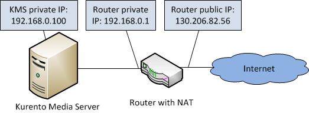

%%%%%%%%%%%%%%%%%%%%%%%%%%%%%%%%%%%%%%%%%%
Kurento Server Advanced Installation guide
%%%%%%%%%%%%%%%%%%%%%%%%%%%%%%%%%%%%%%%%%%

.. highlight:: bash

.. todo:: We have to explain all configuration options for Kurento Server in 
   some place in the documentation. Maybe this section have to be renamed to 
   "Kurento Server configuration" to include this information. 

Monolithic Kurento Server Installation
======================================

Kurento Server is composed by two components: Kurento Media Server and Kurento
Control Server. To configure Kurento Server, both components have to be
configured independently.

Kurento Media Server
--------------------

The KMS configuration file allows configure several details about the server.
The configuration file is located in ``/etc/kurento/media-server.conf``. After
a fresh installation that file looks like this:

.. sourcecode:: ini

    [Server]
    sdpPattern=pattern.sdp
    service=Thrift

    [HttpEPServer]
    #serverAddress=localhost

    # Announced IP Address may be helpful under situations such as the server needs
    # to provide URLs to clients whose host name is different from the one the
    # server is listening in. If this option is not provided, http server will try
    # to look for any available address in your system.
    # announcedAddress=localhost

    serverPort=9091

    [WebRtcEndPoint]
    #stunServerAddress = xxx.xxx.xxx.xxx
    #stunServerPort = xx
    #pemCertificate = file

    [Thrift]
    serverPort=9090

    [RabbitMQ]
    serverAddress = 127.0.0.1
    serverPort = 5672
    username = "guest"
    password = "guest"
    vhost = "/"

This configuration implies that KCS have to use Thrift protocol to communicate
with KMS. Thrift server will be attached in all available network interfaces.
The section ``[Thrift]`` allows to configure the port where KMS will listen to
KCS requests.

The section ``[HttpEPServer]`` controls the IP address and port to listen to the
final users making GET http requests to Kurento Media Server.

With the default configuration file, KMS will be listen Thrift requests from KSC
in the port 9090 of all interfaces and http requests from users in the port
9091 of all interfaces.

Kurento Control Server
----------------------

The KCS configuration file allows configure several details about the server.
The configuration file is located in
``/etc/kurento/media-connector.properties``. After a fresh installation that
file looks like this:

.. sourcecode:: properties

    server.port=8888
    kmf.transport=thrift 
    thrift.kms.address=127.0.0.1:9090
    thrift.kmf.address=127.0.0.1:9900 
    oauthserver.url=

This configuration implies that KCS use Thrift protocol to communicate with KMS
in localhost (127.0.0.1) and port 9090.

KCS will open the port 9900 in all interfaces and inform to KMS that it will be
reachable in IP 127.0.0.1 (from the point of view of KMS) to recevie incomming
Thrift requests.

Finally, all web socket requests must to be made to 8888 port (in any
interface).

Distributed Kurento Server Installation
=======================================

Kurento Server can be installed in a distributed environment, installing Kurento
Media Server in a node and Kurento Control Server in another node. Also, it is
possible to put all nodes in a private network behind a router with :term:`NAT`.

For example, the following picture shows a typical distributed installation
scenario:

   Kurento deployment in a configuration with NAT

This network diagram depicts a scenario where a :term:`NAT` device is present
and KMS and KCS are installed in different nodes in the private network. In
this case, the client will access the public IP 130.206.82.56, which will
connect him with the external interface of the NAT device.

KMS serves media on a specific address which, by default, is the IP of the
server where the service is running. This would have the server announcing that
the media served by an HttpEndpoint can be consumed in the private IP
172.30.1.122. Since this address is not accessible by external clients, the
administrator of the system will have to configure KMS to announce, as
connection address for clients, the public IP of the NAT device. This is
achieved by changing the value of announcedAddress in the file
``/etc/kurento/media-server.conf`` with the appropriate value. The following
lines would be the contents of this configuration file for the present scenario.

.. sourcecode:: ini

    [Server]
    serverAddress=localhost
    serverPort=9090
    sdpPattern=pattern.sdp

    [HttpEPServer]
    #serverAddress=localhost

    # Announced IP Address may be helpful under situations such as the server needs
    # to provide URLs to clients whose host name is different from the one the
    # server is listening in. If this option is not provided, http server will try
    # to look for any available address in your system.
    announcedAddress=130.206.82.56

    serverPort=9091

    [WebRtcEndPoint]
    #stunServerAddress = xxx.xxx.xxx.xxx
    #stunServerPort = xx
    #pemCertificate = file

Verifying Kurento Server installation
=====================================

List of Running Processes
-------------------------

To verify that Kurento Server is up and running use the command:

.. sourcecode:: shell

    ps -ef | grep kurento

The output should be similar to:

.. sourcecode:: shell

   nobody    1494     1  0 13:00 ?        00:01:16 java -server -XX:+UseCompressedOops -XX:+TieredCompilation -jar /var/lib/kurento/kmf-media-connector.jar --spring.config.location=/etc/kurento/media-connector.properties
   nobody   22527     1  0 13:02 ?        00:00:00 /usr/bin/kurento
   kuser    22711  2326  0 13:10 pts/1    00:00:00 grep --color=auto kurento

Network interfaces Up & Open
----------------------------

Unless configured otherwise, Kurento Server will open the following ports:

-  KMS opens port 9091 to receive HTTP TCP requests from final users. KMS
   also opens the port 9090 to receive Thrift TCP requests from KCS.
-  KCS opens the port 8888 to receive websocket TCP requests from final
   users. KCS also opens port 9900 to receive Thrift TCP requests from the KMS.

Ports 9091, and 8888 should be accessible from final users. Therefore these
ports should be open and forwarded on existing network elements, such as NAT or
Firewall.

To verify the ports opened by KMS execute the following command:

.. sourcecode:: shell

    sudo netstat -putan | grep kurento

The output should be similar to the following:

.. sourcecode:: shell

   tcp        0      0 0.0.0.0:9091            0.0.0.0:*               LISTEN      8752/kurento    
   tcp6       0      0 :::9090                 :::*                    LISTEN      8752/kurento 

To verify the ports opened by KCS execute the following command:

.. sourcecode:: shell

    $ sudo netstat -putan | grep java

The output should be similar to the following:

.. sourcecode:: shell

   tcp6       0      0 :::8888                 :::*                    LISTEN      21243/java      
   tcp6       0      0 127.0.0.1:9900          :::*                    LISTEN      21243/java   

