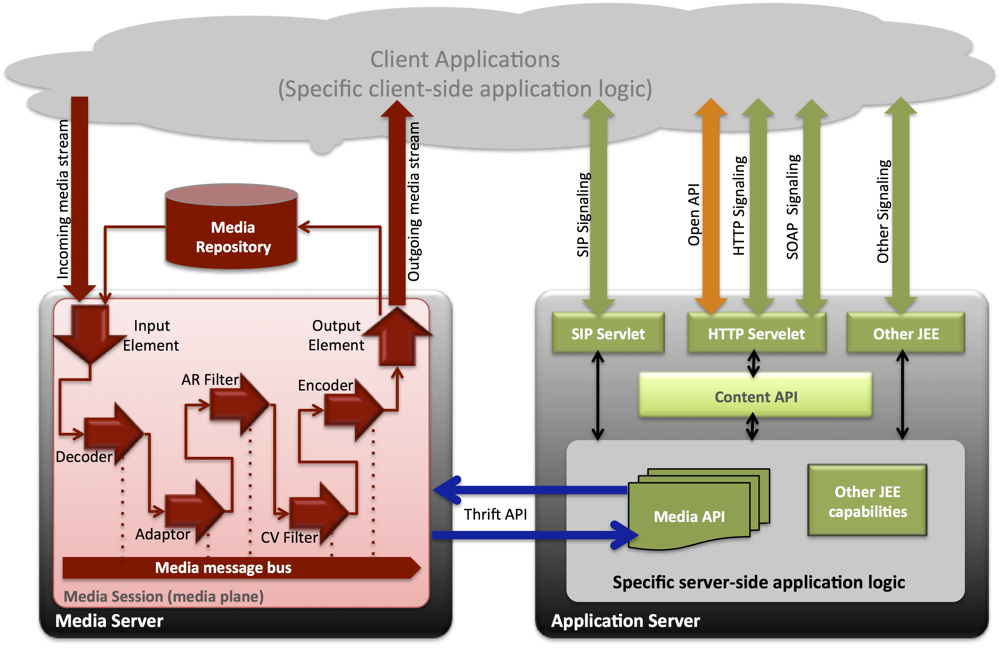
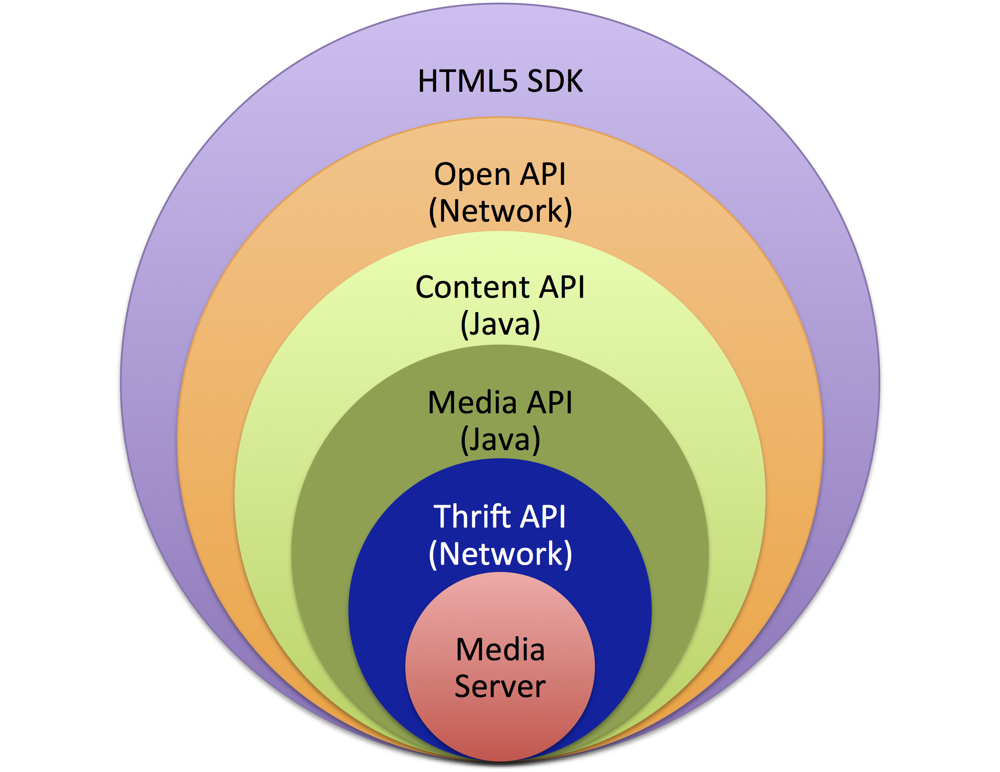
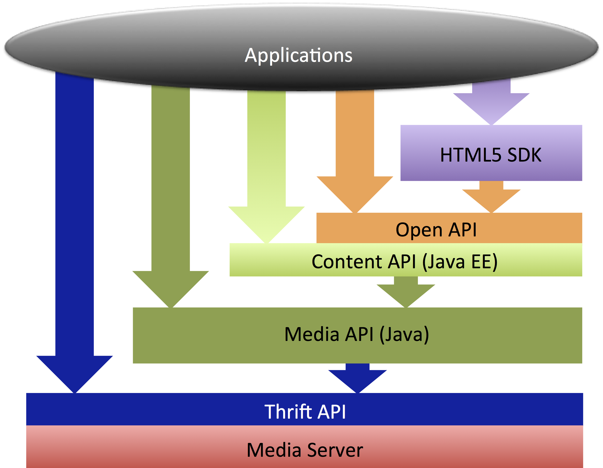
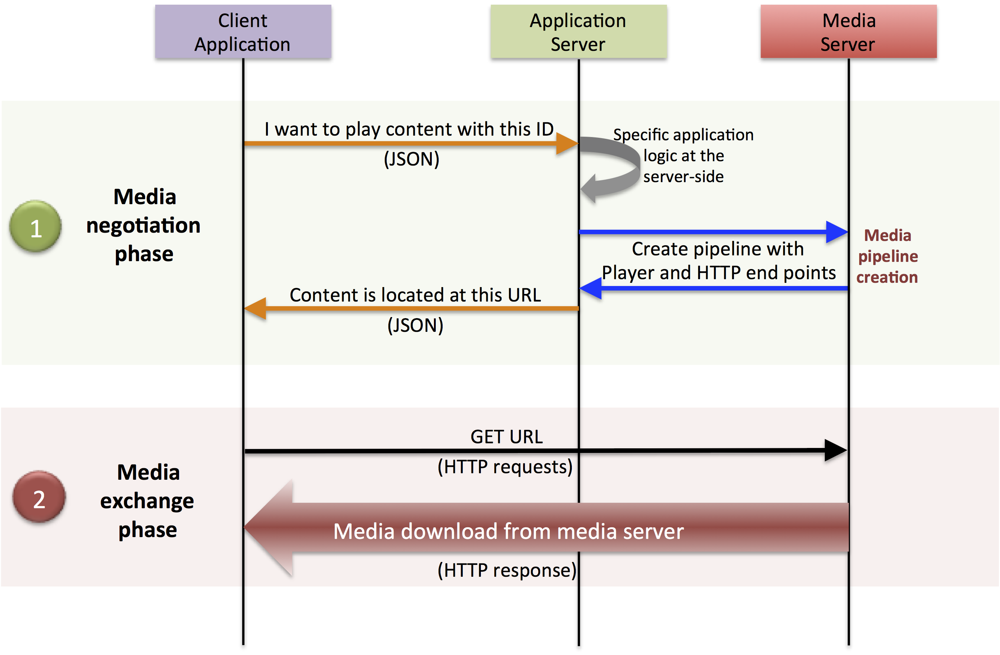
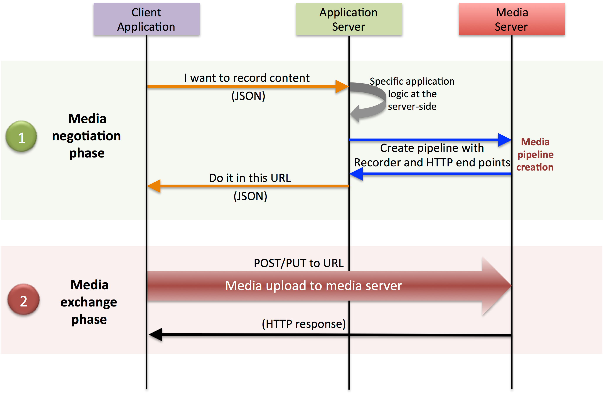

.. _architecture:

%%%%%%%%%%%%%%%%%%%%%%%%%%%%%%%%
 Architecture Description
%%%%%%%%%%%%%%%%%%%%%%%%%%%%%%%%

Overview
========

Kurento provides a framework devoted to simplify the development of
complex interactive :term:`multimedia` applications through a rich
family of APIs and toolboxes, which include:

-  **Content API**: The :doc:`KMF Content API <kmf-content-api/packages>`
   is a Java API bringing all the power of :term:`Java EE`
   technologies to the multimedia arena. This API will be particularly
   natural and intuitive for developers familiar with the Servlet API.

-  **Media API**: The :doc:`KMF Media API <kmf-media-api/packages>`:
   is a Java API exposing a toolbox of Media Elements that
   can be chained for creating complex multimedia processing pipelines.
   The abstraction and modularity of the Media API makes possible for
   non-expert developers to create complex and interoperable multimedia
   applications.

-  **Open API**: The :doc:`Open_API_Specification` is a `REST`:term:-like API
   based on JSON-RPC 2.0 opening Kurento capabilities through a standard
   HTTP network connection.

-  **Open Thrift API**: a network API exposing the kurento capabilities
   through Thrift RPCs. This API makes simple the creation of applications
   on any of the languages and frameworks supported by Thrift including
   Python, PHP, Node JS, Ruby, etc.

-  **HTML5 SDK**: a toolbox of JavaScript libraries providing access to
   the kurento capabilities through any HTML5 compatible
   browser.

Thanks to these, kurento provides developers with a set of robust end-to-end
interoperable multimedia communication capabilities to deal with the
complexity of transport, encoding/decoding, processing and rendering tasks
in an easy and efficient way.

Basic Concepts
==============

.. index:: Signalling Plane, Media Plane

Signalling and media planes
---------------------------

Kurento, as most multimedia communication technologies
out there, is built using two layers (called *planes*) to abstract key functions
in all interactive communication systems:

    **Signalling Plane**
        The parts of the system in charge of the management of communications,
        that is, the modules provides functions for media negotiation, QoS
        parametrization, call establishment, user registration, user presence,
        etc. are conceived as forming part of the :term:`Signalling Plane`.
    **Media Plane**
        Functionalities such as media transport, media encoding/decoding and
        media processing make the :term:`Media Plane`, which takes care of the
        handling of media. The distinction comes from the telephony differentiation
        between the handling of voice and the handling of meta-information such
        as tone, billing, etc.

.. index::
    single: Media; Element
    Pipeline: single; Media

Media elements and media pipelines
----------------------------------

Kurento is based on two concepts that act as building
blocks for application developers:

-  **Media Elements**. A Media element is a functional unit performing a
   specific action on a media stream. Media elements are a way of
   every capability is represented as a self-contained “black box” (the
   media element) to the application developer, who does not need to
   understand the low-level details of the element for using it. Media
   elements are capable of *receiving* media from other elements (through
   media sinks) and of *sending* media to other elements (through media
   sources). Depending on their function, media elements can be split
   into different groups:

   -  **Input Media Elements (IME)**: Media elements capable of
      receiving media and injecting it into a pipeline. There are
      several types of IMEs. File IMEs take the media from a file,
      Network IMEs take the media from the network, and Capture IMES are
      capable of capturing the media stream directly from a camera or
      other kind of hardware resource.
   -  **Processing Media Elements (PME)**: Media elements in charge of
      transforming or analysing media. Hence there are PMEs for
      performing operations such as transcoding, mixing, muxing,
      analyzing, augmenting, etc.
   -  **Output Media Elements (OPE)**: Media elements capable of taking
      a media stream out of the pipeline. Again, there are several types
      of OPEs specialized in files, network, screen, etc.

.. figure:: images/Media_element.png
   :height: 100px
   :width:  180px
   :align:  center
   :alt:    Media Element
   :figwidth: 600px

   **Media Element**.

   *A media element is a functional unit providing a specific media capability,
   which is exposed to application developers as a "black box"*

-  **Media Pipeline**: A Media Pipeline is a chain of media elements,
   where the output stream generated by one element (source) is fed into
   one or more other elements input streams (sinks). Hence, the pipeline
   represents a “machine” capable of performing a sequence of operations
   over a stream.

.. figure:: images/Media_pipeline_example.png
   :height: 450px
   :width:  600px
   :align:  center
   :alt:    Media Pipeline Example
   :figwidth: 600px

   **Media Pipeline Example**.

   *Example of a Media Pipeline implementing an interactive multimedia application
   receiving media from a video source, injecting a love-heart animation in the video
   stream when a specific face has been recognized and sending the resulting media to
   a video sink*

Agnostic media adaptor
----------------------

Using the :term:`KMF` or :term:`KWS` APIs, developers are able to compose the
available media elements, getting the desired pipeline. There is a
challenge in this scheme, as different media elements might require
different input media formats than the output produced by their
preceding element in the chain. For example, if we want to connect a
WebRTC (VP8 encoded) or a RTP (H.264/H.263 encoded) video stream to a
face recognition media element implemented to read raw RGB format, a
transcoding is necessary.

Developers, specially during the initial phases of application
development, might want to simplify development and abstract this
heterogeneneity, so kurento provides an automatic converter
of media formats called the :term:`agnostic media adaptor <agnostic, media>`.
Whenever a media element’s source is connected to another media element’s sink, our
framework verifies if media adaption and transcoding is necessary and,
in case it is, it transparently incorporates the appropriate
transformations making possible the chaining of the two elements into
the resulting pipeline.

Hence, this *agnostic media adaptor* capability fully abstracts all
the complexities of media codecs and formats. This may significantly
accelerate the development process, specially when developers are not
multimedia technology experts. However, there is a price to pay.
Transcoding may be a very CPU expensive operation. The inappropriate
design of pipelines that chain media elements in a way that
unnecessarily alternate codecs (e.g. going from H.264, to raw, to H.264
to raw again) will lead to very poor performance of applications.

.. figure:: images/AgnosticMediaAdaptor.png
   :height: 215px
   :width:  599px
   :align:  center
   :alt:    Media Adaptor
   :figwidth: 600px

   **Media Adaptor**.

   *The agnostic media capability adapts formats between heterogeneous
   media elements making transparent for application developers all
   complexities of media representation and encoding.*

Kurento Architecture
====================

High level architecture
-----------------------

The following figure shows a conceptual representation of the high
level architecture of kurento.

   **Kurento Architecture**.

   *Kurento architecture follows the traditional separation
   between signalling and media planes.*

The right side of the picture shows the Application Server, which is
in charge of the signalling plane and contains the business logic and
connectors of the particular multimedia application being deployed. It
is based on Java EE and includes well known and mature technologies such
as `HTTP`:term: and `SIP`:term: Servlets, Web Services, database connectors, messaging
services, etc. Thanks to this, this plane provides access to the
multimedia signalling protocols commonly used by end-clients such as `SIP`:term:,
RESTful and raw HTTP based formats, SOAP, RMI, CORBA or JMS. These
signalling protocols are used by client applications to command the
creation of media sessions and to negotiate their desired
characteristics on their behalf. Hence, this is the part of the
architecture, which is in contact with application developers and, for
this reason, it needs to be designed pursuing simplicity and
flexibility. On the left side, we have the Media Server, which
implements the media plane capabilities providing access to the
low-level media features: media transport, media encoding/decoding,
media transcoding, media mixing, media processing, etc. The Media Server
must be capable of managing the multimedia streams with minimal latency
and maximum throughput. Hence, in opposition to the Application Server,
the Media Server does not need to be specifically designed for being
simple to use or to control by application developers, but on the other
hand, must be optimized for efficiency.

APIs and interfaces exposed by the architecture
-----------------------------------------------

The capabilities of the media plane (Media Server) and signalling plane
(Application Server) are exposed through a number of APIs, which provide
increasing abstraction levels. These APIs are nested in an onion-like
layered architecture, where each level uses the services exposed by its
immediate inner layer and is used by its outer layer, so that external
levels are more abstract and easier to use by developers than internal
levels. This scheme is shown in the picture below:

   **Onion like layered structure of the APIs**.

   *Kurento has an onion-like architecture
   with APIs providing different abstraction levels.*

Following this, the role of the different APIs can be summarized in the following way:

-  **Thrift API**: Is a network API exposing the Media Server
   Capabilities through Thrift RPCs. Thrift acts as a middleware making
   possible the invocation of methods and constructors on the Media
   Server from stubs. In an architectural perspective, Thrift could be
   replaced by any other middleware providing synchronous and
   Asynchronous RPC invocation in an interoperable way (at least between
   C++ and Java) without requiring any modifications on the rest of API
   layers. This API makes possible the creation and management of media
   elements and pipelines by using references (ids). It is not a full
   abstract API given that non-trivial Media Server features such as
   distributed garbage collection and security mechanisms are explicitly
   exposed. Accessing the Thrift API is possible from any of the
   computer languages and frameworks supported by Thrift.
-  **Media API**: Is a Java SE layer which consumes the Thrift API and
   exposes its capabilities through a simple-to-use modularity based on
   Java POJOs representing media elements and media pipelines. This API
   is abstract in the sense that all the non-intuitive inherent
   complexities of the internal Media Server workings are abstracted and
   developers do not need to deal with them when creating applications.
   Using the Media API only requires adding the appropriate dependency
   to a maven project or to download the corresponding jar into the
   application developer CLASSPATH. In the future, further Media APIs
   can be created exposing the same kind of modularity in other
   languages supported by Thrift such as Python, C/C++, PHP, etc. It is
   important to remark that the Media API is a media-plane control API.
   In other words, its objective is to expose the capability of managing
   media objects, but it does not provide any signalling plane
   capabilities.
-  **Content API**: Is a Java EE layer, which consumes the Media API and
   exposes its capabilities through a simple modularity based on two
   types of objects: *ContentHandlers* and *ContentSessions*.
   ContentHandlers are abstractions extending the Java EE Servlet API
   making possible the creation of multimedia applications just by
   managing signalling events happening into a session (e.g.
   *onContentRequest*, *onContentTerminated*, etc.) *ContentSessions*
   represent specific client applications accessing to the
   infrastructure and have an associated state. The Content API is a
   signalling plane API, which makes possible to react to signalling
   messages received from the client and to execute the appropriate
   application logic (e.g. authenticate, connect to a database, execute
   a web service, use the Media API, etc.) at the appropriate instants.
   Content API developers require a Java EE compatible Application
   Server.
-  **Open API**: is a network API exposing the capabilities of the
   Content API through a `REST`:term:-like protocol based on the `JSON-RPC`:term:
   standard. To some extent, the Open API is the signalling protocol
   associated to the Content API. In addition, the Open API provides a
   mechanism for accessing and managing Media API capabilities directly.
-  **HTML5 SDK**: is an SDK consuming the Open API and exposing all the
   capabilities of the framework to all kinds of clients providing the
   required HTML5 features (i.e. video tag, WebRTC, WebSockets and
   AJAX). Hence, the HTML5 SDK could, at least in principle, be used in
   server side infrastructures such as Node.js and in client side WWW
   browsers. Using the APIs exposed by this SDK requires a Stream
   Oriented GE server infrastructure (Media Server and Application
   Server) in execution. The deployment of the Content API, or any
   application using it, automatically brings to the Java EE container
   all the required JavaScript files that can be imported by the HTML5
   application.

Details and examples on how to use these APIs can be found at the
corresponding Kurento :ref:`devguide`. From an
architectural perspective, the only relevant aspect is that application
developers can use any of these APIs for creating their multimedia
enabled applications. This opens a wide spectrum of potential usage
scenarios ranging from WWW applications (written using the HTML5 SDK),
desktop applications (writen using directly the Java Media API),
distibuted applications (writen using Thrift or Open APIs, etc.) This
idea is represented in the following picture:

   **Creating client applications through Kurento APIs**.

   *Application developers can use any of the available layered APIs for
   creating their applications. Upper layers show higher abstraction and
   require lower the associated development effort. The arrows in the
   figure refer to method calls.*

Creating applications with Kurento
----------------------------------

kurento Architecture has been specifically designed following the
architectural principles of the WWW. For this reason, creating a
multimedia applications basing on it is a similar experience
to creating a web application using any of the popular web development
frameworks.

At the highest abstraction level, web applications have an architecture
comprised of three different layers:

-  **Presentation layer**: Here we can find all the application code
   which is in charge of interacting with end users so that information
   is represented in a comprehensive way user input is captured. This
   usually consists on HTML pages.
-  **Application logic**: This layer is in charge of implementing the
   specific functions executed by the application.
-  **Service layer**: This layer provides capabilities used by the
   application logic such as databases, communications, security, etc.

Following this parallelism, multimedia applications created using
Kurento also respond to the same architecture:

-  **Presentation layer**: Is in charge of multimedia representation and
   multimedia capture. It is usually based on specific build-in
   capabilities of the client. For example, when creating a
   browser-based application, the presentation layer will use
   capabilities such as the <video> tag or the WebRTC PeerConnection
   and MediaStreams APIs.

-  **Application logic**: This layer provides the specific multimedia
   logic. In other words, this layer is in charge of building the
   appropriate pipeline (by chaining the desired media elements) that
   the multimedia flows involved in the application will need to
   traverse.
-  **Service layer**: This layer provides the multimedia services that
   support the application logic such as media recording, media
   ciphering, etc. The Media Server (i.e. the specific :term:`pipeline
   <pipeline, media>` of :term:`media elements<element, media>`)
   is the part of the Kurento architecture in charge of this
   layer.

.. figure:: images/Applications_Layered_Architecture.png
   :height: 278px
   :width:  500px
   :align:  center
   :alt:    Layered architecture of web and multimedia applications
   :figwidth: 600px

   **Layered architecture of web and multimedia applications**.

   *Applications created using Kurento (right) have an
   equivalent architecture to standard WWW applications (left). Both types
   of applications may choose to place the application logic at the client
   or at the server code.*

The interesting aspect of this discussion is that, as happens with
WWW development, Kurento applications always place the
Presentation layer at the client side and the Service layer at the
server side. However, the Application Logic layer, in both cases, can be
located at either of the sides or even distributed between them. This
idea is represented in the following picture:

This means that Kurento developers can choose to include the
code creating the specific media pipeline required by their applications
at the client side (directly through the Thrift or Open network APIs or
in a more abstract manner through the HTML5 SDK) or can place it at the
server side (using for that the Content and Media APIs).

Both options are valid but each of them drives to different development
styles. Having said this, it is important to note that in the WWW
developers usually tend to maintain client side code as simple as
possible, bringing most of their application logic to the server.
Reproducing this kind of development experience, the most common (and
recommended) way of using Kurento is by locating the
multimedia application logic at the server side, so that the specific
media pipelines are created using the Java Media API upon signalling
events managed by the Content API. In the rest of this document, we
assume that this is the standard way in which developers use the Stream
Oriented APIs.

Main Interactions
=================

Interactions from a generic perspective
---------------------------------------

As can be observed in Figure 4 above, a Kurento application
involves interactions among three main modules:

-  **Client Application**: which involves the native multimedia
   capabilities of the client platform plus the specific client-side
   application logic consuming the client-side Kurento APIs
   (i.e. :term:`HTML5 SDK<KWS>`, :ref:`Open API<openapi>`, etc.)
-  **Application Server**: which involves a Java EE application server
   and the server-side application logic consuming the server-side
   Kurento APIs (i.e. :ref:`Content API<kmf-content-api>` and
   :ref:`Media API<kmf-media-api>`)
-  **Media Server**: which receives commands for creating specific
   multimedia capabilities (i.e. specific pipelines adapted to the needs
   of specific applications)

The interactions maintained among these modules depend on the
specificities of each application. However, in general, for most
applications they can be reduced to the following conceptual scheme:

.. figure:: images/Generic_interactions.png
   :width:  720px
   :align:  center
   :alt:    Main interactions between architectural modules
   :figwidth: 800px

   **Main interactions between architectural modules**.

   *Main interactions occur in two fases: negotiation and media exchange.
   Remark that the color of the different arrows and boxes is aligned with
   the architectural figures presented above, so that, for example, orange
   arrows show exchanges belonging to the Open API, blue arrows show
   exchanges belonging to the Thrift API, red boxes are associated to the
   Media Server and green boxes with the Application Server.*

1. Media negotiation phase
~~~~~~~~~~~~~~~~~~~~~~~~~~

As it can be observed, at a first stage, a client (a browser in a
computer, a mobile application, etc.) issues a message requesting some
kind of capability from kurento. This message is based on
a JSON-RPC V2.0 representation and fulfills the Open API specification.
It can be generated directly from the client application or, in case of
web applications, indirectly consuming the abstract HTML5 SDK. For
instance, that request could ask for the visualization of a given video
clip.

When the Application Server receives the request, if appropriate, it
will carry out the specific server side application logic, which an
include Authentication, Authorization and Accounting (AAA), CDR
generation, consuming some type of web service, etc.

After that, the Application Server processes the request and, according
to the specific instructions programmed by the developer, commands the
Media Server to instantiate the suitable media elements and to chain
them in an appropriate media pipeline. Once the pipeline has been
created successfully the server responds accordingly and the Application
Server forwards the successful response to the client, showing it how
and where the media service can be reached.

During the above mentioned steps no media data is really exchanged. All
the interactions have the objective of negotiating the whats, hows,
wheres and whens of the media exchange. For this reason, we call it the
negotiation phase. Clearly, during this phase only signalling protocols
are involved.

2. Media exchange phase
~~~~~~~~~~~~~~~~~~~~~~~

After that, a new phase starts devoted to producing the actual media
exchange. The client addresses a request for the media to the Media
Server using the information gathered during the negotiation phase.
Following with the video-clip visualization example mentioned above, the
browser will send a GET request to the IP address and port of the Media
Server where the clip can be obtained and, as a result, an HTTP request
with the media will be received.

Following the discussion with that simple example, one may wonder why
such a complex scheme for just playing a video, when in most usual
scenarios clients just send the request to the appropriate URL of the
video without requiring any negotiation. The answer is straightforward.
Kurento is designed for media applications involving complex
media processing. For this reason, we need to establish a
two-phase mechanism enabling a negotiation before the media exchange.
The price to pay is that simple applications, such as one just
downloading a video, also need to get through these phases. However, the
advantage is that when creating more advanced services the same simple
philosophy will hold. For example, if we want to add augmented reality
or computer vision features to that video-clip, we just need to create
the appropriate pipeline holding the desired media element during the
negotiation phase. After that, from the client perspective, the
processed clip will be received as any other video.

Specific interactions for commonly used services
------------------------------------------------

Regardless of the actual type of session, all interactions follow the
pattern described in section above. However, most common services
respond to one of the following three main categories:

HTTP content player sessions
~~~~~~~~~~~~~~~~~~~~~~~~~~~~

This type of session emerges when clients use kurento to
receive media through an HTTP response. The client sends a JSON request
identifying the desired content and, as a result, it receives an URL
where the content can be found. This URL is associated to a pipeline
where the media processing logic is executed. The Application Server is
in charge of commanding the creation of that media pipeline following
the instructions provided by the application developer. The Application
Server can interrogate that pipeline for obtaining the URL it is
exposing to the world. This URL travels at the end of the negotiation to
the client, which an recover the stream by connecting to it. The
following image shows the interactions taking place in this kind of
session.

   **Main Interactions**.

   *Main interactions in a kurento session devoted to playing
   an HTTP media stream.*

Clearly, the specific media stream that the client receives depends
on the pipeline serving it. For HTTP content playing sessions, the usual
pipeline may follow the scheme depicted in the figure below, where a
video clip is recovered from a media repository (e.g. the file system)
and it is fed into a filter performing specific processing on it (e.g.
augmenting the media, recognizing objects of faces through computer
vision, adding subtitles, modifying the color palette, etc.) At the end
of the pipeline an element called :rom:cls:`HttpGetEndpoint` adapts the media and
sends it as an HTTP answer upon client requests. This basic pipeline can
be modified by the developer adding additional elements at wish, which
can be done creating the server-side application logic.

.. figure:: images/Player_session_pipeline.png
   :width: 720px
   :align: center
   :alt:   Example of pipeline for an HTTP content player session
   :figwidth: 800px

   **Sample Player Pipeline**.

   *Example of pipeline for an HTTP content player session.*

HTTP content recording sessions
~~~~~~~~~~~~~~~~~~~~~~~~~~~~~~~

HTTP recording sessions are equivalent to playing sessions although, in
this case, the media goes from the client to the server using the
appropriate HTTP methods for it (i.e. POST or PUT). The negotiation
phase hence starts with the client requesting to upload the content and
the Application Server creating the appropriate pipeline for doing it.
This pipeline will always start with an :rom:cls:`HttpPostEndpoint` element as the one
shown in Figure 10, but used in sink mode so that the media stream gets
into the pipeline instead of out of it. To that end point further
elements can be connected for filtering media, processing it or storing
it into a media repository. The specific interactions taking place in
this type of session are shown in the figure below

   **Sample Recorder Pipeline**.

   *Example of pipeline for an HTTP content recorder session.*

Content sessions for real time communications
~~~~~~~~~~~~~~~~~~~~~~~~~~~~~~~~~~~~~~~~~~~~~

Kurento allows the establishment of real time multimedia
session between a peer client and the Media Server directly through the
use of RTP/RTCP or through WebRTC. In addition, the Media Server can be
used to act as media proxy for making possible the communication among
different peer clients, which are mediated by the kurento
infrastructure. Hence, the GE can act as a conference bridge (Multipoing
Control Unit), as a machine-to-machine communication system, as a video
call recording system, etc. As shown in the picture, the client exposes
its media capabilities through an SDP (Session Description Protocol)
payload encapsulated in a JSON object request. Hence, the Application
Server is able to instantiate the appropriate media element (either RTP
or WebRTC end points), and to require it to negotiate and offer a
response SDP based on its own capabilities and on the offered SDP. When
the answer SDP is obtained, it is given back to the client and the media
exchange can be started. The interactions among the different modules
are summarized in the following picture

.. figure:: images/RTC_session.png
   :width: 720px
   :align: center
   :alt:   Main interactions in a RTC session
   :figwidth: 800px

   **Main interactions in a RTC session**.

   *Interactions taking place in a Real Time Communications (RTC)
   session. During the negotiation phase, a Session Description Protocol
   (SDP) message is exchanged offering the capabilities of the client. As a
   result, the Media Server generates an SDP answer that can be used by the
   client for extablishing the media exchange.*

As with the rest of examples shown above, the application developer is
able to create the desired pipeline during the negotiation phase, so
that the real time multimedia stream is processed accordingly to the
application needs. Just as an example, imagine that we want to create a
WebRTC application recording the media received from the client and
augmenting it so that if a human face is found, a hat will be rendered
on top of it. This pipeline is schematically shown in the figure below,
where we assume that the Filter element is capable of detecting the face
and adding the hat to it.

.. figure:: images/RTC_session_pipeline.png
   :width: 720px
   :align: center
   :alt:   Example pipeline for a WebRTC session
   :figwidth: 800px

   **Example pipeline for a WebRTC session**.

   *During the negotiation phase, the application developer can create a
   pipeline providing the desired specific functionality. For example, this
   pipeline uses a WebRtcEndpoint for communicating with the client, which
   is connected to a RecorderEndpoint storing the received media streamd
   and to an augmented reality filter, which feeds its output media stream
   back to the client. As a result, the end user will receive its own image
   filtered (e.g. with a hat added onto her head) and the stream will be
   recorded and made available for further recovery into a repository (e.g.
   a file).*

Basic Design Principles
=======================

Kurento is designed based on the following main principles:

    **Separate Media and Signalling Planes**
        :term:`Signalling <signalling plane>` and :term:`Media <media plane>`
        are two separate planes and Kurento is designed so that applications
        can handle separately those facets of multimedia processing.

    **Distribution of Media and Application Services**
        Media (:term:`KMS`) and Application (:term:`KAS`) servers can
        be collocated, scalated or distributed among different machines.

        A single Application Server can invoke the services of more than one
        Media Server. The opposite also applies, that is, a Media Server can
        attend the requests of more than one Application Server.

    **Suitable for the Cloud**
        Kurento is suitable to be integrated into cloud environments to act
        as a PaaS (Platform as a Service) component.

    **Media Pipelines**
        Chaining :term:`Media Elements <element, media>` via :term:`Media
        Pipelines <pipeline, media>` is an intuitive approach to challenge
        the complexity of Multimedia processing.

        In a Media Pipeline there exists a global clock suitable for the
        synchronization of different media elements

    **Application development**
        Developers do not need to be aware of internal Media Server
        complexities, all the applications are deployed in the :term:`Java EE`
        Application Server.

        Client-side SDKs are provided to simplify the application development
        for smartphones and Web browsers.

    **End-to-end Communication Capability**
        Kurento provides end-to-end communication capabilities so developers
        do not need to deal with the complexity of transporting,
        encoding/decoding and rendering media on client devices.

    **Fully Processable Media Streams**
       Kurento enables not only interactive interpersonal communications
       (e.g. Skype-like with conversational call push/reception
       capabilities), but also human-to-machine (e.g. Video on Demand
       through real-time streaming) and machine-to-machine (e.g. remote
       video recording, multisensory data exchange) communications.

    **Modular Processing of Media**
       Modularization achieved through :term:`media elements <element, media>`
       and :term:`pipelines <pipeline, media>` allows defining the media
       processing functionality of an application through a “graph-oriented”
       language, where the application developer is able to create the
       desired logic by chaining the appropriate functionalities.

    **Auditable Processing**
        Kurento is able to generate rich and detailed information for QoS
        monitoring, billing and auditing.

    **Seamless IMS integration**
        Kurento is designed to support seamless integration into the
        :term:`IMS` infrastructure of Telephony Carriers.

    **Transparent Media Adaptation Layer**
        Kurento provides a transparent media adaptation layer to make the
        convergence among different devices having different requirements in
        terms of screen size, power consumption, transmission rate, etc.
        possible.

