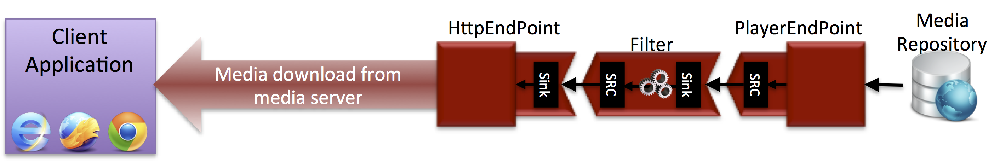

.. Developing Java apps with Kurento

%%%%%%%%%%%%%%%%%%%%%%%%%%%%%%%%%
Developing Java apps with Kurento
%%%%%%%%%%%%%%%%%%%%%%%%%%%%%%%%%

Kurento team provides to developers a Kurento Client for :term:`Java` to control
**Kurento Server**. This client library can be used in any kind of Java
application: Server Side Web, Desktop, Android, etc. It is compatible with any
framework like Java EE, Spring, Play, Vert.x, Swing, JavaFX, etc.

In this section, we provide detailed information about using
**Kurento Java Client** to build Java applications. If you want to see working
applications that use Kurento Java Client please visit to
:doc:`Tutorials section</Tutorials>`. There are several demos showing the
typical real time media web applications:

   - :doc:`Tutorial 1 - Magic mirror </tutorials/java/tutorial-1-magicmirror>`

   - :doc:`Tutorial 2 - One to One video call </tutorials/java/tutorial-2-one2one>`

   - :doc:`Tutorial 3 - Advanced One to One video call </tutorials/java/tutorial-3-one2one-adv>`

   - :doc:`Tutorial 4 - Many to many video call </tutorials/java/tutorial-4-group>`

To better understand the concepts showed in this section, it is recommended to
take a look to :doc:`Kurento API section <Kurento_API>` section. In that
section, general aspects of media managment in Kurento are presented. In the
following subsections, we will see how this general aspects are materialized
when using Kurento Java Client.

Maven and JavaDoc
=================

The Kurento Java Client is provided as :term:`Maven` dependency in
:term:`Maven Central` repository. To use it in a Maven application you have to
include the following dependency in dependencies section of your application's
pom.xml:

.. sourcecode:: xml 

      <dependency>
         <groupId>org.kurento</groupId>
         <artifactId>kurento-client</artifactId>
         <version>|version|</version>
      </dependency>
   
.. note::
    
   We are in active development. Be sure that you have the latest version of Kurento 
   Java Client your POM. You can find it at Maven Central searching for 
   ``kurento-client``.
   
Kurento Java Client has a minimum requirement of **Java 7**. To configure your
maven app to use Java 7, you have to include the following properties in the
properties section:

.. sourcecode:: xml 

   <maven.compiler.target>1.7</maven.compiler.target>
   <maven.compiler.source>1.7</maven.compiler.source>

The reference documentation of the Kurento Java Client can be browsed in its
`JavaDoc page <../javadoc/index.html?com/kurento/kmf/media/package-summary.html>`__.

Connecting to Kurento Server
============================

``KuerentoClient`` is the main class used to connect to Kurento server. This
class has several static factory methods to create instances from it. In the
following code snippet you can see how to create a ``KurentoClient`` instance
to connect a Kurento Server installed in the same host than Java app with all
default installation values:

.. sourcecode:: java

   KurentoClient kurento = KurentoClient.create("ws://localhost:8888");
   
Objects of ``KurentoClient`` class are used to create ``MediaPipeline`` objects
responsible to media managment in Kurento server.

Creating media pipelines
========================

A ``MediaPipeline`` object is required to build media services. Method
``newMediaPipeline()`` can be used in the ``KurentoClient`` for this purpose.

.. sourcecode:: java

    MediaPipeline pipeline = kurento.newMediaPipeline();

*Media elements* have to be created inside *media pipelines*. *Media elements*
within a pipeline can be connected to build services, but they are isolated
from the rest of the system. As introduced in the
:doc:`Kurento API section <Kurento_API>`, the main types of *MediaElements* are
*Endpoints* and *Filters*.

*Media elements* are created using the :term:`Builder Pattern` allowing a
flexible initialization. Mandatory parameters must be provided in the builder
constructor. Optional parameters are set to defaults unless the application
overrides their values using setter methods in the builder object. When the
builder is configured, the object can be created using its ``build()`` method.
In the following snippet, several `media elements` are created:

.. sourcecode:: java

        PlayerEndpoint player = 
            new PlayerEndpoint.Builder(pipeline, "http://files.kurento.org/video/fiwarecut.mp4")
                .build();

        FaceOverlayFilter filter = 
            new FaceOverlayFilter.Builder(pipeline)
               .withFaceOverlayedImage("http://files.kurento.org/imgs/mario-wings.png")
               .build();

        HttpGetEndpoint http = 
            new HttpGetEndpoint.Builder(pipeline)
               .build();

Now that all media elements are created, we have to connect them from input
endpoints to output endpoints through media filters.

.. sourcecode:: java

        player.connect(filter);
        filter.connect(http);

*Media elements* can be connected with ``connect()`` method. This method creates
a directional connection between the element in which ``connect()`` method is
invoked and the element passed as parameter.

In the previous steps we have created the media pipeline with a player endpoint
(to read the video from a file), a face overlay filter (to put a hat over the
faces in the video) and an http endpoint (to send the processed video to
browsers by means of http).

This media pipeline can be shown in the following figure:

   **Media Pipeline playing and processing a video file and sending it by http**.

To finalize this basic app, we last two important steps. First, we have to press
"play" button on the player endpoint to start reading file:

.. sourcecode:: java

        player.play();

And second, we have to open a web browser pointing to the URL in which we can
see the processed video.

.. sourcecode:: java

   String videoUrl = http.getUrl();

To make easier the execution of the demo, we can use a Java 7 useful utility to
open the default browser at a specific URL:

.. sourcecode:: java 

   Desktop.getDesktop().browse(new URI(videoUrl));

Let's put all above code together in a complete Java class:

.. sourcecode:: java

   import java.awt.Desktop;
   import java.io.IOException; 
   import java.net.URI; 
   import java.net.URISyntaxException;

   import org.kurento.client.KurentoClient;
   import org.kurento.client.MediaPipeline;
   import org.kurento.client.PlayerEndpoint;
   import org.kurento.client.FaceOverlayFilter;
   import org.kurento.client.HttpGetEndpoint;      
      
   public class KurentoHelloWorld {
      
      public static void main(String[] args) throws IOException,
         URISyntaxException {
      
         KurentoClient kurento = KurentoClient.create("ws://localhost:8888");
      
         MediaPipeline pipeline = kurento.newMediaPipeline();
          
         PlayerEndpoint player = 
            new PlayerEndpoint.Builder(pipeline, "http://files.kurento.org/video/fiwarecut.mp4")
               .build();
      
         FaceOverlayFilter filter = 
            new FaceOverlayFilter.Builder(pipeline)
               .withFaceOverlayedImage("http://files.kurento.org/imgs/mario-wings.png")
               .build();
       
         HttpGetEndpoint http = 
            new HttpGetEndpoint.Builder(pipeline)
               .build();
      
         player.connect(filter);
         filter.connect(http);
      
         player.play();
         
         String videoUrl = http.getUrl();
         Desktop.getDesktop().browse(new URI(videoUrl));
      }
   }
   
.. todo:: Upload this example to a GitHub project or to a Gist
   
Now, if you compile and execute the above class you will see a video in your
browser with a person with a red hat over his face. This media processing is
performing in real time, when you see the video.

Of course, this is a very minimal app that demonstrates what you can do with
Kurento, but you can build more interesting apps with this framework. If you
didn't take a look to :doc:`Tutorials section <Tutorials>`, please do it now to
see powerful multimedia web applications that can be built with Kurento.

Connecting media elements
=========================

*Media elements* can be connected with ``connect()`` method. This method creates
a directional connection between the element in which ``connect()`` method is
invoked and the element passed as parameter.

In order to create bidirectional connections the application must perform a
connect operation in both directions. The bidirectional connection is only
valid for bidirectional media elements like, for example, ``RtpEndppoint``.

.. sourcecode:: java

        RtpEndpoint rtpA = new RtpEndpoint.Builder(pipeline).build(); 
        RtpEndpoint rtpB = new RtpEndpoint.Builder(pipeline).build();

        rtpA.connect(rtpB); 
        rtpB.connect(rtpA);      

Reacting to events
==================

One of the most powerful functionalities provided by Kurento is that application
developers can subscribe to events happening in the media elements. This allow
to create rich multimedia applications with a high level language, letting
Kurento filters and endpoints do the low level work.

Event subscription in Kurento Java Client is inspired in frameworks to create
interactive applications like Swing. In order to execute a code fragment when
an event if fired, you have to register a ``listener`` in the object. For
example, the following code snippet shows how to execute some code when player
finishes the file is reading.

.. sourcecode:: java

    PlayerEndpoint player = 
       new PlayerEndpoint.Builder(pipeline, "http://files.kurento.org/video/fiwarecut.mp4")
          .build();
               
    player.addEndOfStreamListener(new MediaEventListener<EndOfStreamEvent>() {
       @Override public void onEvent(EndOfStreamEvent event) {
         System.out.println("The playing has finished"); 
       }
    });

Non blocking reactive API
=========================

Kurento Java Client provides a non blocking, reactive, asynchronous interface
for those applications that cannot afford to block their calls until Kurento
Server responds. The asynchronous interface improves performance at a cost of
increase in complexity.

In the following snippet, we show how to create a PlayerEndpoint with the
asynchronous interface:

.. sourcecode:: java

        new PlayerEndpoint.Builder(pipeline, "http://files.kurento.org/video/fiwarecut.mp4")
           .buildAsync(new Continuation<PlayerEndpoint>() {
              @Override public void onSuccess(PlayerEndpoint player) {
                  // Use player
              }                
              @Override public void onError(Throwable cause) { 
                  // log error
              }
           });

