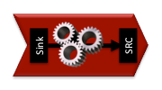
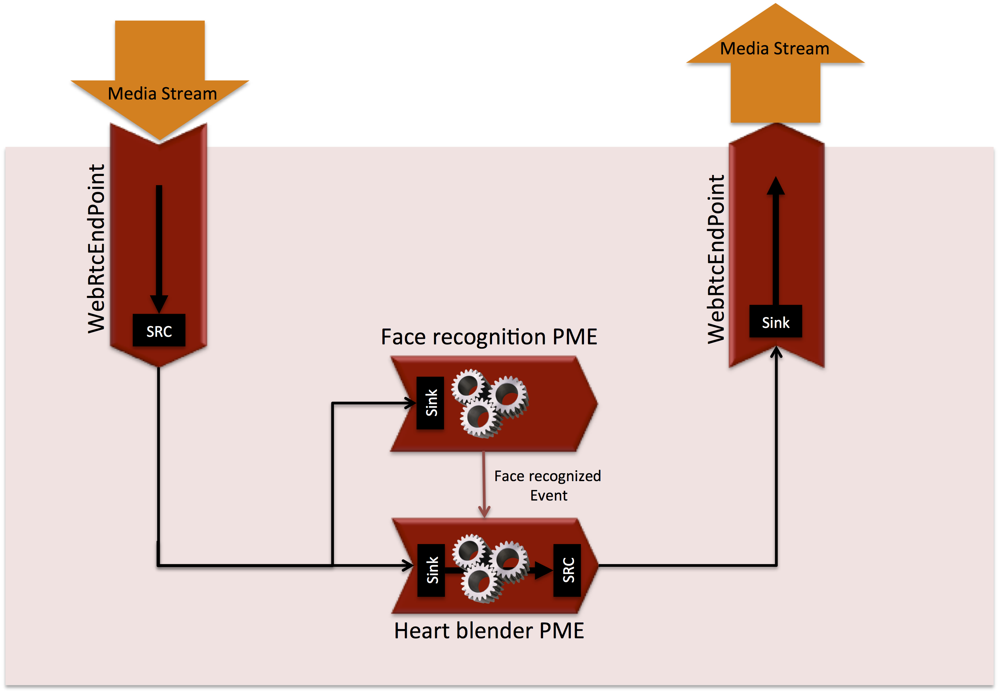
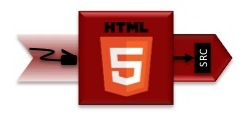
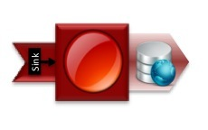
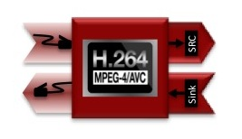
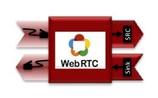
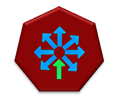

.. _Kurento_API:

%%%%%%%%%%%
Kurento API
%%%%%%%%%%%

**Kurento Server** exposes an API to high level languages that allow application
programmers to control it. This high level API can be used with a
:doc:`Kurento Client <Kurento_Client>` for **Java** or **JavaScript**. If you
prefer another programming language, you can use the
:doc:`Kurento Protocol<Kurento_Protocol>`, based on :term:`WebSocket` and
:term:`Json-RPC`.

In the following sections we will describe the Kurento API in a high level way.
We will show the media capabilities exposed by Kurento Server to clients. If
you want see working demos using Kurento, please refer to
:doc:`Tutorials section<Tutorials>`.

.. index::
    single: Media; Element
    Pipeline: single; Media

Media elements and media pipelines
==================================

Kurento is based on two concepts that act as building blocks for application
developers:

-  **Media Elements**. A Media element is a functional unit performing a
   specific action on a media stream. Media elements are a way of every
   capability is represented as a self-contained “black box” (the media
   element) to the application developer, who does not need to understand the
   low-level details of the element for using it. Media elements are capable of
   *receiving* media from other elements (through media sources) and of
   *sending* media to other elements (through media sinks). Depending on their
   function, media elements can be split into different groups:

   -  **Input Endpoints**: Media elements capable of receiving media and
      injecting it into a pipeline. There are several types of input endpoints.
      File input endpoints take the media from a file, Network input endpoints
      take the media from the network, and Capture input endpoints are capable
      of capturing the media stream directly from a camera or other kind of
      hardware resource.
   -  **Filters**: Media elements in charge of transforming or analyzing
      media. Hence there are filters for performing operations such as mixing,
      muxing, analyzing, augmenting, etc.
   -  **Hubs**: Media Objects in charge of managing multiple media flows
      in a pipeline. A Hub has several hub ports where other media elements are
      connected. Depending on the Hub type, there are different ways to control
      the media. For example, there are a Hub called Composite that merge all
      input video streams in a unique output video stream with all inputs in a
      grid.
   -  **Output Endpoints**: Media elements capable of taking a media
      stream out of the pipeline. Again, there are several types of output
      endpoints specialized in files, network, screen, etc.

   **Media Element**.

   *A media element is a functional unit providing a specific media capability,
   which is exposed to application developers as a "black box"*

-  **Media Pipeline**: A Media Pipeline is a chain of media elements, where
   the output stream generated by one element (source) is fed into one or more
   other elements input streams (sinks). Hence, the pipeline represents a
   “machine” capable of performing a sequence of operations over a stream.

   **Media Pipeline Example**.

   *Example of a Media Pipeline implementing an interactive multimedia application
   receiving media from a video source, injecting a love-heart animation in the video
   stream when a specific face has been recognized and sending the resulting media to
   a video sink*

Kurento API is an object oriented API. That is, there are classes that can be
instantiated. This classes define operations that can be invoked over objects
of this classes. The classes can have an inheritance relationship with other
classes, inheriting operations from parent classes to children ones.

The following class diagram shows some of the relationships of the main classes
in the Kurento API.

.. digraph:: Media_Objects
   :caption: Class diagram of main classes in Kurento API

   size="12,8";
   fontname = "Bitstream Vera Sans"
   fontsize = 8

   node [
        fontname = "Bitstream Vera Sans"
        fontsize = 8
        shape = "record"
   ]

   edge [
        fontname = "Bitstream Vera Sans"
        fontsize = 8
        arrowtail = "empty"
        dir = back;
   ]

   MediaObject [
        label = "{MediaObject|" +
                "+ getMediaPipeline() : MediaPipeline\l" +
                "+ getParent() : MediaObject[]\l}"
        labelurl = "MediaObject"
        href = "com/kurento/kmf/media/MediaObject.html"
   ]

   MediaElement [
        label = "{MediaElement|" +
                "+ connect(...) : void\l" +
                "+ getMediaSinks(...) : MediaSink[]\l" +
                "+ getMediaSrcs(...) : MediaSource[]\l}"
        urllabel = "MediaElement"
        href = "com/kurento/kmf/media/MediaElement.html"
   ]   

   
   MediaObject -> MediaPipeline;
   MediaObject -> MediaElement;   
   MediaObject -> Hub;
   
   MediaObject -> MediaObject [label = "parent", constraint=false, dir = normal, arrowhead="vee"]

   MediaObject -> MediaPipeline [label = "pipeline", constraint=false, dir = normal, arrowhead="vee"]

   MediaPipeline -> MediaElement [headlabel="*" label = "elements", constraint=false, dir = normal, arrowhead="vee"]

   MediaElement -> Endpoint;
   MediaElement -> Filter;
   MediaElement -> HubPort;
   
   "Hub" -> "HubPort" [headlabel = "*", constraint=false, dir = normal, arrowhead="vee"]

Endpoints
=========

Let us discuss briefly the different Endpoints offered by kurento:

HttpGetEndpoint
    An ''HttpGetEndpoint'' is an output endpoint that delivers media using
    HTML5 pseudo-streaming mechanism by means of http GET requests.

HttpPostEndpoint
    An ''HttpPostEndpoint'' is an input endpoint that accepts media using
    http POST requests like HTTP file upload function.

   
PlayerEndpoint
    A ''PlayerEndpoint'' is an input endpoint that retrieves content from
    file system, http URL or RTSP url and inject it into the media pipeline.

   
RecorderEndpoint
    A ''RecorderEndpoint'' is an output endpoint that  provides function to
    store contents in reliable mode (doesn't discard data). It contains ''Media
    Sink'' pads for audio and video.

   
RtpEndpoint
    A ''RtpEndpoint'' is an output and input endpoint. That is, provides
    bidirectional content delivery capabilities with remote networked peers
    through RTP protocol. As you can imagine, to send and receive media through
    the network it uses :term:`RTP` protocol and :term:`SDP` for media
    negotiation.

   
WebRtcEndpoint
    A ''WebRtcEndpoint'' is an output and input endpoint that provides media
    streaming for Real Time Communications (RTC) through the web. It implements
    :term:`WebRTC` technology to communicate with browsers.

The following class diagram shows the relationships of the main endpoint classes.

.. digraph:: Endpoints
   :caption: Class diagram of Endpoints in Kurento API

   size="12,8";
   fontname = "Bitstream Vera Sans"
   fontsize = 8

   node [
        fontname = "Bitstream Vera Sans"
        fontsize = 8
        shape = "record"
   ]

   edge [
        fontname = "Bitstream Vera Sans"
        fontsize = 8
        arrowtail = "empty"
        dir = back;
   ]
   
   "MediaElement" -> "Endpoint";
   Endpoint -> SessionEndpoint;
   Endpoint -> UriEndpoint;
   
   SessionEndpoint -> HttpEndpoint;
   SessionEndpoint -> SdpEndpoint;
   
   HttpEndpoint -> HttpGetEndpoint;
   HttpEndpoint -> HttpPostEndpoint;
   
   SdpEndpoint -> RtpEndpoint;
   SdpEndpoint -> WebRtcEndpoint;
   
   UriEndpoint -> PlayerEndpoint;
   UriEndpoint -> RecorderEndpoint;

Filters
=======

Filters are MediaElements that perform media processing, computer vision,
augmented reality, and so on. Let see the available filters in Kurento:

ZBarFilter
    This filter detects QR and bar codes in a video stream. When a code is
    found, the filter raises a ``CodeFoundEvent``. Clients can add a listener
    to this event to execute some action.

   
FaceOverlayFilter
    This type of filter detects faces in a video stream and overlaid it with
    a configurable image.

.. image:: images/face.jpg
   :align:  center
   
GStreamerFilter
    This is a generic filter interface that allow use GStreamer filter in
    Kurento Media Pipelines.

The following class diagram shows the relationships of the main filter classes.

.. digraph:: Filters
   :caption: Class diagram of Filters in Kurento API

    size="12,8";
   fontname = "Bitstream Vera Sans"
   fontsize = 8

   node [
        fontname = "Bitstream Vera Sans"
        fontsize = 8
        shape = "record"
   ]

   edge [
        fontname = "Bitstream Vera Sans"
        fontsize = 8
        arrowtail = "empty"
        dir = back;
   ]
   
    "MediaElement" -> "Filter";
    "Filter" -> "ZBarFilter";
    "Filter" -> "FaceOverlayFilter";
    "Filter" -> "GStreamerFilter";

Hubs
====
Hubs are media objects in charge of managing multiple media flows in a pipeline.
A Hub has several hub ports where other media elements are connected. Let's see
the available hubs in Kurento:

Composite
    A Hub that mixes the audio stream of its connected inputs and constructs
    a grid with the video streams of them.

   
DispatcherOneToMany
    A Hub that sends a given input to all the connected output HubPorts.

   
Dispatcher
    A Hub that allows routing between arbitrary input-output HubPort pairs.

   
.. digraph:: Hubs
   :caption: Class diagram of Hubs in Kurento API

    size="12,8";
   fontname = "Bitstream Vera Sans"
   fontsize = 8

   node [
        fontname = "Bitstream Vera Sans"
        fontsize = 8
        shape = "record"
   ]

   edge [
        fontname = "Bitstream Vera Sans"
        fontsize = 8
        arrowtail = "empty"
        dir = back;
   ]
   
    "MediaObject" -> "Hub";
    "MediaObject" -> "MediaElement";
    
    "Hub" -> "HubPort" [headlabel = "*", constraint=false, dir = normal, arrowhead="vee"]
    
    "MediaElement" -> "HubPort";
   
    "Hub" -> "Composite";
    "Hub" -> "Dispatcher";
    "Hub" -> "DispatcherOneToMany";

Kurento API Reference
=====================

.. include:: api_reference/Kurento_API_Reference.txt

