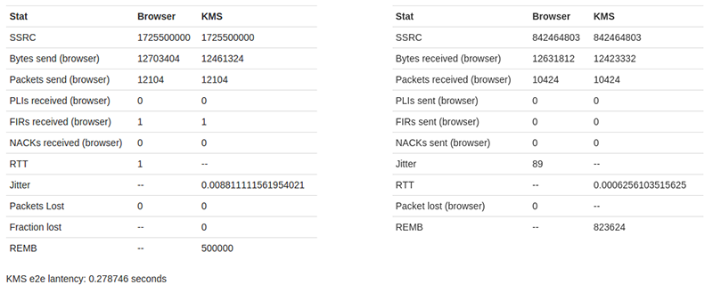

.. _stats:

%%%%%%%%%%%%%%%%%
WebRTC Statistics
%%%%%%%%%%%%%%%%%

[TODO full review]

Introduction
============

WebRTC streams (audio, video, or data) can be lost, and experience varying
amounts of network delay. In order to assess the performance of WebRTC
applications, it could be required to be able to monitor the WebRTC features of
the underlying network and media pipeline.

To that aim, Kurento provides WebRTC statistics gathering for the server-side
(Kurento Media Server, KMS). The implementation of this capability follows the
guidelines provided in the
`W3C WebRTC's Statistics API <https://www.w3.org/TR/webrtc-stats/>`__.
Therefore, the statistics gathered in the KMS can be divided into two groups:

- *inboundrtp*: statistics on the stream received in the KMS.

- *outboundrtp*: statistics on the stream sent by KMS.

API description
===============

As usual, WebRTC statistics gathering capability is provided by the KMS and is
consumed by means of the different Kurento client implementations (Java,
JavaScript clients are provided out of the box). To read these statistics,
first it should be enabled using the method *setLatencyStats* of a Media
Pipeline object. Using the Kurento Java client this is done as follows:

.. sourcecode:: java

   String kmsWsUri = "ws://localhost:8888/kurento";
   KurentoClient kurentoClient = KurentoClient.create(kmsWsUri);
   MediaPipeline mediaPipeline = kurentoClient.createMediaPipeline();
   mediaPipeline.setLatencyStats(true);

   // ...

... and using the JavaScript client:

.. sourcecode:: js

   var kmsWsUri = "ws://localhost:8888/kurento";
   kurentoClient(kmsWsUri, function(error, kurentoClient) {
      kurentoClient.create("MediaPipeline", function(error, mediaPipeline) {
         mediaPipeline.setLatencyStats(true, function(error){

            // ...

         });
      });
   });

Once WebRTC statistics are enabled, the second step is reading the statistics
values using the method *getStats* of a Media Element, For example, to read
the statistics of a *WebRtcEndpoint* object in Java:

.. sourcecode:: java

   WebRtcEndpoint webRtcEndpoint = new WebRtcEndpoint.Builder(mediaPipeline).build();
   MediaType mediaType = ... // it can be MediaType.VIDEO, MediaType.AUDIO, or MediaType.DATA
   Map<String, Stats> statsMap = webRtcEndpoint.getStats(mediaType);

   // ...

... and in JavaScript:

.. sourcecode:: js

   mediaPipeline.create("WebRtcEndpoint", function(error, webRtcEndpoint) {
      var mediaType = ... // it can be 'VIDEO', 'AUDIO', or 'DATA'
      webRtcEndpoint.getStats(mediaType, function(error, statsMap) {

         // ...

      });
   });

Notice that the WebRTC statistics are read as a map. Therefore, each entry of
this collection has a key and a value, in which the key is the specific
statistic, with a given value at the reading time. Take into account that these
values make reference to real-time properties, and so these values vary in time
depending on multiple factors (for instance network performance, KMS load, and
so on). The complete description of the statistics are defined in the
`KMD interface <https://github.com/Kurento/kms-core/blob/master/src/server/interface/core.kmd.json>`__
description. The most relevant statistics are listed below:

- *ssrc*: The synchronized source (SSRC).

- *firCount*: Count the total number of Full Intra Request (FIR) packets
  received by the sender. This metric is only valid for video and is sent by
  receiver.

- *pliCount*: Count the total number of Packet Loss Indication (PLI) packets
  received by the sender and is sent by receiver.

- *nackCount*: Count the total number of Negative ACKnowledgement (NACK)
  packets received by the sender and is sent by receiver.

- *sliCount*: Count the total number of Slice Loss Indication (SLI) packets
  received by the sender. This metric is only valid for video and is sent by
  receiver.

- *remb*: The Receiver Estimated Maximum Bitrate (REMB). This metric is only
  valid for video.

- *packetsLost*: Total number of RTP packets lost for this SSRC.

- *packetsReceived*: Total number of RTP packets received for this SSRC.

- *bytesReceived*: Total number of bytes received for this SSRC.

- *jitter*: Packet Jitter measured in seconds for this SSRC.

- *packetsSent*: Total number of RTP packets sent for this SSRC.

- *bytesSent*: Total number of bytes sent for this SSRC.

- *targetBitrate*: Presently configured bitrate target of this SSRC, in bits
  per second.

- *roundTripTime*: Estimated round trip time (seconds) for this SSRC based
  on the RTCP timestamp.

- *E2ELatency*: Array of average latencies (``MediaLatencyStat[]``) for each media (audio, video), in nanoseconds.

All in all, the process for gathering WebRTC statistics in the KMS can be
summarized in two steps: 1) Enable WebRTC statistics; 2) Read WebRTC. This
process is illustrated in the following picture. This diagram also describes
the :term:`JSON-RPC` messages exchanged between Kurento client and KMS
following the :doc:`Kurento Protocol </features/kurento_protocol>`:

.. figure:: ../images/kurento-stats.png
   :align: center
   :alt:   Sequence diagram for gathering WebRTC statistics in KMS

   *Sequence diagram for gathering WebRTC statistics in KMS*

Example
=======

There is a running tutorial which uses the WebRTC gathering as described before.
This demo has been implemented using the JavaScript client and it is available
on GitHub:
`kurento-loopback-stats <https://github.com/Kurento/kurento-tutorial-js/tree/master/kurento-loopback-stats>`__.

From a the Media Pipeline point of view, this demo application consists in a
*WebRtcEndpoint* in loopback. Once the demo is up and running, WebRTC are
enabled and gathered with a rate of 1 second.

In addition to the KMS WebRTC statistics, client-side (i.e. browser WebRTC peer)
stats are also gathered by the application. This is done using the standard
method provided by the *RTCPeerConnection* object, i.e using its method
*getStats*. Please check out the JavaScript logic located in the
`index.js <https://github.com/Kurento/kurento-tutorial-js/blob/master/kurento-loopback-stats/js/index.js>`__
file for implementation details.

Both kinds of WebRTC statistics values (i.e. browser and KMS side) are updated
and shown each second in the application GUI, as follows:

   *Statistics results in the kurento-loopback-stats demo GUI*
