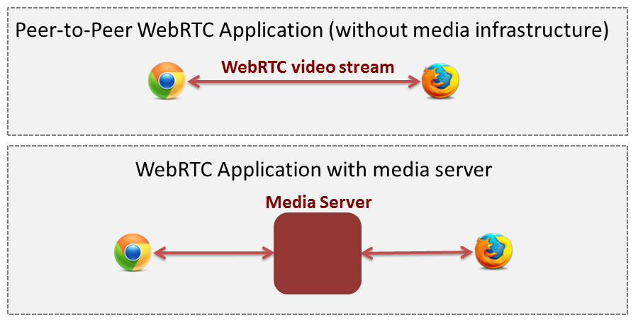
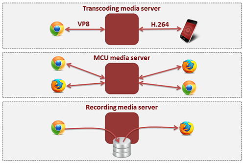
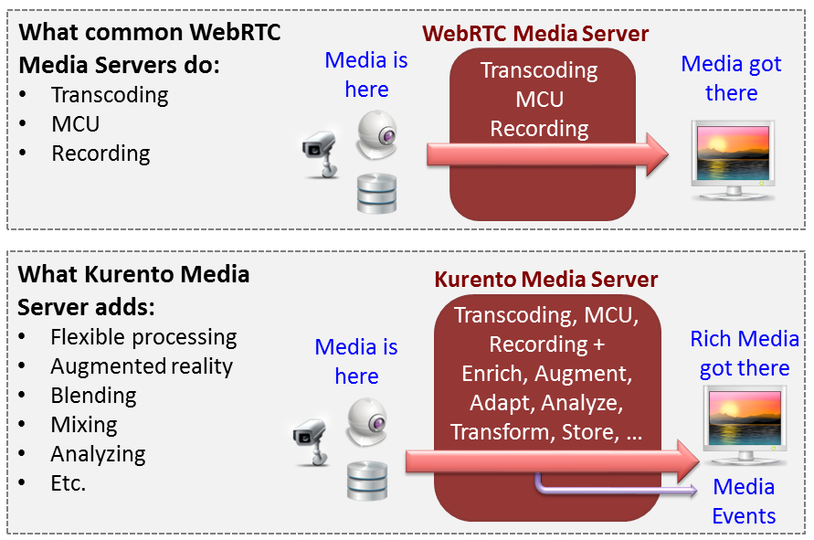
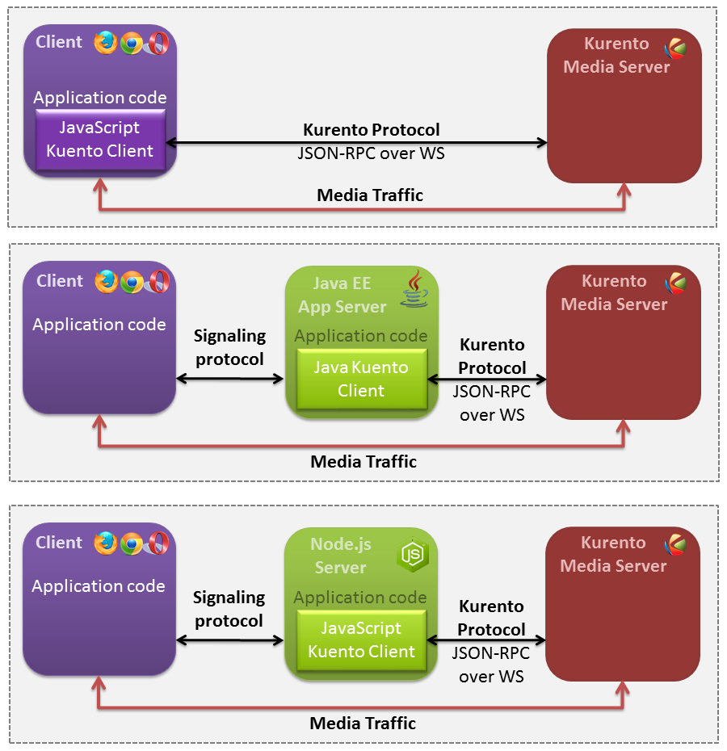
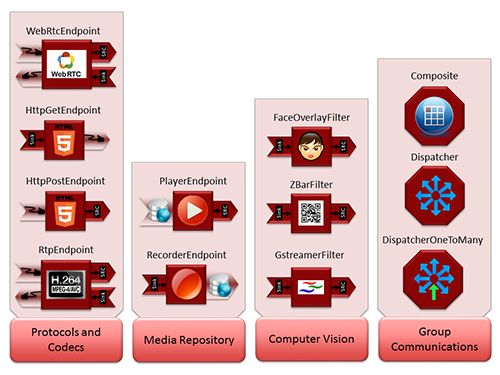
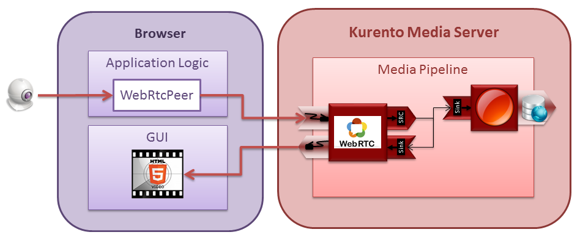

.. _Introducing_Kurento:

%%%%%%%%%%%%%%%%%%%
Introducing Kurento
%%%%%%%%%%%%%%%%%%%

WebRTC media servers
====================

:term:`WebRTC` is an open source technology that enables web browsers with
Real-Time Communications (RTC) capabilities via JavaScript APIs. It has been
conceived as a peer-to-peer technology where browsers can directly communicate
without the mediation of any kind of infrastructure. This model is enough for
creating basic applications but features such as group communications, media
stream recording, media broadcasting or media transcoding are difficult to
implement on top of it. For this reason, many applications require using a
media server.

   *Peer-to-peer WebRTC approach vs. WebRTC through a media server*

Conceptually, a WebRTC media server is just a kind of “multimedia middleware”
(it is in the middle of the communicating peers) where media traffic pass
through when moving from source to destinations. Media servers are capable of
processing media streams and offering different types including groups
communications (distributing the media stream one peer generates among several
receivers, i.e. acting as Multi-Conference Unit, MCU), mixing (transforming
several incoming stream into one single composite stream), transcoding
(adapting codecs and formats between incompatible clients), recording (storing
in a persistent way the media exchanged among peers), etc.

   *Typical WebRTC Media Server capabilities*

Kurento Media Server
====================

At the heart of the Kurento architecture there is a media server called the
**Kurento Media Server (KMS)**. Kurento Media Server is based on pluggable
media processing capabilities meaning that any of its provided features is a
pluggable module that can be activated or deactivated. Moreover, developers can
seamlessly create additional modules extending Kurento Media Server with new
functionalities which can be plugged dynamically.

Kurento Media Server provides, out of the box, group communications, mixing,
transcoding, recording and playing. In addition, it also provides advanced
modules for media processing including computer vision, augmented reality,
alpha blending and much more.

   *Kurento Media Server capabilities*

Kurento API, Clients, and Protocol
==================================

Kurento Media Server capabilities are exposed by the **Kurento API** to
application developers. This API is implemented by means of libraries called
**Kurento Clients**. Kurento offers two clients out of the box for **Java** and
**JavaScript**. If you have another favorite language, you can still use
Kurento using directly the **Kurento Protocol**. This protocol allows to
control Kurento Media Server and it is based on Internet standards such as
:term:`WebSocket` and :term:`JSON-RPC`. The picture below shows how to use
Kurento Clients in three scenarios:

* Using the Kurento JavaScript Client directly in a compliant
  `WebRTC <http://www.webrtc.org/>`_ browser

* Using the Kurento Java Client in a Java EE Application Server

* Using the Kurento JavaScript Client in a Node.js server

   *Connection of Kurento Clients (Java and JavaScript) to Kuento Media Server*

Complete examples for these three technologies is described in the
:doc:`tutorials <./tutorials>` section.

Kurento Client's API is based on the concept of **Media Element**. A Media
Element holds a specific media capability. For example, the media element
called *WebRtcEndpoint* holds the capability of sending and receiving WebRTC
media streams, the media element called *RecorderEndpoint* has the capability
of recording into the file system any media streams it receives, the
*FaceOverlayFilter* detects faces on the exchanged video streams and adds a
specific overlaid image on top of them, etc. Kurento exposes a rich toolbox of
media elements as part of its APIs.

   *Some Media Elements provided out of the box by Kurento*

To better understand theses concepts it is recommended to take a look to
:doc:`Kurento API <./mastering/kurento_API>` and
:doc:`Kurento Protocol <./mastering/kurento_protocol>` sections.

Creating applications with Kurento
==================================

From the application developer perspective, Media Elements are like *Lego*
pieces: you just need to take the elements needed for an application and
connect them following the desired topology. In Kurento jargon, a graph of
connected media elements is called a **Media Pipeline**. Hence, when creating a
pipeline, developers need to determine the capabilities they want to use (the
media elements) and the topology determining which media elements provide media
to which other media elements (the connectivity). The connectivity is
controlled through the *connect* primitive, exposed on all Kurento Client APIs.
This primitive is always invoked in the element acting as source and takes as
argument the sink element following this scheme:

.. sourcecode:: java

   sourceMediaElement.connect(sinkMediaElement)

For example, if you want to create an application recording WebRTC streams into
the file system, you'll need two media elements: *WebRtcEndpoint* and
*RecorderEndpoint*. When a client connects to the application, you will need to
instantiate these media elements making the stream received by the
*WebRtcEndpoint* (which is capable of receiving WebRTC streams) to be feed to
the *RecorderEndpoint* (which is capable of recording media streams into the
file system). Finally you will need to connect them so that the stream received
by the former is fed into the later:

.. sourcecode:: java

   WebRtcEndpoint.connect(RecorderEndpoint)

To simplify the handling of WebRTC streams in the client-side, Kurento provides
an utility called *WebRtcPeer*. Nevertheless, the standard WebRTC API
(*getUserMedia*, *RTCPeerConnection*, and so on) can also be used to connect to
*WebRtcEndpoints*. For further information please visit the
:doc:`tutorials <./tutorials>` section.

   *Simple Example of a Media Pipeline*
