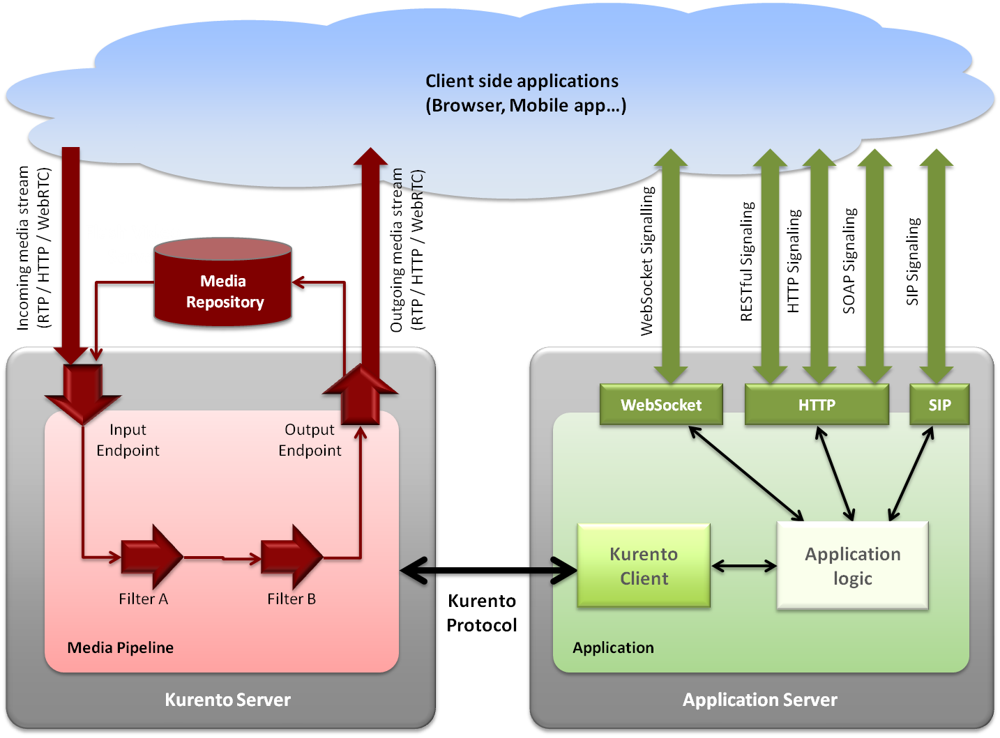
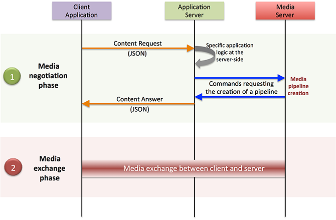
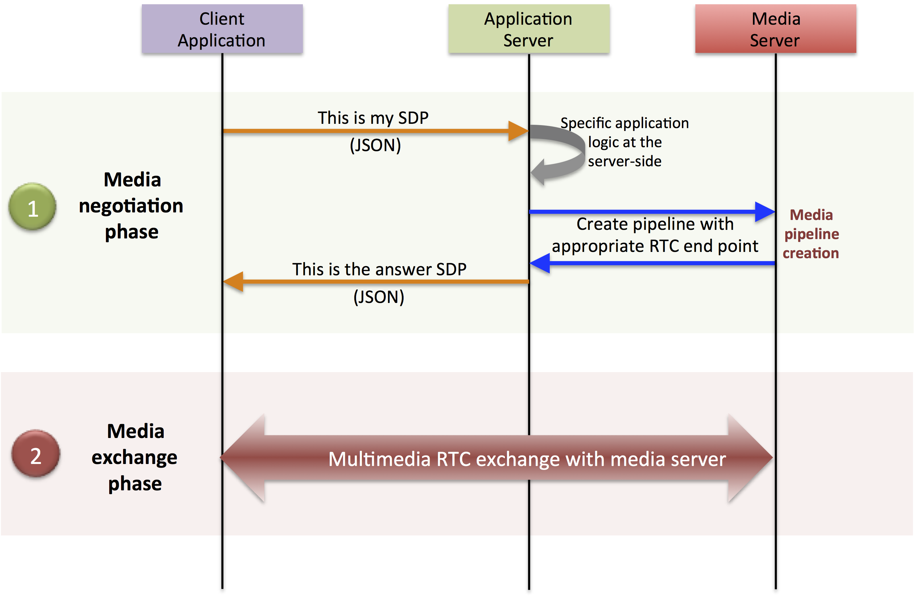
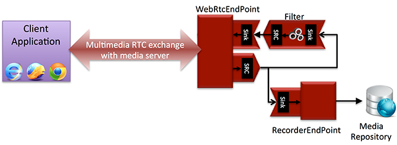

.. _architecture:

%%%%%%%%%%%%%%%%%%%%
Kurento Architecture
%%%%%%%%%%%%%%%%%%%%

Kurento, as most multimedia communication technologies out there, is built using
two layers (called *planes*) to abstract key functions in all interactive
communication systems:

    **Signalling Plane**
        The parts of the system in charge of the management of
        communications, that is, the modules that provides functions for media
        negotiation, QoS parametrization, call establishment, user
        registration, user presence, etc. are conceived as forming part of the
        :term:`Signalling Plane`.

    **Media Plane**
        Functionalities such as media transport, media encoding/decoding
        and media processing make the :term:`Media Plane`, which takes care of
        the handling of media. The distinction comes from the telephony
        differentiation between the handling of voice and the handling of
        meta-information such as tone, billing, etc.

The following figure shows a conceptual representation of the high level
architecture of kurento.

   **Kurento Architecture**. *Kurento architecture follows the traditional separation
   between signalling and media planes.*

The **right side** of the picture shows the application, which is in charge of
the signalling plane and contains the business logic and connectors of the
particular multimedia application being deployed. It can be build with any
programming technology like Java, Node.js, PHP, Ruby, .NET, etc. The
application can use mature technologies such as `HTTP`:term: and `SIP`:term:
Servlets, Web Services, database connectors, messaging services, etc. Thanks to
this, this plane provides access to the multimedia signalling protocols
commonly used by end-clients such as `SIP`:term:, RESTful and raw HTTP based
formats, SOAP, RMI, CORBA or JMS. These signalling protocols are used by client
side of applications to command the creation of media sessions and to negotiate
their desired characteristics on their behalf. Hence, this is the part of the
architecture, which is in contact with application developers and, for this
reason, it needs to be designed pursuing simplicity and flexibility.

On the **left side**, we have the Kurento Server, which implements the media
plane capabilities providing access to the low-level media features: media
transport, media encoding/decoding, media transcoding, media mixing, media
processing, etc. The Kurento Server must be capable of managing the multimedia
streams with minimal latency and maximum throughput. Hence the Kurento Server
must be optimized for efficiency.

Kurento APIs and interfaces
---------------------------

The capabilities of the media plane (Kurento Server) and signalling plane
(Application) are exposed through a number of APIs, which provide increasing
abstraction levels.

Following this, the role of the different APIs can be summarized in the
following way:

- **Kurento Protocol**: Is a network protocol exposing the Kurento Server
  capabilities through `WebSocket`:term: (read more in
  :doc:`Kurento Protocol section <Kurento_Protocol>`).
- **Kurento API**: Is the object oriented view of the Kurento Protocol. This
  API makes possible the creation and management of media elements and
  pipelines by using references (ids). Accessing the Kurento API is possible
  from any of the computer languages and frameworks implementing Kurento
  Protocol. (read more in :doc:`Kurento API section <Kurento_API>`)
-  **Kurento Java Client**: Is a Java SE layer which consumes the Kurento API
   and exposes its capabilities through a simple-to-use modularity based on
   Java POJOs representing media elements and media pipelines. This API is
   abstract in the sense that all the non-intuitive inherent complexities of
   the internal Kurento Protocol workings are abstracted and developers do not
   need to deal with them when creating applications. Using the Kurento Java
   Client only requires adding the appropriate dependency to a maven project or
   to download the corresponding jar into the application developer CLASSPATH.
   It is important to remark that the Kurento Java Client is a media-plane
   control API. In other words, its objective is to expose the capability of
   managing media objects, but it does not provide any signalling plane
   capabilities. (read more in :doc:`Kurento Clients section <Kurento_Clients>`)
-  **Kurento JavaScript Client**: Is a JavaScript layer which consumes the
   Kurento API and exposes its capabilities to JavaScript developers. It allow
   to build node.js and browser based applications. In the future, further
   Kurento Clients can be created exposing the same kind of modularity in other
   languages such as Python, C/C++, PHP, etc. (read more in
   :doc:`Kurento Clients section <Kurento_Clients>`)

From an architectural perspective, the only relevant aspect is that application
developers can use Kurento Clients or Kurento API directly for creating their
multimedia enabled applications. This opens a wide spectrum of potential usage
scenarios ranging from web applications (written using the Kurento JavaScript
client), desktop applications (written using the Kurento Java Client),
distibuted applications (writen using Kurento Protocol, etc.).

Creating applications with Kurento
----------------------------------

Kurento can be used following the architectural principles of the WWW. That is,
creating a multimedia applications basing on it can be a similar experience to
creating a web application using any of the popular web development frameworks.

At the highest abstraction level, web applications have an architecture
comprised of three different layers:

-  **Presentation layer (client side)**: Here we can find all the application
   code which is in charge of interacting with end users so that information is
   represented in a comprehensive way user input is captured. This usually
   consists on HTML pages.

-  **Application logic (server side)**: This layer is in charge of
   implementing the specific functions executed by the application.

-  **Service layer (server or Internet side)**: This layer provides
   capabilities used by the application logic such as databases,
   communications, security, etc. This services can be hosted in the same
   server as application logic or can be provided by external parties.

Following this parallelism, multimedia applications created using Kurento can
also be implemented with the same architecture:

-  **Presentation layer (client side)**: Is in charge of multimedia
   representation and multimedia capture. It is usually based on specific
   build-in capabilities of the client. For example, when creating a
   browser-based application, the presentation layer will use capabilities such
   as the ``<video>`` HTML tag or the `WebRTC`:term: JavaScript APIs.

-  **Application logic**: This layer provides the specific multimedia logic.
   In other words, this layer is in charge of building the appropriate pipeline
   (by chaining the desired media elements) that the multimedia flows involved
   in the application will need to traverse.

-  **Service layer**: This layer provides the multimedia services that
   support the application logic such as media recording, media ciphering, etc.
   The Kurento Server (i.e. the specific :term:`pipeline <pipeline, media>` of
   :term:`media elements<element, media>`) is in charge of this layer.

The interesting aspect of this discussion is that, as happens with WWW
development, Kurento applications can place the Presentation layer at the
client side and the Service layer at the server side. However, the Application
Logic layer, in both cases, can be located at either of the sides or even
distributed between them. This idea is represented in the following picture:

.. figure:: ../images/Applications_Layered_Architecture.png
   :width:  500px
   :align:  center
   :alt:    Layered architecture of web and multimedia applications

   **Layered architecture of web and multimedia applications**.
   *Applications created using Kurento (right) can be similar
   to standard WWW applications (left). Both types
   of applications may choose to place the application logic at the client
   or at the server code.*

This means that Kurento developers can choose to include the code creating the
specific media pipeline required by their applications at the client side
(using a suitable Kurento Client or directly with Kurento Protocol) or can
place it at the server side.

Both options are valid but each of them drives to different development styles.
Having said this, it is important to note that in the WWW developers usually
tend to maintain client side code as simple as possible, bringing most of their
application logic to the server. Reproducing this kind of development
experience is the most usual way of using Kurento. That is, by locating the
multimedia application logic at the server side, so that the specific media
pipelines are created using the Kurento Client for your favorite language.

.. note:: In the following sections it is considered that all Kurento handling
   is done at the server side. Although this is the most common way of using
   Kurento, is important to note that all multimedia logic can be implemented at
   the client with **Kurento JavaScript Client**.

Communicating client, server and Kurento
----------------------------------------

As can be observed in Figure above, a Kurento application involves interactions
among three main modules:

-  **Client Application**: which involves the native multimedia capabilities
   of the client platform plus the specific client-side application logic. It
   can use Kurento Clients designed to client platforms (for example, Kurento
   JavaScript Client).

-  **Application Server**: which involves an application server and the
   server-side application logic. It can use Kurento Clients designed to server
   platforms (for example, Kurento Java Client for Java EE and Kurento
   JavaScript Client for Node.js).

-  **Kurento Server**: which receives commands for creating specific
   multimedia capabilities (i.e. specific pipelines adapted to the needs of
   specific applications)

The interactions maintained among these modules depend on the specificities of
each application. However, in general, for most applications they can be
reduced to the following conceptual scheme:

   **Main interactions between architectural modules**.
   *Main interactions occur in two fases: negotiation and media exchange.
   Remark that the color of the different arrows and boxes is aligned with
   the architectural figures presented above, so that, for example, orange
   arrows show exchanges belonging to the signaling plane, blue arrows show
   exchanges belonging to the Kurento Protocol, red boxes are associated to the
   Kurento Server and green boxes with the application.*

1. Media negotiation phase (signalling)
~~~~~~~~~~~~~~~~~~~~~~~~~~~~~~~~~~~~~~~

As it can be observed, at a first stage, a client (a browser in a computer, a
mobile application, etc.) issues a message to the application requesting some
kind of multimedia capability. This message can be implemented with any
protocol (http, websockets, SIP, etc.). For instance, that request could ask
for the visualization of a given video clip.

When the application receives the request, if appropriate, it will carry out the
specific server side application logic, which can include Authentication,
Authorization and Accounting (AAA), CDR generation, consuming some type of web
service, etc.

After that, the application processes the request and, according to the specific
instructions programmed by the developer, commands Kurento Server to
instantiate the suitable media elements and to chain them in an appropriate
media pipeline. Once the pipeline has been created successfully, kurento server
responds accordingly and the application forwards the successful response to
the client, showing it how and where the media service can be reached.

During the above mentioned steps no media data is really exchanged. All the
interactions have the objective of negotiating the whats, hows, wheres and
whens of the media exchange. For this reason, we call it the negotiation phase.
Clearly, during this phase only signalling protocols are involved.

2. Media exchange phase
~~~~~~~~~~~~~~~~~~~~~~~

After that, a new phase starts devoted to producing the actual media exchange.
The client addresses a request for the media to the Kurento Server using the
information gathered during the negotiation phase. Following with the
video-clip visualization example mentioned above, the browser will send a GET
request to the IP address and port of the Kurento Server where the clip can be
obtained and, as a result, an HTTP reponse with the media will be received.

Following the discussion with that simple example, one may wonder why such a
complex scheme for just playing a video, when in most usual scenarios clients
just send the request to the appropriate URL of the video without requiring any
negotiation. The answer is straightforward. Kurento is designed for media
applications involving complex media processing. For this reason, we need to
establish a two-phase mechanism enabling a negotiation before the media
exchange. The price to pay is that simple applications, such as one just
downloading a video, also need to get through these phases. However, the
advantage is that when creating more advanced services the same simple
philosophy will hold. For example, if we want to add augmented reality or
computer vision features to that video-clip, we just need to create the
appropriate pipeline holding the desired media element during the negotiation
phase. After that, from the client perspective, the processed clip will be
received as any other video.

Real time WebRTC applications with Kurento
------------------------------------------

Kurento allows the establishment of real time multimedia session between a
browser and the Kurento Server directly through the use of `WebRTC`:term:. In
addition, Kurento Server can be used to act as media proxy for making possible
the communication among different clients, which are mediated by the kurento
infrastructure. Hence, Kurento Server can act as a conference bridge
(Multipoing Control Unit, `MCU`:term:), as a machine-to-machine communication
system, as a video call recording system, etc.

As shown in the picture, the client exposes its media capabilities through an
`SDP`:term: (Session Description Protocol) sent in a request. Hence, the
application is able to instantiate the appropriate WebRTC endpoint, and to
require it to generate a response SDP based on its own capabilities and on the
offered SDP. When the answer SDP is obtained, it is given back to the client
and the media exchange can be started. The interactions among the different
modules are summarized in the following picture

   **Main interactions in a WebRTC session**.
   *Interactions taking place in a Real Time Communications (RTC)
   session. During the negotiation phase, a Session Description Protocol
   (SDP) message is exchanged offering the capabilities of the client. As a
   result, Kurento Server generates an SDP answer that can be used by the
   client for extablishing the media exchange.*

The application developer is able to create the desired pipeline during the
negotiation phase, so that the real time multimedia stream is processed
accordingly to the application needs. Just as an example, imagine that we want
to create a WebRTC application recording the media received from the client and
augmenting it so that if a human face is found, a hat will be rendered on top
of it. This pipeline is schematically shown in the figure below, where we
assume that the Filter element is capable of detecting the face and adding the
hat to it.

   **Example pipeline for a WebRTC session**.
   *During the negotiation phase, the application developer can create a
   pipeline providing the desired specific functionality. For example, this
   pipeline uses a WebRtcEndpoint for communicating with the client, which
   is connected to a RecorderEndpoint storing the received media streamd
   and to an augmented reality filter, which feeds its output media stream
   back to the client. As a result, the end user will receive its own image
   filtered (e.g. with a hat added onto her head) and the stream will be
   recorded and made available for further recovery into a repository (e.g.
   a file).*

Kurento Design Principles
-------------------------

Kurento is designed based on the following main principles:

    **Separate Media and Signalling Planes**
        :term:`Signalling <signalling plane>` and
        :term:`Media <media plane>` are two separate planes and Kurento is
        designed so that applications can handle separately those facets of
        multimedia processing.

    **Distribution of Media and Application Services**
        Kurento Server and applications can be collocated, scalated or
        distributed among different machines.

        A single application can invoke the services of more than one
        Kurento Server. The opposite also applies, that is, a Kurento Server
        can attend the requests of more than one application.

    **Suitable for the Cloud**
        Kurento is suitable to be integrated into cloud environments to
        act as a PaaS (Platform as a Service) component.

    **Media Pipelines**
        Chaining :term:`Media Elements <element, media>` via
        :term:`Media Pipelines <pipeline, media>` is an intuitive approach to
        challenge the complexity of multimedia processing.

    **Application development**
        Developers do not need to be aware of internal Kurento Server
        complexities, all the applications can deployed in any technology or
        framework the developer like, from client to server. From browsers to
        cloud services.

    **End-to-end Communication Capability**
        Kurento provides end-to-end communication capabilities so
        developers do not need to deal with the complexity of transporting,
        encoding/decoding and rendering media on client devices.

    **Fully Processable Media Streams**
       Kurento enables not only interactive interpersonal communications
       (e.g. Skype-like with conversational call push/reception capabilities),
       but also human-to-machine (e.g. Video on Demand through real-time
       streaming) and machine-to-machine (e.g. remote video recording,
       multisensory data exchange) communications.

    **Modular Processing of Media**
       Modularization achieved through
       :term:`media elements <element, media>` and
       :term:`pipelines <pipeline, media>` allows defining the media processing
       functionality of an application through a “graph-oriented” language,
       where the application developer is able to create the desired logic by
       chaining the appropriate functionalities.

    **Auditable Processing**
        Kurento is able to generate rich and detailed information for
        QoS monitoring, billing and auditing.

    **Seamless IMS integration**
        Kurento is designed to support seamless integration into the
        :term:`IMS` infrastructure of Telephony Carriers.

    **Transparent Media Adaptation Layer**
        Kurento provides a transparent media adaptation layer to make
        the convergence among different devices having different requirements
        in terms of screen size, power consumption, transmission rate, etc.
        possible.

