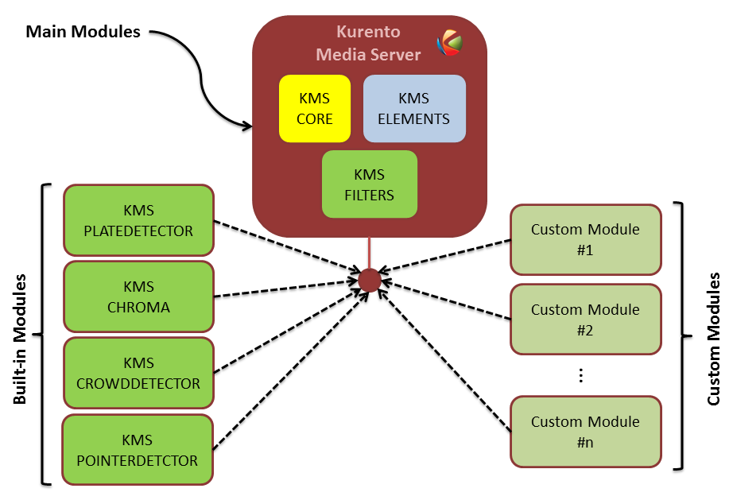
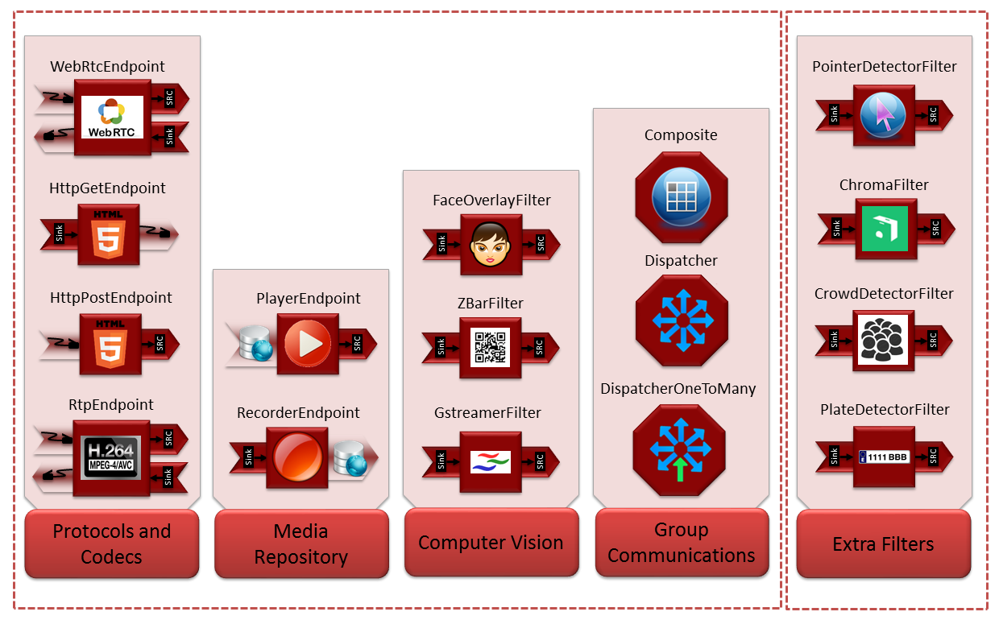

%%%%%%%%%%%%%%%
Kurento Modules
%%%%%%%%%%%%%%%

Kurento is a pluggable framework. Each plugin in Kurento is called **module**.
We classify Kurento modules into three groups, namely:

* Main modules. Incorporated out of the box with Kurento Media Server

   * ``kms-core``: Main components of Kurento Media Server.
   * ``kms-elements``: Implementation of Kurento Media Elements
     (``WebRtcEndpoint``, ``PlayerEndpoint``, and so on).
   * ``kms-filters``: Implementation of Kurento Filters
     (``FaceOverlayFilter``, ``ZBarFilter``, ``GStreamerFilter``).

* Built-in modules. Extra modules developed by the Kurento team to enhance the
  basic capabilities of Kurento Media Server. So far, there are four built-in
  modules, namely:

   * ``kms-pointerdetector``: Filter that detects pointers in video streams
     based on color tracking. The command to install this module is:

     .. sourcecode:: console

        sudo apt-get install kms-pointerdetector

   * ``kms-chroma``: Filter that makes transparent a color range in the top
     layer, revealing another image behind.

     .. sourcecode:: console

        sudo apt-get install kms-chroma

   * ``kms-crowddetector``: Filter that detects people agglomeration in
     video streams.

     .. sourcecode:: console

        sudo apt-get install kms-crowddetector

   * ``kms-platedetector``: Filter that detects vehicle plates in video
     streams.

     .. sourcecode:: console

        sudo apt-get install kms-platedetector

* Custom modules. Extensions to Kurento Media Server which provides new media
  capabilities. If you are planning to develop your own custom module, please
  take a look to the following page:

.. toctree:: :maxdepth: 1

   How to create Kurento modules </mastering/develop_kurento_modules>

The following picture shows an schematic view of the Kurento Media Server as
described before:

   **Kurento modules architecture**.
   *Kurento Media Server can be extended with built-it modules (crowddetector,
   pointerdetector, chroma, platedetector) and also with other custom modules.*

Taking into account the built-in modules, the Kurento toolbox is extended as
follows:

   **Extended Kurento Toolbox**.
   *The basic Kurento toolbox (left side of the picture) is extended with more
   computer vision and augmented reality filters (right side of the picture)
   provided by the built-in modules.*

The remainder of this page is structured in four sections in which the built-in
modules (``kms-pointerdetector``, ``kms-chroma``, ``kms-crowddetector``,
``kms-platedetector``) are used to develop simple applications (tutorials)
aimed to show how to use them.

Module Tutorial 1 - Pointer Detector Filter
===========================================

This web application consists on a `WebRTC`:term: video communication in mirror
(*loopback*) with a pointer tracking filter element.

.. toctree:: :maxdepth: 1

   Java </tutorials/java/module-1-pointerdetector>
   Browser JavaScript </tutorials/js/module-1-pointerdetector>
   Node.js </tutorials/node/module-1-pointerdetector>

Module Tutorial 2 - Chroma Filter
=================================

This web application consists on a `WebRTC`:term: video communication in mirror
(*loopback*) with a chroma filter element.

.. toctree:: :maxdepth: 1

   Java </tutorials/java/module-2-chromafilter>
   Browser JavaScript </tutorials/js/module-2-chromafilter>
   Node.js </tutorials/node/module-2-chromafilter>

Module Tutorial 3 - Crowd Detector Filter
=========================================

This web application consists on a `WebRTC`:term: video communication in mirror
(*loopback*) with a crowd detector filter. This filter detects people
agglomeration in video streams.

.. toctree:: :maxdepth: 1

   Java </tutorials/java/module-3-crowddetector>
   Browser JavaScript </tutorials/js/module-3-crowddetector>
   Node.js </tutorials/node/module-3-crowddetector>

Module Tutorial 4 - Plate Detector Filter
=========================================

This web application consists on a `WebRTC`:term: video communication in mirror
(*loopback*) with a plate detector filter element.

.. toctree:: :maxdepth: 1

   Java </tutorials/java/module-4-platedetector>
   Browser JavaScript </tutorials/js/module-4-platedetector>
   Node.js </tutorials/node/module-4-platedetector>
