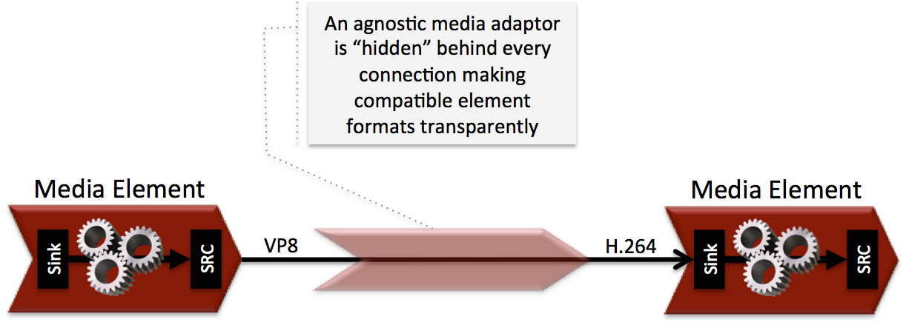

.. basic_media_concepts

%%%%%%%%%%%%%%
Media Concepts
%%%%%%%%%%%%%%

Streaming
=========

There are several streaming concepts that might be of interest in order to know
the precise behaviour that can be expected when adding multimedia resources to
applications.

Any streaming protocol requires two main components: a *control function* to
manage connection setup and a *media function*, that actually provides media
process & transfer capabilities. For true streaming protocols, like *RTP*,
*RTSP*, *RTMP* or *WebRTC* there is a clear differentiation between both
functions. Actually *RTP* is the media function of the *RTSP* protocol. *RTP*
can also be used in conjunction with other control protocols like *SIP* or
*XMPP*. *WebRTC* is a media function like *RTP* and it also requires a control
protocol that negotiates connection setup.

Streaming over *HTTP* (a.k.a. *HTML5 streaming*) is somehow special because
*HTTP* is not a protocol designed for media transfer. *HTML5 streaming*
sessions starts with the browser sending a GET request to the server. In this
step both: browser and server play the *control function* role. The server then
maps the URL to the actual resource, encapsulates its content in the response
and sends it back to the ``<video>`` component, just like any download
operation. Now browser and server switch to the *media function*. There isn't a
clear differentiation between control and media functions that are played
sequentially by the same element in both sides. Apart form this function mixup,
many people will argue the *HTTP* is not really a streaming protocol, since
there is no relation between media transfer pace and playing pace, i.e. the
network transfer rate is not limited by the media consumption rate and you
might find situations where the whole content of a 1 hour video is already
downloaded when still playing the first minute.

There is quite an important and somehow confusing concept related to the
capability to jump to a time position within a stream. This operation is
normally called *SEEK* and streams that supports it are called *seek-able*.
Those not supporting *SEEK* operation are called *live* or *non-seek-able*.
There are two conditions a stream must meet in order to be *seek-able*. First,
the control protocol must provide a *SEEK* command and second, the media
resource must be completely available before the stream starts transmission.
The reason for the second condition is because seeks must specify somehow the
file position where the stream must jump and that requires to know in advance
the size or length of the media resource and hence the whole resource must be
available in advance. Streaming protocols like *RTSP* and *HTTP* use header
``Range`` as a mean to build seek command. When the ``<video>`` component in an
*HTML5* application request a seek operation, the browser sends a new GET
request with the appropriate ``Range`` header. But this is only available if
the server provided the resource size in advance in the first request (the one
that initiated the stream). If resource size is not available at start time,
the video component does not show any kind of progress bar, switching into
*live* mode. *Kurento* is currently supporting only *live* mode, independently
of the prior availabily of the media resource.

When designing streaming services it is also very important to determine the
type of service that is being offered. There are two main classifications for
streaming services: *Video on demand* (*VoD*) and *Broadcast*. Main difference
between these two services is the streaming time scale. In *Broadcast* mode any
new client connecting to the streaming service assumes the time scale defined
by the source, and this time scale is shared among all connected clients. In
*VoD* service a new time scale is built for each client. The client not only
selects resource, but also the starting time. When many *VoD* clients access
the same resource, each one has its own time scale, and each time scale is
reset if the client breaks the connection. *Kurento* is currently supporting
Broadcast services, but in future versions it will also support true *VoD*
mode.

Agnostic media adaptor
======================

Using the Kurento Clients, developers are able to compose the available media
elements, getting the desired pipeline. There is a challenge in this scheme, as
different media elements might require different input media formats than the
output produced by their preceding element in the chain. For example, if we
want to connect a WebRTC (VP8 encoded) or a RTP (H.264/H.263 encoded) video
stream to a face recognition media element implemented to read raw RGB format,
a transcoding is necessary.

Developers, specially during the initial phases of application development,
might want to simplify development and abstract this heterogeneity, so Kurento
provides an automatic converter of media formats called the
:term:`agnostic media adaptor <agnostic, media>`. Whenever a media element is
connected to another media element’s, Kurento verifies if media adaption and
transcoding is necessary and, in case it is, it transparently incorporates the
appropriate transformations making possible the chaining of the two elements
into the resulting pipeline.

Hence, this *agnostic media adaptor* capability fully abstracts all the
complexities of media codecs and formats. This may significantly accelerate the
development process, specially when developers are not multimedia technology
experts. However, there is a price to pay. Transcoding may be a very CPU
expensive operation. The inappropriate design of pipelines that chain media
elements in a way that unnecessarily alternate codecs (e.g. going from H.264,
to raw, to H.264 to raw again) will lead to very poor performance of
applications.

   **Media Adaptor**.

   *The agnostic media capability adapts formats between heterogeneous
   media elements making transparent for application developers all
   complexities of media representation and encoding.*
