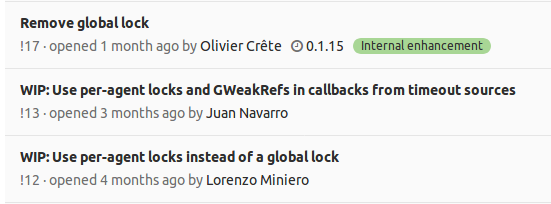
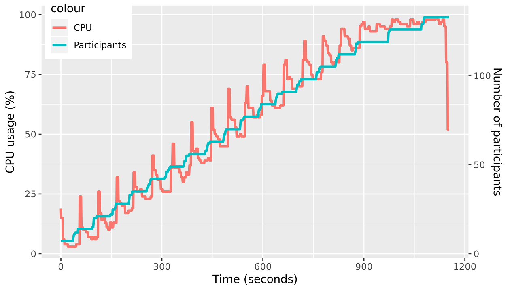

================
6.9.0 (Dec 2018)
================

(lib)Nicer and performant
=========================

Howdy!

A new release of Kurento Media Server brings huge stability and performance improvements.

Until recently, some Kurento users had been suffering `a fatal bug <https://github.com/Kurento/bugtracker/issues/247>`__ which would cause crashes and segmentation faults in some specific configurations, related to abruptly interrupted TCP connections. Thanks to the invaluable help of `Olivier Crête <https://gitlab.freedesktop.org/ocrete>`__, who is the main maintainer and developer of the **libnice** library, `this bug <https://gitlab.freedesktop.org/libnice/libnice/issues/33>`__ has been fixed and all projects that make use of this library are now able to benefit from the fix.

Kurento is of course one of these projects, making use of the *libnice* library to provide WebRTC compatibility. Starting from version 6.9.0, the latest improvements made to the *libnice* library have been integrated, and now all related crashes have stopped happening. Once again, we want to send **a huge thank you to Olivier** for his great work!

Another relevant topic for this release is all the effort directed at creating proper test infrastructure to perform **load and stress testing** with Kurento Media Server. We pushed forward to unify some work that had been laying around in different branches, and another `high-impact patch <https://gitlab.freedesktop.org/libnice/libnice/merge_requests/13>`__ ended up merged into mainline *libnice*. This time, removing a global lock that caused a performance cap.

Our intention has been to raise the number of simultaneous streams that the media server is able to sustain, as a direct response to the lackluster results that Kurento obtained in a recent benchmark / comparison between WebRTC implementations, `published in webrtcH4cKS <https://webrtchacks.com/sfu-load-testing/>`__ a couple of months ago. For this purpose, one of the hard tasks was to create a custom stress test that could be used as proof for Kurento capabilities; at first we were able to reproduce the reduced performance shown in the published benchmark, but as of latest weeks, Kurento has been more on par with other solutions:

- Kurento was able to support a maximum of **133** simultaneously connected users (browsers): **19 conference rooms with 7 users each**.
- Due to the SFU architecture, this means that KMS sustained **133 inbound streams**, and **798 outbound streams**.
- The test machine was an **8-core**, **16GB RAM** instance on AWS.
- Test videos are **540×360** in size.
- All participants were simulated with Chrome browsers, so the video formats were always compatible between senders and receivers. This is a very important detail because it means that video :term:`transcoding <Agnostic media>` ("*on-the-fly adaptation of codecs and formats between incompatible clients*") was not necessary and thus it was inactive.

During these stress tests, CPU usage grew with number of participants, and RAM usage stayed at around 25% (4GB):

.. image:: v6_9_0/test_load_ram.png
   :width: 45%
   :align: right
   :alt:   RAM usage during the load tests

Next is a summary of all additions, changes and/or fixes that are included in this release:

Added
=====

- [kms-elements] The port range that *PlayerEndpoint* uses for incoming RTP streams can now be configured with the ``rtspClientPortRange`` property in ``/etc/kurento/modules/kurento/PlayerEndpoint.conf.ini``. Thanks `Mislav Čakarić <https://github.com/chax>`__ for the `Pull Request #14 <https://github.com/Kurento/kms-elements/pull/14>`__!

- [kms-omni-build] The ``bin/`` folder now contains a set of scripts that help developers run Valgrind to find memory leaks and access errors.

- [doc-kurento] Our documentation has received a big bump in the project management section, this time related to how our End-to-End tests are designed and how Kurento developers can use them. This has little to no relevance to end users, but it's a first step into the long-term objective of letting developers who use Kurento have better knowledge about our testing software.

  If you want to have a look, check out the :doc:`Testing section </dev/testing>`. Thanks `Boni García <https://github.com/bonigarcia>`__ for `all the work <https://github.com/Kurento/doc-kurento/search?o=desc&q=author%3Abonigarcia+author-date%3A2018-11-08..2018-12-10&s=author-date&type=Commits>`__!

Changed
=======

- [kms-core] The default port range for incoming RTP streams (applicable to both *RtpEndpoint* and *WebRtcEndpoint*) was ``[0, 65535]``. This changed to exclude all privileged ports, which are system-protected and require root permissions to be used; now the port range is ``[1024, 65535]``.

  Of course, you are still able to configure a different range of ports by setting the `minPort` and/or `maxPort` properties in ``/etc/kurento/modules/kurento/BaseRtpEndpoint.conf.ini``.

- [kurento-media-server] The daemon settings file in ``/etc/default/kurento-media-server`` now disables colored output by default. This is useful to produce a clean error log file in ``/var/log/kurento-media-server/errors.log``.

- [kurento-media-server] There was some confusion surrounding how to configure the System Limits that Kurento needs for working, specifically the **Open File Descriptors limit**. These are configured by the daemon files during the service startup, but there was no error control and these limits could end up being *silently left with their default values* (which is a bad thing and a sure way to have performance issues with the media server). There are now controls in place that will set up some valid limits.

- [kurento-media-server] Error messages in ``/var/log/kurento-media-server/errors.log`` are now separated between executions of Kurento Media Server, with this line:

  .. code-block:: text

     <TIMESTAMP> -- New execution

  Before this change, all errors were appended without separation, which could become confusing and users had problems identifying where older executions finished and where the latest one started.

Fixed
=====

- [kurento-media-server] The daemon would crash if the debug log files couldn't be created for any reason (e.g. because of permission problems). After this fix, if log files cannot be created or accessed, file logging will be disabled and logging will revert back to being printed to *stdout*.
