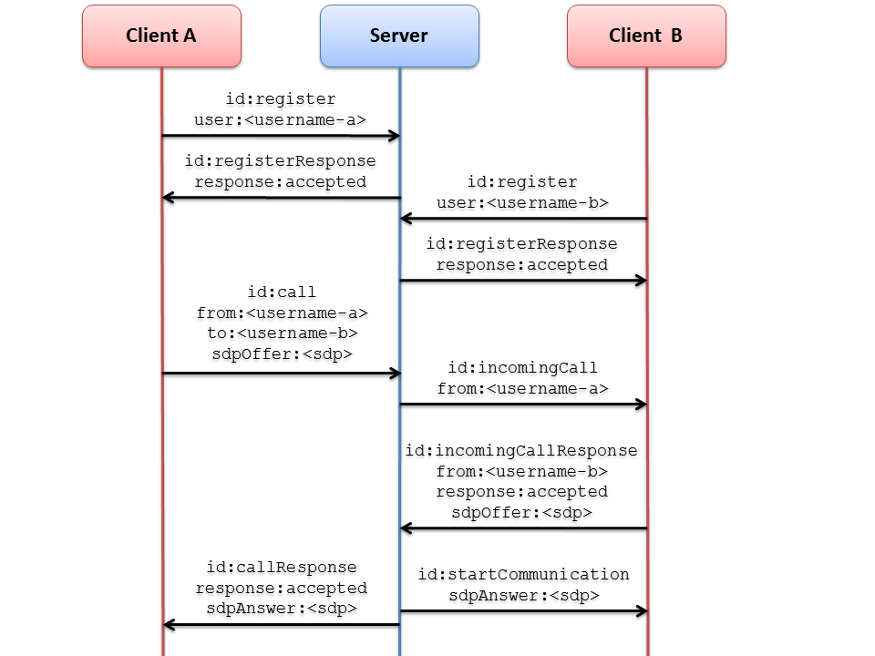

%%%%%%%%%%%%%%%%%%%%%
One to one video call
%%%%%%%%%%%%%%%%%%%%%

This web application consists on a WebRTC communication between two peers. In other words, this application is similar to a phone but also with video.

In the client-side we have two HTML5 video tags: one for the local stream and other for the remote stream. In the server-side we have the following media pipeline :

.. figure:: ../../images/kmf-webrtc-call-pipeline.png
   :align:   center
   :alt:     One to one video call media pipeline

The following picture shows an screenshot of this demo running in a web browser:

.. figure:: ../../images/kmf-webrtc-call-screenshot.png
   :align:   center
   :alt:     One to one video call screenshot
   :width: 600px

The complete source code of this demo can be found in `GitHub <https://github.com/Kurento/kmf-tutorial/tree/develop/kmf-webrtc-call>`_. 

Server-Side
===========

This demo has been developed using **Java** in the server-side. It uses `Spring Boot <http://projects.spring.io/spring-boot/>`_ to simplify deployment. This technology embeds an application server (Jetty) as a stand-alone application.

The main class of this demo is named `CallApp <https://github.com/Kurento/kmf-tutorial/blob/develop/kmf-webrtc-call/src/main/java/com/kurento/kmf/tutorial/call/CallApp.java>`_. As you can see, the *MediaPipelineFactory* is instantiated in this class as a Spring Bean. This class is used to create **Kurento Media Pipelines**, which are used to add media capabilities in your applications.

.. sourcecode:: java

    @Configuration
    @EnableWebSocket
    @EnableAutoConfiguration
    public class CallApp implements WebSocketConfigurer {

        @Bean
        public CallHandler callHandler() {
            return new CallHandler();
        }

        @Bean
        public UserRegistry registry() {
            return new UserRegistry();
        }

        @Bean
        public MediaPipelineFactory mediaPipelineFactory() {
            return KmfMediaApi.createMediaPipelineFactoryFromSystemProps();
        }

        public void registerWebSocketHandlers(WebSocketHandlerRegistry registry) {
            registry.addHandler(callHandler(), "/call");
        }

        public static void main(String[] args) throws Exception {
            SpringApplication application = new SpringApplication(CallApp.class);
            application.run(args);
        }

    }

Any media application should have two different channels for media and signaling. The media plane is the properly speaking stream transfer. In this example, the media plane will be the WebRTC stream. The signaling plane is composed by the messages exchange concerning to the establishment and control of the media. In this demo, the signaling plane is implemented using `WebSockets <https://www.websocket.org/>`_. In other words, the link between client-side and server-side in this demo is done be means of requests/responses through a WebSocket. The WebSocket of this demo is registered in the class before (`CallApp <https://github.com/Kurento/kmf-tutorial/blob/develop/kmf-webrtc-call/src/main/java/com/kurento/kmf/tutorial/call/CallApp.java>`_) in the method *registerWebSocketHandlers*. Concretely, the path */call* of the application server will listen to WebSockets requests.

We have designed a signaling protocol using `JSON <http://en.wikipedia.org/wiki/JSON>`_. The normal sequence would be as follows:

1. Two users are registered in the system
2. One peer start a call to another user, identified by its name
3. The called user accept the incoming call
4. The communication is established
5. One of the peers finishes the video communication

Of course this signaling protocol can be improved, for example implementing seeking user, ordered finished, among other functions. It has been designed in this way to be simple and help developers to understand how to use Kurento.

We use the Spring class *TextWebSocketHandler* to implement the WebSocket handler. Take a look to the `CallHandler <https://github.com/Kurento/kmf-tutorial/blob/develop/kmf-webrtc-call/src/main/java/com/kurento/kmf/tutorial/call/CallHandler.java>`_ class. The central piece of this class is the method *handleTextMessage*. This method implements the actions for requests, returning responses through the WebSocket. In other words, it implements the signaling protocol depicted in the figure before. In that figure, we can see that there are three different kind of incoming messages to the *Server* component: *register*, *call*, and *incommingCallResponse*. These messages are treated in the *switch* clause, taking the proper steps in each case.     

.. sourcecode:: java

    @RestController
    public class CallHandler extends TextWebSocketHandler {

        private static final Logger log = LoggerFactory
                .getLogger(CallHandler.class);
        private static final Gson gson = new GsonBuilder().create();

        @Autowired
        private MediaPipelineFactory mpf;

        @Autowired
        private UserRegistry registry;

        @Override
        public void handleTextMessage(WebSocketSession session, TextMessage message)
                throws Exception {
            JsonObject jsonMessage = gson.fromJson(message.getPayload(),
                    JsonObject.class);
            UserSession user = registry.getBySession(session);

            if (user != null) {
                log.debug("Incoming message from user '{}': {}", user.getName(),
                        jsonMessage);
            } else {
                log.debug("Incoming message from new user: {}", jsonMessage);
            }

            switch (jsonMessage.get("id").getAsString()) {
            case "register":
                register(session, jsonMessage);
                break;
            case "call":
                call(user, jsonMessage);
                break;
            case "incommingCallResponse":
                incommingCallResponse(user, jsonMessage);
                break;
            default:
                break;
            }
        }

        private void register(WebSocketSession session, JsonObject jsonMessage)
                throws IOException {
            String name = jsonMessage.getAsJsonPrimitive("name").getAsString();

            UserSession caller = new UserSession(session, name);
            String responseMsg = "accepted";
            if (name.isEmpty()) {
                responseMsg = "rejected: empty user name";
            } else if (registry.exists(name)) {
                responseMsg = "rejected: user '" + name + "' already registered";
            } else {
                registry.register(caller);
            }

            JsonObject response = new JsonObject();
            response.addProperty("id", "resgisterResponse");
            response.addProperty("response", responseMsg);
            caller.sendMessage(response);
        }

        // Rest of methods: call, incommingCallResponse

        @Override
        public void afterConnectionClosed(WebSocketSession session,
                CloseStatus status) throws Exception {
            registry.removeBySession(session);
        }

    }

The media logic in this demo is implemented in the class `CallMediaPipeline <https://github.com/Kurento/kmf-tutorial/blob/develop/kmf-webrtc-call/src/main/java/com/kurento/kmf/tutorial/call/CallMediaPipeline.java>`_. As you can see, the media pipeline of this demo is quite simple: two *WebRtcEndpoints* directly interconnected. 

.. sourcecode:: java

    public class CallMediaPipeline {

        private MediaPipeline mp;
        private WebRtcEndpoint callerWebRtcEP;
        private WebRtcEndpoint calleeWebRtcEP;

        public CallMediaPipeline(MediaPipelineFactory mpf) {
            this.mp = mpf.create();
            this.callerWebRtcEP = mp.newWebRtcEndpoint().build();
            this.calleeWebRtcEP = mp.newWebRtcEndpoint().build();

            this.callerWebRtcEP.connect(this.calleeWebRtcEP);
            this.calleeWebRtcEP.connect(this.callerWebRtcEP);
        }

        public String generateSdpAnswerForCaller(String sdpOffer) {
            return callerWebRtcEP.processOffer(sdpOffer);
        }

        public String generateSdpAnswerForCallee(String sdpOffer) {
            return calleeWebRtcEP.processOffer(sdpOffer);
        }

    }

As usual in WebRTC application, SDP (Session Description protocol) is used for negotiating session capabilities between the peers. Such negotiation happens based on the SDP offer and answer exchange mechanism. The SDP offers are sent respectively by peers, then are processed in the server-side to obtain the SDP answer, which is then sent to the peers.

Client-Side
===========

Let's move now to the client-side of the application. To call the previously created WebSocket service in the server-side, we use JavaScript class *WebSocket*. In addition, we use an specific Kurento JavaScript library called *kws-utils.js* to simplify the WebRTC interaction with the server. These libraries are linked in the `index.html <https://github.com/Kurento/kmf-tutorial/blob/develop/kmf-webrtc-call/src/main/resources/static/index.html>`_ web page, and are used in the `index.js <https://github.com/Kurento/kmf-tutorial/blob/develop/kmf-webrtc-call/src/main/resources/static/js/index.js>`_. 

In the following snippet we can see the creation of the WebSocket (variable *ws*) in the path */call*. Then, the *onmessage* listener of the WebSocket is used to implement the JSON signaling protocol in the client-side. Notice that there are four incoming messages to client: *resgisterResponse*, *callResponse*, *incommingCall*, and *startCommunication*. Convenient actions are taken to implement each step in the communication. For example, in functions *call* and *incommingCall* (for caller and callee respectively), the function *startSendRecv* of *kws-utils* is used to start a WebRTC communication.

.. sourcecode:: javascript

    var ws = new WebSocket('ws://' + location.host + '/call');

    ws.onmessage = function(message) {
        var parsedMessage = JSON.parse(message.data);
        console.info('Received message: ' + message.data);

        switch (parsedMessage.id) {
        case 'resgisterResponse':
            resgisterResponse(parsedMessage);
            break;
        case 'callResponse':
            callResponse(parsedMessage);
            break;
        case 'incommingCall':
            incommingCall(parsedMessage);
            break;
        case 'startCommunication':
            startCommunication(parsedMessage);
            break;
        default:
            console.error('Unrecognized message', parsedMessage);
        }
    }

    function incommingCall(message) {
        if (confirm('User ' + message.from
                + ' is calling you. Do you accept the call?')) {
            showSpinner(videoInput, videoOutput);
            webRtcPeer = kwsUtils.WebRtcPeer.startSendRecv(videoInput, videoOutput,
                    function(sdp, wp) {
                        var response = {
                            id : 'incommingCallResponse',
                            from : message.from,
                            callResponse : 'accept',
                            sdpOffer : sdp
                        };
                        sendMessage(response);
                    });
        } else {
            var response = {
                id : 'incommingCallResponse',
                from : message.from,
                callResponse : 'reject'
            };
            sendMessage(response);
            stop();
        }
    }

    function call() {
        showSpinner(videoInput, videoOutput);

        kwsUtils.WebRtcPeer.startSendRecv(videoInput, videoOutput, function(
                offerSdp, wp) {
            webRtcPeer = wp;
            console.log('Invoking SDP offer callback function');
            var message = {
                id : 'call',
                from : document.getElementById('name').value,
                to : document.getElementById('peer').value,
                sdpOffer : offerSdp
            };
            sendMessage(message);
        });
    }

How to run this demo
====================

`Maven <http://maven.apache.org/>`_ has been used to package this demo. The relevant part of the *pom.xml* is where Kurento dependencies as declared. As the following snippet shows, we need two dependencies: the Java dependency (*kmf-media-api*) for the server-side and the JavaScript utility library (*kws-utils*) for the client-side:   

.. sourcecode:: xml

    <dependencies>
        <dependency>
            <groupId>com.kurento.kmf</groupId>
            <artifactId>kmf-media-api</artifactId>
            <version>${project.version}</version>
        </dependency>
        <dependency>
            <groupId>com.kurento.kws</groupId>
            <artifactId>kws-utils</artifactId>
            <version>${kws.version}</version>
        </dependency>
    </dependencies>

First of all, you should install Kurento Media Server to run this demo. Please visit the `installation guide <../../Installation_Guide.rst>`_ for further information.

This demo is assuming that you have a Kurento Media Server installed and running in your local machine. If so, to launch the demo you need to clone the GitHub project where this demo is hosted, and then run the main class, as follows:

.. sourcecode:: bash

    $ git clone https://github.com/Kurento/kmf-tutorial.git
    $ cd kmf-webrtc-call
    $ mvn exec:java -Dexec.mainClass="com.kurento.kmf.tutorial.call.CallApp"

The web application starts on port 8080 in the localhost by default. Therefore, open that URL in WebRTC compliant browser (Chrome, Firefox).

If your Kurento Media Server is not hosted in the localhost (see `advanced installation guide <../../Advanced_Installation_Guide.rst>`_), then you need to specify your custom values to reach the media server. The accepted parameters to launch the demo are:

- thrift.kms.address: Specifies the address of the Kurento Media Server Thrift IP and port. The default value is "127.0.0.1:9090".
- thrift.kmf.address: Specifies the address of the Media API Thrift IP and port. The default value is "127.0.0.1:9191".

In this case, you would need to run the application as follows:

.. sourcecode:: bash

    $ mvn exec:java -Dexec.mainClass="com.kurento.kmf.tutorial.call.CallApp" \
    -Dthrift.kms.address=127.0.0.1:9090 -Dthrift.kmf.address=127.0.0.1:9191
