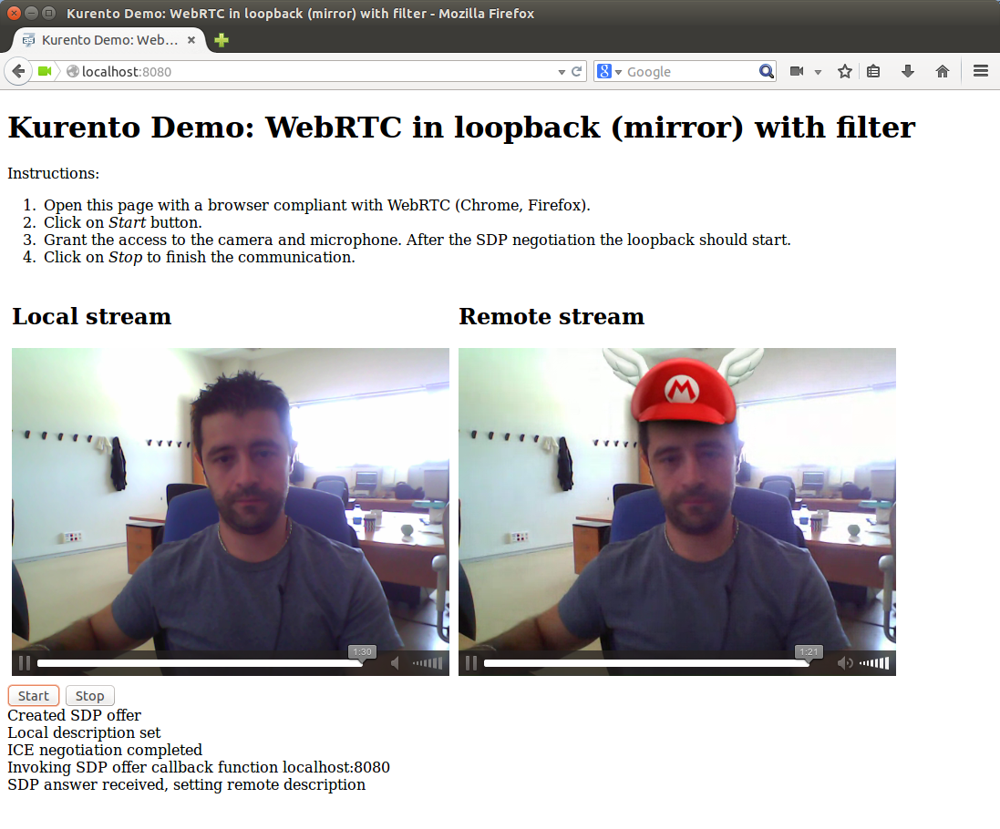

%%%%%%%%%%%%%%%%%%%%%%%%%%%%%%%%%%
Loopback video call with filtering
%%%%%%%%%%%%%%%%%%%%%%%%%%%%%%%%%%

This web application consists on a WebRTC communication in mirror, i.e., a media loopback.

In the client-side of the application we have two HTML5 video tags: one for the local stream and other for the remote stream. This local remote stream is processed in the Kurento Media Server and then is returned to the client (*remote stream*). In this processing an extra media element is introduced: a *FaceOverlay* filter. This element is an example of augmented reality media capability since it detects faces on the media overlaying a custom image in the media (in this example, a `Super Mario hat <http://files.kurento.org/imgs/mario-wings.png>`_).

Thus, the media pipeline implemented in this demo is illustrated in the following picture:

.. figure:: ../../images/kmf-webrtc-loopback-pipeline.png
   :align:   center
   :alt:     Loopback video call with filtering media pipeline

The following picture shows an screenshot of this demo running in a web browser:

This demo is an example of a quite simple application developed with Kurento. You can see it as the *Hello World* application for Kurento. The following sections describe in detail the server-side, the client-side, and how to run the demo.

The complete source code of this demo can be found in `GitHub <https://github.com/Kurento/kmf-tutorial/tree/develop/kmf-webrtc-loopback>`_. 

Server-Side
===========

This demo has been developed using **Java** in the server-side. It uses `Spring Boot <http://projects.spring.io/spring-boot/>`_ to simplify deployment. This technology embeds an application server (Jetty) as a stand-alone application.

The main class of this demo is named `LoopbackApp <https://github.com/Kurento/kmf-tutorial/blob/develop/kmf-webrtc-loopback/src/main/java/com/kurento/kmf/tutorial/loopback/LoopbackApp.java>`_. As you can see, the *MediaPipelineFactory* is instantiated in this class as a Spring Bean. This class is used to create **Kurento Media Pipelines**, which are used to add media capabilities in your applications. 

.. sourcecode:: java

    @ComponentScan
    @EnableAutoConfiguration
    public class LoopbackApp {

    	@Bean
    	MediaPipelineFactory mediaPipelineFactory() {
		    return KmfMediaApi.createMediaPipelineFactoryFromSystemProps();
	    }

    	public static void main(String[] args) throws Exception {
	    	SpringApplication application = new SpringApplication(LoopbackApp.class);
		    application.run(args);
	    }
    }

Any media application should have two different channels for media and signaling. The media plane is the properly speaking stream transfer. In this example, the media plane will be the WebRTC stream. The signaling plane is composed by the messages exchange concerning to the establishment and control of the media. In this demo, the signaling plane is implemented using `REST <http://en.wikipedia.org/wiki/Representational_state_transfer>`_. In other words, the link between client-side and server-side in this demo is done be means of REST requests/responses. Specifically, we use the Spring annotation *RestController* to implement this REST service in the server-side. Take a look to the `LoopbackController <https://github.com/Kurento/kmf-tutorial/blob/develop/kmf-webrtc-loopback/src/main/java/com/kurento/kmf/tutorial/loopback/LoopbackController.java>`_ class:     

.. sourcecode:: java

    @RestController
    public class LoopbackController {

    	private final Logger log = LoggerFactory.getLogger(LoopbackController.class);

	    @Autowired
	    private MediaPipelineFactory mpf;

	    @RequestMapping(value = "/webrtc", method = RequestMethod.POST)
	    private String processRequest(@RequestBody String sdpOffer)
	    		throws IOException {

		    // Media Logic
		    MediaPipeline mp = mpf.create();
		    WebRtcEndpoint webRtcEndpoint = mp.newWebRtcEndpoint().build();
		    FaceOverlayFilter faceOverlayFilter = mp.newFaceOverlayFilter().build();
		    faceOverlayFilter.setOverlayedImage(
			    	"http://files.kurento.org/imgs/mario-wings.png", -0.35F, -1.2F,
				    1.6F, 1.6F);
		    webRtcEndpoint.connect(faceOverlayFilter);
		    faceOverlayFilter.connect(webRtcEndpoint);

		    // SDP negotiation (offer and answer)
	    	sdpOffer = URLDecoder.decode(sdpOffer, "UTF-8");
	    	log.debug("Received SDP offer: {}", sdpOffer);
		    String responseSdp = webRtcEndpoint.processOffer(sdpOffer);
		    log.debug("Sent SDP response: {}", responseSdp);

		    return responseSdp;
	    }

    }

This class exposes a service which is requested by the client-side. This service is implemented in the method *processRequest*. Requests to the path */webrtc* using POST will be attended by this method. In the body of the method *processRequest* we can seen two main parts: media logic and SDP negotiation.

Regarding media logic, this is the part in which the application uses media capabilities exposed by Kurento. In other words, the media pipeline is implemented here. To that aim, the bean *MediaPipelineFactory* is used to create a *MediaPipeline*. Using this *MediaPipeline*, the media elements are created and connected.   

In WebRTC, SDP (Session Description protocol) is used for negotiating session capabilities between the peers. Such negotiation happens based on the SDP offer and answer exchange mechanism. This negotiation is implemented in the second part of the method *processRequest*, using the SDP offer obtained from the client, and returning a SDP answer. 

Client-Side
===========

Let's move now to the client-side of the application. To call the previously created REST service in the server-side, we use the JavaScript library `jQuery <http://jquery.com/>`_. In addition, we use an specific Kurento JavaScript library called *kws-utils.js* to simplify the WebRTC interaction with the server.

These libraries are linked in the `index.html <https://github.com/Kurento/kmf-tutorial/blob/develop/kmf-webrtc-loopback/src/main/resources/static/index.html>`_ web page, and are used in the `index.js <https://github.com/Kurento/kmf-tutorial/blob/develop/kmf-webrtc-loopback/src/main/resources/static/js/index.js>`_. The most relevant part of this file is the *start* function. In this function we can see how jQuery is used to call the path */webrtc*, where the REST service is listening in the server-side. The function *startSendRecv* of *kws-utils* is used to start a WebRTC communciation, using the HTML video tags with id *videoInput* (local stream) and *videoOutput* (remote stream). 

.. sourcecode:: javascript

    function start() {
    	showSpinner(videoInput, videoOutput);

    	webRtcPeer = kwsUtils.WebRtcPeer.startSendRecv(videoInput, videoOutput,
	    		function(offerSdp, wp) {
		    		console.log('Invoking SDP offer callback function '
			    			+ location.host);
    				$.ajax({
	    				url : location.protocol + '/webrtc',
		    			type : 'POST',
			    		dataType : 'text',
				    	data : offerSdp,
					    success : function(data) {
						    wp.processSdpAnswer(data);
    					},
	    				error : function(jqXHR, textStatus, error) {
		    				console.error(error);
			    		}
				    });
			    });
    }

How to run this demo
====================

`Maven <http://maven.apache.org/>`_ has been used to package this demo. The relevant part of the *pom.xml* is where Kurento dependencies as declared. As the following snippet shows, we need two dependencies: the Java dependency (*kmf-media-api*) for the server-side and the JavaScript utility library (*kws-utils*) for the client-side:   

.. sourcecode:: xml

	<dependencies>
		<dependency>
			<groupId>com.kurento.kmf</groupId>
			<artifactId>kmf-media-api</artifactId>
			<version>${project.version}</version>
		</dependency>
		<dependency>
			<groupId>com.kurento.kws</groupId>
			<artifactId>kws-utils</artifactId>
			<version>${kws.version}</version>
		</dependency>
	</dependencies>

First of all, you should install Kurento Media Server to run this demo. Please visit the `installation guide <../../Installation_Guide.rst>`_ for further information.

This demo is assuming that you have a Kurento Media Server installed and running in your local machine. If so, to launch the demo you need to clone the GitHub project where this demo is hosted, and then run the main class, as follows:

.. sourcecode:: bash

	$ git clone https://github.com/Kurento/kmf-tutorial.git
	$ cd kmf-webrtc-loopback
	$ mvn exec:java -Dexec.mainClass="com.kurento.kmf.tutorial.loopback.LoopbackApp"

The web application starts on port 8080 in the localhost by default. Therefore, open that URL in WebRTC compliant browser (Chrome, Firefox).

If your Kurento Media Server is not hosted in the localhost (see `advanced installation guide <../../Advanced_Installation_Guide.rst>`_), then you need to specify your custom values to reach the media server. The accepted parameters to launch the demo are:

- thrift.kms.address: Specifies the address of the Kurento Media Server Thrift IP and port. The default value is "127.0.0.1:9090".
- thrift.kmf.address: Specifies the address of the Media API Thrift IP and port. The default value is "127.0.0.1:9191".

In this case, you would need to run the application as follows: 
 
.. sourcecode:: bash

	$ mvn exec:java -Dexec.mainClass="com.kurento.kmf.tutorial.loopback.LoopbackApp" \
	-Dthrift.kms.address=127.0.0.1:9090 -Dthrift.kmf.address=127.0.0.1:9191
