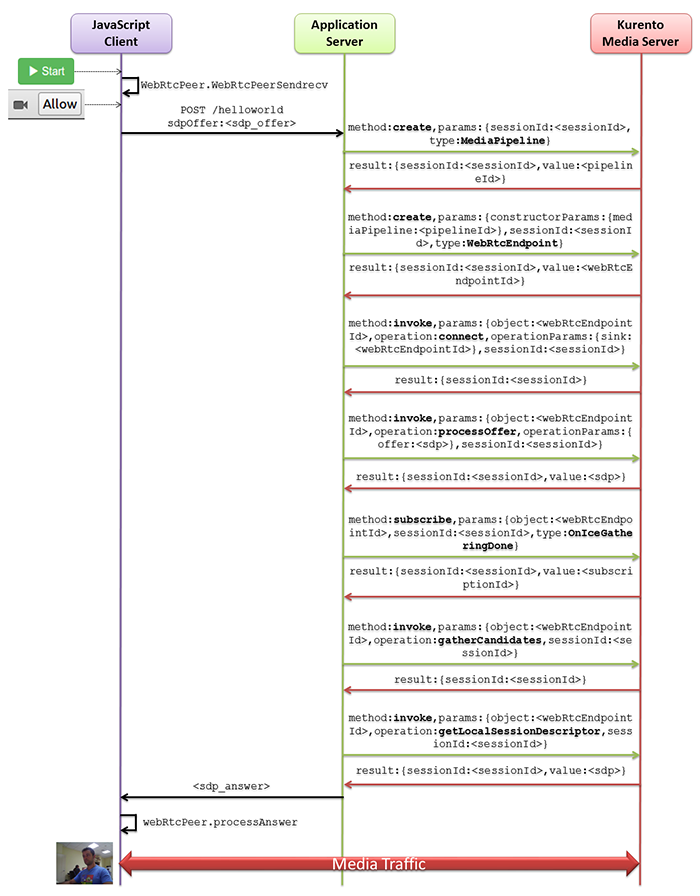

%%%%%%%%%%%%%%%%%%%%%%%%%%%%%
Java Tutorial 1 - Hello world
%%%%%%%%%%%%%%%%%%%%%%%%%%%%%

This web application has been designed to introduce the principles of
programming with Kurento for Java developers. It consists on a `WebRTC`:term:
video communication in mirror (*loopback*). This tutorial assumes you have
basic knowledge on JavaScript, HTML and WebRTC. We also recommend reading the
:doc:`Introducing Kurento <../../introducing_kurento>` section before starting
this tutorial.

For the impatient: running this example
=======================================

You need to have installed the Kurento Media Server before running this example.
Read the `installation guide <../../Installation_Guide.rst>`_ for further
information.

To launch the application you need to clone the GitHub project where this demo
is hosted and then run the main class, as follows:

.. sourcecode:: shell

    git clone https://github.com/Kurento/kurento-java-tutorial.git
    cd kurento-hello-world
    mvn compile exec:java -Dexec.mainClass="org.kurento.tutorial.helloworld.HelloWorldApp"

Access the application connecting to the URL http://localhost:8080/ through a
WebRTC capable browser (Chrome, Firefox).

Understanding this example
==========================

Kurento provides developers a **Kurento Java Client** to control
**Kurento Media Server**. This client library can be used in any kind of Java
application: Server Side Web, Desktop, Android, etc. It is compatible with any
framework like Java EE, Spring, Play, Vert.x, Swing and JavaFX.

This *hello world* demo is one of the simplest web application you can create
with Kurento. The following picture shows an screenshot of this demo running:

.. figure:: ../../images/kurento-java-tutorial-1-helloworld-screenshot.png 
   :align:   center
   :alt:     Kurento Hello World Screenshot: WebRTC in loopback
   :width: 600px

   *Kurento Hello World Screenshot: WebRTC in loopback*

The interface of the application (an HTML web page) is composed by two HTML5
video tags: one showing the local stream (as captured by the device webcam) and
the other showing the remote stream sent by the media server back to the client.

The logic of the application is quite simple: the local stream is sent to the
Kurento Media Server, which returns it back to the client without
modifications. To implement this behavior we need to create a
`Media Pipeline`:term: composed by a single `Media Element`:term:, i.e. a
**WebRtcEndpoint**, which holds the capability of exchanging full-duplex
(bidirectional) WebRTC media flows. This media element is connected to itself
so that the media it receives (from browser) is send back (to browser). This
media pipeline is illustrated in the following picture:

.. figure:: ../../images/kurento-java-tutorial-1-helloworld-pipeline.png
   :align:   center
   :alt:     Kurento Hello World Media Pipeline in context
   :width: 600px

   *Kurento Hello World Media Pipeline in context*

This is a web application, and therefore it follows a client-server
architecture. At the client-side, the logic is implemented in **JavaScript**.
At the server-side we use a Java application server consuming the
**Kurento Java Client** API to control **Kurento Media Server** capabilities.
All in all, the high level architecture of this demo is three-tier. To
communicate these entities the following technologies are used:

* `REST`:term:: Communication between JavaScript client-side and Java
  application server-side.

* `WebSocket`:term:: Communication between the Kurento Java Client and the
  Kurento Media Server. This communication is implemented by the
  **Kurento Protocol**. For further information, please see this
  :doc:`page <../../mastering/kurento_protocol>` of the documentation.

The diagram below shows an complete sequence diagram from the interactions with
the application interface to: i) JavaScript logic; ii) Application server logic
(which uses the Kurento Java Client); iii) Kurento Media Server.

   *Complete sequence diagram of Kurento Hello World (WebRTC in loopbak) demo*

.. note::

   The communication between client and server-side does not need to be
   REST. For simplicity, in this tutorial REST has been used. In later examples
   a more complex signaling between client and server has been implement,
   using WebSockets. Please see later tutorials for further information.

The following sections analyze in deep the server (Java) and client-side
(JavaScript) code of this application. The complete source code can be found in
`GitHub <https://github.com/Kurento/kurento-tutorial-java/tree/master/kurento-hello-world>`_.

Application Server Logic
========================

This demo has been developed using **Java** in the server-side with
`Spring Boot`:term: framework. This technology can be used to embed the Tomcat
web server in the application and thus simplify the development process.

.. note::

   You can use whatever Java server side technology you prefer to build web
   applications with Kurento. For example, a pure Java EE application, SIP 
   Servlets, Play, Vert.x, etc. Here we chose Spring Boot for convenience.

In the following figure you can see a class diagram of the server side code:

.. digraph:: HelloWorld
   :caption: Server-side class diagram of the HelloWorld app

   size="12,8";
   fontname = "Bitstream Vera Sans"
   fontsize = 8

   node [
        fontname = "Bitstream Vera Sans"
        fontsize = 8
        shape = "record"
         style=filled
        fillcolor = "#E7F2FA"
   ]

   edge [
        fontname = "Bitstream Vera Sans"
        fontsize = 8
        arrowhead = "vee"
   ]

   HelloWorldApp -> HelloWorldController;
   HelloWorldApp -> KurentoClient;
   HelloWorldController -> KurentoClient [constraint = false]

The main class of this demo is
`HelloWorldApp <https://github.com/Kurento/kurento-tutorial-java/blob/master/kurento-hello-world/src/main/java/org/kurento/tutorial/helloworld/HelloWorldApp.java>`_.
As you can see, the *KurentoClient* is instantiated in this class as a Spring
Bean. This bean is used to create **Kurento Media Pipelines**, which are used
to add media capabilities to the application. In this instantiation we see that
we need to specify to the client library the location of the Kurento Media
Server. In this example, we assume it's located at *localhost* listening in
port 8888. If you reproduce this example you'll need to insert the specific
location of your Kurento Media Server instance there.

Once the *Kurento Client* has been instantiated, you are ready for communicating
with Kurento Media Server and controlling its multimedia capabilities.

.. sourcecode:: java

   @ComponentScan
   @EnableAutoConfiguration
   public class HelloWorldApp {
   
      @Bean
      public KurentoClient kurentoClient() {
         return KurentoClient.create("ws://localhost:8888/kurento");
      }
   
      public static void main(String[] args) throws Exception {
         new SpringApplication(HelloWorldApp.class).run(args);
      }
   }

As introduced before, we use `REST`:term: to communicate the client with the
Java application server. Specifically, we use the Spring annotation
*@RestController* to implement REST services in the server-side. Take a look to
the
`HelloWorldController <https://github.com/Kurento/kurento-java-tutorial/blob/master/tutorial-1-hello-world/src/main/java/org/kurento/tutorial/helloworld/HelloWorldController.java>`_
class:

.. sourcecode:: java

   @RestController
   public class HelloWorldController {
   
      @Autowired
      private KurentoClient kurento;
   
      @RequestMapping(value = "/helloworld", method = RequestMethod.POST)
      private String processRequest(@RequestBody String sdpOffer)
            throws IOException {
   
         // Media Logic
         MediaPipeline pipeline = kurento.createMediaPipeline();
         WebRtcEndpoint webRtcEndpoint = new WebRtcEndpoint.Builder(pipeline)
               .build();
         webRtcEndpoint.connect(webRtcEndpoint);
   
         // SDP negotiation (offer and answer)
         String responseSdp = webRtcEndpoint.processOffer(sdpOffer);
         return responseSdp;
      }
   
   }

The application logic is implemented in the method *processRequest*. POST
Requests to path */helloworld* will fire this method, whose execution has two
main parts:

 - **Configure media processing logic**: This is the part in which the
   application configures how Kurento has to process the media. In other words,
   the media pipeline is created here. To that aim, the object *KurentoClient*
   is used to create a *MediaPipeline* object. Using it, the media elements we
   need are created and connected. In this case, we only instantiate one
   *WebRtcEndpoint* for receiving the WebRTC stream and sending it back to the
   client.

 - **WebRTC SDP negotiation**: In WebRTC, an `SDP`:term: (Session Description
   protocol) is used for negotiating media exchanges between apps. Such
   negotiation happens based on the SDP offer and answer exchange mechanism. In
   this example we assume the SDP offer and answer contain all WebRTC ICE
   candidates. This negotiation is implemented in the second part of the method
   *processRequest*, using the SDP offer obtained from the browser client and
   returning a SDP answer generated by WebRtcEndpoint.

Client-Side Logic
=================

Let's move now to the client-side of the application, which follows
*Single Page Application* architecture (`SPA`:term:). To call the previously
created REST service, we use the JavaScript library `jQuery`:term:. In
addition, we use a Kurento JavaScript utilities library called
*kurento-utils.js* to simplify the WebRTC management in the browser.

These libraries are linked in the
`index.html <https://github.com/Kurento/kurento-tutorial-java/blob/master/kurento-hello-world/src/main/resources/static/index.html>`_
web page, and are used in the
`index.js <https://github.com/Kurento/kurento-tutorial-java/blob/master/kurento-hello-world/src/main/resources/static/js/index.js>`_.
In the *start* function we can see how jQuery is used to send a POST request to
the path */helloworld*, where the application server REST service is listening.
The function *WebRtcPeer.startSendRecv* abstracts the WebRTC internal details
(i.e. PeerConnection and getUserStream) and makes possible to start a
full-duplex WebRTC communication, using the HTML video tag with id *videoInput*
to show the video camera (local stream) and the video tag *videoOutput* to show
the remote stream provided by the Kurento Media Server.

.. sourcecode:: javascript

   var webRtcPeer;

   function start() {
      console.log("Starting video call ...");
      showSpinner(videoInput, videoOutput);
      webRtcPeer = kurentoUtils.WebRtcPeer.startSendRecv(videoInput, videoOutput, onOffer, onError);
   }

   function onOffer(sdpOffer) {
      console.info('Invoking SDP offer callback function ' + location.host);
      $.ajax({
         url : location.protocol + '/helloworld',
         type : 'POST',
         dataType : 'text',
         contentType : 'application/sdp',
         data : sdpOffer,
         success : function(sdpAnswer) {
            console.log("Received sdpAnswer from server. Processing ...");
            webRtcPeer.processSdpAnswer(sdpAnswer);
         },
         error : function(jqXHR, textStatus, error) {
            onError(error);
         }
      });
   }

   function onError(error) {
      console.error(error);
   }

Dependencies
============

This Java Spring application is implemented using `Maven`:term:. The relevant
part of the *pom.xml* is where Kurento dependencies are declared. As the
following snippet shows, we need two dependencies: the Kurento Client Java
dependency (*kurento-client*) and the JavaScript Kurento utility library
(*kurento-utils*) for the client-side:

.. sourcecode:: xml 

   <dependencies> 
      <dependency>
         <groupId>org.kurento</groupId>
         <artifactId>kurento-client</artifactId>
         <version>|version|</version>
      </dependency> 
      <dependency> 
         <groupId>org.kurento</groupId>
         <artifactId>kurento-utils-js</artifactId> 
         <version>|version|</version>
      </dependency> 
   </dependencies>

.. note::

   We are in active development. Be sure that you have the latest version of Kurento 
   Java Client your POM. You can find it at Maven Central searching for 
   ``kurento-client``.
   
Kurento Java Client has a minimum requirement of **Java 7**. Hence, you need to
include the following in the properties section:

.. sourcecode:: xml 

   <maven.compiler.target>1.7</maven.compiler.target>
   <maven.compiler.source>1.7</maven.compiler.source>

