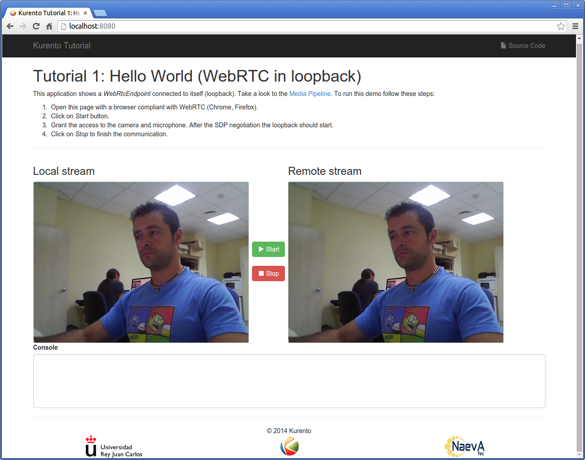
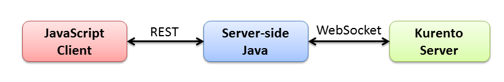

%%%%%%%%%%%%%%%%%%%%%%%%%%%%%
Java Tutorial 1 - Hello World
%%%%%%%%%%%%%%%%%%%%%%%%%%%%%

This web application has been designed to introduce the principles of
programming with Kurento for Java developers. It consists on a `WebRTC`:term:
video communication in mirror (*loopback*).

Kurento provides to developers a **Kurento Java Client** to control
**Kurento Server**. This client library can be used in any kind of Java
application: Server Side Web, Desktop, Android, etc. It is compatible with any
framework like Java EE, Spring, Play, Vert.x, Swing, JavaFX, etc.

Kurento in a nutshell
=====================

At the heart of the Kurento architecture there is a piece of software called
**Kurento Server**, based on pluggable media processing capabilities. Those
capabilities are exposed by the **Kurento Clients** to application developers
as black boxes called **Media Elements**. Each Media Element holds a specific
media capability, whose details are fully hidden to application developers.
From the application developer perspective, Media Elements are like *Lego*
pieces: one just needs to take the elements needed for an application and
connect them following the desired topology. In Kurento jargon, a graph of
connected media elements is called a **Media Pipeline**.

To better understand theses concepts it is recommended to take a look to
:doc:`Kurento API section <../../mastering/kurento_API>` section.

Let's get started
=================

We are going to learn how to create Kurento applications with examples. The
*hello world* demo is one of the simplest web application you can create with
Kurento. It is a `WebRTC`:term: communication in mirror. The following picture
shows an screenshot of this demo running in a web browser:

The interface of the application (an HTML web page) is composed by two HTML5
video tags: one for the video camera stream (the local client-side stream) and
other for the mirror (the remote stream). The video camera stream is sent to
the Kurento Server, processed and then is returned to the client as a remote
stream.

To implement this behavior we have to create a `Media Pipeline`:term: composed
by a single  `Media Element`:term:, i.e. a **WebRtcEndpoint**, which is
bidirectional media element to receive a media stream (audio and video) from
the browser and send another media stream back to it. As suggested by its name,
this endpoint is capable to communicate with the browser by means of
`WebRTC`:term: technology. Therefore, the media pipeline implemented is
illustrated in the following picture:

.. figure:: ../../images/kurento-java-tutorial-1-helloworld-pipeline.png
   :align:   center
   :alt:     Loopback video call media pipeline

This is a web application, and therefore it follows a client-server
architecture. In the client-side, the logic is implemented in **JavaScript**.
In the server-side we use the **Kurento Java Client** in order to reach the
**Kurento Server**. All in all, the high level architecture of this demo is
three-tier. To communicate these entities the following technologies are used:

* `REST`:term:: Communication between JavaScript client-side and Java
  server-side.

* `WebSocket`:term:: Communication between the Kurento Java Client and the
  Kurento Server. This communication is implemented by the
  **Kurento Protocol**. For further information, please see this
  :doc:`page <../../mastering/kurento_protocol>` of the documentation.

.. note::

   The communication between client and server-side is not mandatory to be
   REST. This demo is extremely simple, and so REST has been used. In the
   next examples a more complex signaling between client and server has been
   implement, and for that reason WebSocket has also been employed to communicate
   client and server. Please see the following tutorials for further information.

The following sections analyze in deep the server (Java) and client-side
(JavaScript) code of this application. The complete source code can be found in
`GitHub <https://github.com/Kurento/kurento-tutorial-java/tree/develop/kurento-hello-world>`_.

Server-Side
===========

This demo has been developed using **Java** in the server-side with
`Spring Boot`:term: framework. This technology can be used to embed the Tomcat
web server in the application and thus simplify the development process.

.. note::

   You can use whatever Java server side technology you prefer to build web
   applications with Kurento. For example, a pure Java EE application, SIP 
   Servlets, Play, Vertex, etc. We chose Spring Boot for convenience.

In the following figure you can see a class diagram of the server side code:

.. digraph:: HelloWorld
   :caption: Server-side class diagram of the HelloWorld app

   size="12,8";
   fontname = "Bitstream Vera Sans"
   fontsize = 8

   node [
        fontname = "Bitstream Vera Sans"
        fontsize = 8
        shape = "record"
         style=filled
        fillcolor = "#E7F2FA"
   ]

   edge [
        fontname = "Bitstream Vera Sans"
        fontsize = 8
        arrowhead = "vee"
   ]

   HelloWorldApp -> HelloWorldController;
   HelloWorldApp -> KurentoClient;
   HelloWorldController -> KurentoClient [constraint = false]

The main class of this demo is named
`HelloWorldApp <https://github.com/Kurento/kurento-tutorial-java/blob/develop/kurento-hello-world/src/main/java/org/kurento/tutorial/helloworld/HelloWorldApp.java>`_.
As you can see, the *KurentoClient* is instantiated in this class as a Spring
Bean. This bean is used to create **Kurento Media Pipelines**, which are used
to add media capabilities to your applications. In this instantiation we see
that a WebSocket is used to connect with Kurento Server, by default in the
*localhost* and listening in the port 8888.

.. sourcecode:: java

   @ComponentScan
   @EnableAutoConfiguration
   public class HelloWorldApp {
   
      @Bean
      public KurentoClient kurentoClient() {
         return KurentoClient.create("ws://localhost:8888/kurento");
      }
   
      public static void main(String[] args) throws Exception {
         new SpringApplication(HelloWorldApp.class).run(args);
      }
   }

As introduced before, it uses `REST`:term: to communicate client with server by
means of requests and responses. Specifically, we use the Spring annotation
*@RestController* to implement REST services in the server-side. Take a look to
the
`HelloWorldController <https://github.com/Kurento/kurento-java-tutorial/blob/develop/tutorial-1-hello-world/src/main/java/org/kurento/tutorial/helloworld/HelloWorldController.java>`_
class:

.. sourcecode:: java

   @RestController
   public class HelloWorldController {
   
      @Autowired
      private KurentoClient kurento;
   
      @RequestMapping(value = "/helloworld", method = RequestMethod.POST)
      private String processRequest(@RequestBody String sdpOffer)
            throws IOException {
   
         // Media Logic
         MediaPipeline pipeline = kurento.createMediaPipeline();
         WebRtcEndpoint webRtcEndpoint = new WebRtcEndpoint.Builder(pipeline)
               .build();
         webRtcEndpoint.connect(webRtcEndpoint);
   
         // SDP negotiation (offer and answer)
         String responseSdp = webRtcEndpoint.processOffer(sdpOffer);
         return responseSdp;
      }
   
   }

This demo exposes a REST service which is requested by the client-side. This
service is implemented in the method *processRequest*. Requests to the path
*/helloworld* using POST will be attended by this method. In the body of the
method *processRequest* we can see two main parts:

 - **Configure media processing logic**: This is the part in which the
   application configures how Kurento has to process the media. In other words,
   the media pipeline is implemented here. To that aim, the object
   *KurentoClient* is used to create a *MediaPipeline*. Using this
   *MediaPipeline*, the media elements are created and connected.

 - **WebRTC SDP negotiation**: In WebRTC, `SDP`:term: (Session Description
   protocol) is used for negotiating media interchange between apps. Such
   negotiation happens based on the SDP offer and answer exchange mechanism.
   This negotiation is implemented in the second part of the method
   *processRequest*, using the SDP offer obtained from the browser client, and
   returning a SDP answer returned by WebRtcEndpoint.

Client-Side
===========

Let's move now to the client-side of the application, which follows
*Single Page Application* architecture (`SPA`:term:). To call the previously
created REST service, we use the JavaScript library `jQuery`:term:. In
addition, we use a Kurento JavaScript utilities library called
*kurento-utils.js* to simplify the WebRTC management in the browser.

These libraries are linked in the
`index.html <https://github.com/Kurento/kurento-tutorial-java/blob/develop/kurento-hello-world/src/main/resources/static/index.html>`_
web page, and are used in the
`index.js <https://github.com/Kurento/kurento-tutorial-java/blob/develop/kurento-hello-world/src/main/resources/static/js/index.js>`_.
The most relevant part of this file is the *start* function. In this function
we can see how jQuery is used to call the path */helloworld*, where the REST
service is listening in the server-side. The function
*WebRtcPeer.startSendRecv* of *kurento-utils* is used to start a WebRTC
communication, using the HTML video tag with id *videoInput* to show the video
camera (local stream) and the video tag *videoOutput* to show the video
processed by Kurento server (remote stream).

.. sourcecode:: javascript

   function start() {
      console.log("Starting video call ...");
      showSpinner(videoInput, videoOutput);
   
      webRtcPeer = kurentoUtils.WebRtcPeer.startSendRecv(videoInput, videoOutput, function(offerSdp, wp) {
         console.info('Invoking SDP offer callback function ' + location.host);
         $.ajax({
            url : location.protocol + '/helloworld',
            type : 'POST',
            dataType : 'text',
            contentType : 'application/sdp',
            data : offerSdp,
            success : function(data) {
               console.log("Received sdpAnswer from server. Processing ...");
               wp.processSdpAnswer(data);
            },
            error : function(jqXHR, textStatus, error) {
               console.error(error);
            }
         });
      });
   }

Dependencies
============

This Java Spring application is implemented using `Maven`:term:. The relevant
part of the *pom.xml* is where Kurento dependencies are declared. As the
following snippet shows, we need two dependencies: the Kurento Client Java
dependency (*kurento-client*) and the JavaScript Kurento utility library
(*kurento-utils*) for the client-side:

.. sourcecode:: xml 

   <dependencies> 
      <dependency>
         <groupId>org.kurento</groupId>
         <artifactId>kurento-client</artifactId>
         <version>|version|</version>
      </dependency> 
      <dependency> 
         <groupId>org.kurento</groupId>
         <artifactId>kurento-utils-js</artifactId> 
         <version>|version|</version>
      </dependency> 
   </dependencies>

.. note::

   We are in active development. Be sure that you have the latest version of Kurento 
   Java Client your POM. You can find it at Maven Central searching for 
   ``kurento-client``.
   
Kurento Java Client has a minimum requirement of **Java 7**. To configure the
application to use Java 7, we have to include the following properties in the
properties section:

.. sourcecode:: xml 

   <maven.compiler.target>1.7</maven.compiler.target>
   <maven.compiler.source>1.7</maven.compiler.source>

How to run this application
===========================

First of all, you should install Kurento Server to run this demo. Please visit
the `installation guide <../../Installation_Guide.rst>`_ for further
information.

This demo is assuming that you have a Kurento Server installed and running in
your local machine. If so, to launch the app you need to clone the GitHub
project where this demo is hosted, and then run the main class, as follows:

.. sourcecode:: shell

    git clone https://github.com/Kurento/kurento-java-tutorial.git
    cd kurento-hello-world
    mvn compile exec:java -Dexec.mainClass="org.kurento.tutorial.helloworld.HelloWorldApp"

The web application starts on port 8080 in the localhost by default. Therefore,
open the URL http://localhost:8080/ in a WebRTC compliant browser (Chrome,
Firefox).

