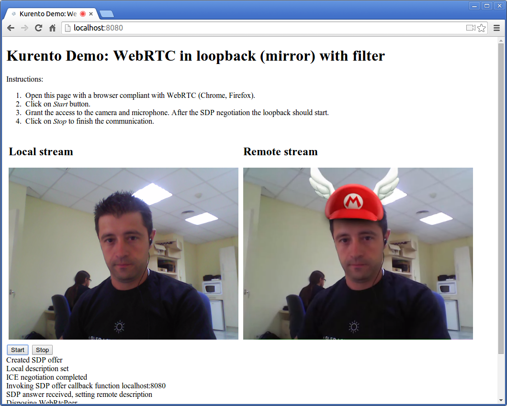

%%%%%%%%%%%%%%%%%%%%%%%%%%%%%%
Java Tutorial 1 - Magic Mirror
%%%%%%%%%%%%%%%%%%%%%%%%%%%%%%

This web application consists on a magic mirror that add with a funny hat over
your face. It is implemented using `WebRTC`:term: technology. The following
picture shows an screenshot of this demo running in a web browser:

The interface of the application (a HTML web page) is composed by two HTML5
video tags: one for the video camera stream (the local client-side stream) and
other for the mirror (the remote stream). The video camera stream is sent to
the Kurento Media Server, processed and then is returned to the client as a
remote stream.

To implement this behavior we have to create a `Media Pipeline`:term: composed
by the following `Media Element`:term: s:

- **WebRtc endpoint**: Bidirectional media element to receive a media stream
  (audio and video) from the browser and send another media stream back to it.
  As suggested by its name, this endpoint is capable to communicate with the
  browser by means of `WebRTC`:term: technology.

- **FaceOverlay filter**: Artificial vision filter that detects a face in the
  video stream and put an image over it. In this demo application, the filter
  is configured to put a
  `Super Mario hat <http://files.kurento.org/imgs/mario-wings.png>`_).

The media pipeline implemented is illustrated in the following picture:

.. figure:: ../../images/kurento-java-tutorial-1-magicmirror-pipeline.png
   :align:   center
   :alt:     Loopback video call with filtering media pipeline

This demo is an example of a quite simple application developed with Kurento.
You can see it as the *Hello World* application for Kurento. The following
sections describe in detail the server-side, the client-side, and how to run
the demo.

The complete source code of this demo can be found in
`GitHub <https://github.com/Kurento/kurento-tutorial-java/tree/develop/kurento-magic-mirror>`_.

Server-Side
===========

This demo has been developed using **Java** in the server-side with
`Spring Boot`:term: framework. This technology can be used to embed the Tomcat
web server in the application and thus simplify the development process.

.. note::

   You can use whatever Java server side technology you prefer to build web
   applications with Kurento. For example, a pure Java EE application, SIP 
   Servlets, Play, Vertex, etc. We chose Spring Boot for convenience.

In the following figure you can see a class diagram of the server side code:

.. digraph:: MagicMirror
   :caption: Server-side class diagram of the MagicMirror app

   size="12,8";
   fontname = "Bitstream Vera Sans"
   fontsize = 8

   node [
        fontname = "Bitstream Vera Sans"
        fontsize = 8
        shape = "record"
         style=filled
        fillcolor = "#E7F2FA"
   ]

   edge [
        fontname = "Bitstream Vera Sans"
        fontsize = 8
        arrowhead = "vee"
   ]

   MagicMirrorApp -> MagicMirrorController;
   MagicMirrorApp -> KurentoClient;
   MagicMirrorController -> KurentoClient [constraint = false]

The main class of this demo is named
`MagicMirrorApp <https://github.com/Kurento/kurento-java-tutorial/blob/develop/tutorial-1-magic-mirror/src/main/java/org/kurento/tutorial/magicmirror/MagicMirrorApp.java>`_.
As you can see, the *KurentoClient* is instantiated in this class as a Spring
Bean. This bean is used to create **Kurento Media Pipelines**, which are used
to add media capabilities to your applications.

.. sourcecode:: java

    @ComponentScan
    @EnableAutoConfiguration
    public class MagicMirrorApp {

        @Bean
        public KurentoClient kurentoClient() {
            return KurentoClient.create("ws://localhost:8888");
        }

        public static void main(String[] args) throws Exception {
            new SpringApplication(MagicMirrorApp.class).run(args);
        }
    }

This web application follows *Single Page Application* architecture
(`SPA`:term:) and uses `REST`:term: to communicate client with server by means
of requests and responses. Specifically, we use the Spring annotation
*@RestController* to implement REST services in the server-side. Take a look to
the
`MagicMirrorController <https://github.com/Kurento/kurento-java-tutorial/blob/develop/tutorial-1-magic-mirror/src/main/java/org/kurento/tutorial/magicmirror/MagicMirrorController.java>`_
class:

.. sourcecode:: java

    @RestController
    public class MagicMirrorController {

        private final Logger log = LoggerFactory.getLogger(MagicMirrorController.class);

        @Autowired
        private KurentoClient kurento;

        @RequestMapping(value = "/magicmirror", method = RequestMethod.POST)
        private String processRequest(@RequestBody String sdpOffer)
                throws IOException {

            // Configure media processing logic
            MediaPipeline pipeline = kurento.newMediaPipeline();
            WebRtcEndpoint webRtcEndpoint = new WebRtcEndpoint.Builder(pipeline).build();
            FaceOverlayFilter filter = new FaceOverlayFilter(pipeline).build();
            filter.setCompleteOverlayedImage("http://localhost:8080/imgs/mario-wings.png");                    
            webRtcEndpoint.connect(filter);
            filter.connect(webRtcEndpoint);

            // WebRtc SDP negotiation
            sdpOffer = URLDecoder.decode(sdpOffer, "UTF-8");
            log.debug("Received SDP offer: {}", sdpOffer);
            String responseSdp = webRtcEndpoint.processOffer(sdpOffer);
            log.debug("Sent SDP response: {}", responseSdp);

            return responseSdp;
        }

    }

This app exposes a REST service which is requested by the client-side. This
service is implemented in the method *processRequest*. Requests to the path
*/magicmirror* using POST will be attended by this method. In the body of the
method *processRequest* we can see two main parts:

 - **Configure media processing logic**: This is the part in which the
   application configures how Kurento has to process the media. In other words,
   the media pipeline is implemented here. To that aim, the object
   *KurentoClient* is used to create a *MediaPipeline*. Using this
   *MediaPipeline*, the media elements are created and connected.

 - **WebRTC SDP negotiation**: In WebRTC, `SDP`:term: (Session Description
   protocol) is used for negotiating media interchange between apps. Such
   negotiation happens based on the SDP offer and answer exchange mechanism.
   This negotiation is implemented in the second part of the method
   *processRequest*, using the SDP offer obtained from the browser client, and
   returning a SDP answer returned by WebRtcEndpoint.

Client-Side
===========

Let's move now to the client-side of the application. To call the previously
created REST service, we use the JavaScript library `jQuery`:term:. In
addition, we use a Kurento JavaScript utilities library called
*kurento-utils.js* to simplify the WebRTC management in the browser.

These libraries are linked in the
`index.html <https://github.com/Kurento/kurento-tutorial-java/blob/develop/kurento-magic-mirror/src/main/resources/static/index.html>`_
web page, and are used in the
`index.js <https://github.com/Kurento/kurento-tutorial-java/blob/develop/kurento-magic-mirror/src/main/resources/static/js/index.js>`_.
The most relevant part of this file is the *start* function. In this function
we can see how jQuery is used to call the path */magicmirror*, where the REST
service is listening in the server-side. The function
*WebRtcPeer.startSendRecv* of *kurento-utils* is used to start a WebRTC
communication, using the HTML video tag with id *videoInput* to show the video
camera (local stream) and the video tag *videoOutput* to show the video
processed by Kurento server (remote stream).

.. sourcecode:: javascript

    function start() {
        showSpinner(videoInput, videoOutput);

        webRtcPeer = kurentoUtils.WebRtcPeer.startSendRecv(videoInput, videoOutput,
                function(offerSdp) {
                    
                    console.log('Invoking SDP offer callback function '+ location.host);
                    
                    $.ajax({
                        url : location.protocol + '/magicmirror',
                        type : 'POST',
                        dataType : 'text',
                        data : offerSdp,
                        success : function(data) {
                            wp.processSdpAnswer(data);
                        },
                        error : function(jqXHR, textStatus, error) {
                            console.error(error);
                        }
                    });
                });
    }

Dependencies
============

This Java Spring application is implemented using `Maven`:term:. The relevant
part of the *pom.xml* is where Kurento dependencies are declared. As the
following snippet shows, we need two dependencies: the Kurento Client Java
dependency (*kurento-client*) and the JavaScript Kurento utility library
(*kurento-utils*) for the client-side:

.. sourcecode:: xml 

   <dependencies> 
      <dependency>
         <groupId>org.kurento</groupId>
         <artifactId>kurento-client</artifactId>
         <version>5.0.0</version>
      </dependency> 
      <dependency> 
         <groupId>org.kurento</groupId>
         <artifactId>kurento-utils-js</artifactId> 
         <version>5.0.0</version>
      </dependency> 
   </dependencies>

How to run this application
===========================

First of all, you should install Kurento Server to run this demo. Please visit
the `installation guide <../../Installation_Guide.rst>`_ for further
information.

This demo is assuming that you have a Kurento Server installed and running in
your local machine. If so, to launch the app you need to clone the GitHub
project where this demo is hosted, and then run the main class, as follows:

.. sourcecode:: shell

    git clone https://github.com/Kurento/kurento-java-tutorial.git
    cd kurento-magic-mirror
    mvn compile exec:java -Dexec.mainClass="org.kurento.tutorial.magicmirror.MagicMirrorApp"

The web application starts on port 8080 in the localhost by default. Therefore,
open the URL http://localhost:8080/ in a WebRTC compliant browser (Chrome,
Firefox).
