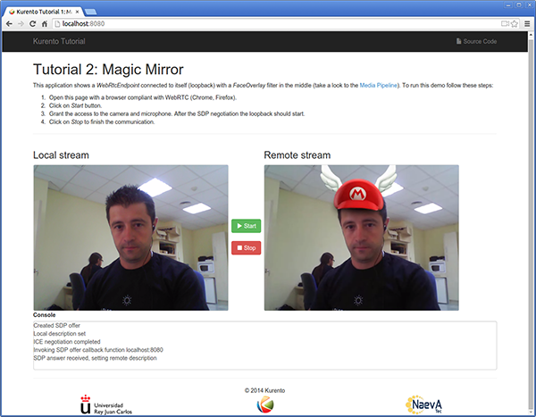
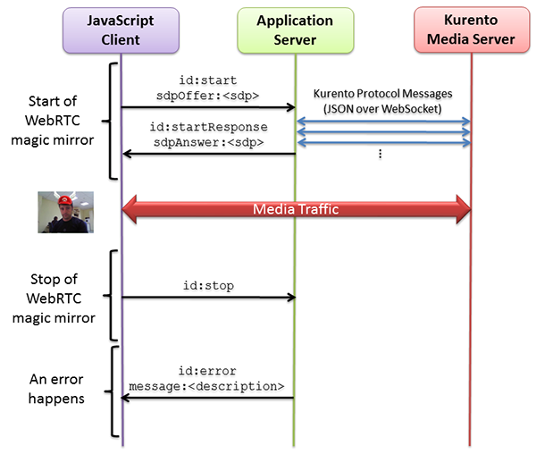

%%%%%%%%%%%%%%%%%%%%%%%%%%%%%%%%%%%%%
Java Tutorial 2 - WebRTC magic mirror
%%%%%%%%%%%%%%%%%%%%%%%%%%%%%%%%%%%%%

This web application extends :doc:`Tutorial 1 <./tutorial-1-helloworld>` adding
media processing to the basic `WebRTC`:term: loopback.

For the impatient: running this example
=======================================

First of all, you should install Kurento Media Server to run this demo. Please
visit the :doc:`installation guide <../../installation_guide>` for further
information.

To launch the application you need to clone the GitHub project where this demo
is hosted and then run the main class, as follows:

.. sourcecode:: sh

    git clone https://github.com/Kurento/kurento-tutorial-java.git
    cd kurento-tutorial-java/kurento-magic-mirror
    mvn compile exec:java -Dexec.mainClass="org.kurento.tutorial.magicmirror.MagicMirrorApp"

The web application starts on port 8080 in the localhost by default. Therefore,
open the URL http://localhost:8080/ in a WebRTC compliant browser (Chrome,
Firefox).

Understanding this example
==========================

This application uses computer vision and augmented reality techniques to add a
funny hat on top of faces. The following picture shows a screenshot of the demo
running in a web browser:

   *Kurento Magic Mirror Screenshot: WebRTC with filter in loopback*

The interface of the application (an HTML web page) is composed by two HTML5
video tags: one for the video camera stream (the local client-side stream) and
other for the mirror (the remote stream). The video camera stream is sent to
Kurento Media Server, which processes and sends it back to the client as a
remote stream. To implement this, we need to create a `Media Pipeline`:term:
composed by the following `Media Element`:term: s:

- **WebRtcEndpoint**: Provides full-duplex (bidirectional) `WebRTC`:term:
  capabilities.

- **FaceOverlay filter**: Computer vision filter that detects faces in the
  video stream and puts an image on top of them. In this demo the filter is
  configured to put a
  `Super Mario hat <http://files.kurento.org/imgs/mario-wings.png>`_).

.. figure:: ../../images/kurento-java-tutorial-2-magicmirror-pipeline.png
   :align:   center
   :alt:     WebRTC with filter in loopback Media Pipeline
   :width: 400px

   *WebRTC with filter in loopback Media Pipeline*

This is a web application, and therefore it follows a client-server
architecture. At the client-side, the logic is implemented in **JavaScript**.
At the server-side we use a Java EE application server consuming the
**Kurento Java Client** API to control **Kurento Media Server** capabilities.
All in all, the high level architecture of this demo is three-tier. To
communicate these entities, two WebSockets are used. First, a WebSocket is
created between client and application server to implement a custom signaling
protocol. Second, another WebSocket is used to perform the communication
between the Kurento Java Client and the Kurento Media Server. This
communication takes place using the **Kurento Protocol**. For further
information on it, please see this
:doc:`page <../../mastering/kurento_protocol>` of the documentation.

To communicate the client with the Java EE application server we have designed a
simple signaling protocol based on `JSON`:term: messages over `WebSocket`:term:
's. The normal sequence between client and server is as follows: i) Client
starts the Magic Mirror. ii) Client stops the Magic Mirror.

If any exception happens, server sends an error message to the client. The
detailed message sequence between client and application server is depicted in
the following picture:

   *One to one video call signaling protocol*

As you can see in the diagram, an `SDP`:term: needs to be exchanged between
client and server to establish the `WebRTC`:term: session between the browser
and Kurento. Specifically, the SDP negotiation connects the WebRtcPeer at the
browser with the WebRtcEndpoint at the server. The complete source code of this
demo can be found in
`GitHub <https://github.com/Kurento/kurento-tutorial-java/tree/master/kurento-magic-mirror>`_.

Application Server Side
=======================

This demo has been developed using a **Java EE** application server based on the
`Spring Boot`:term: framework. This technology can be used to embed the Tomcat
web server in the application and thus simplify the development process.

.. note::

   You can use whatever Java server side technology you prefer to build web
   applications with Kurento. For example, a pure Java EE application, SIP 
   Servlets, Play, Vert.x, etc. Here we chose Spring Boot for convenience.

In the following figure you can see a class diagram of the server side code:

.. digraph:: MagicMirror
   :caption: Server-side class diagram of the MagicMirror app

   size="12,8";
   fontname = "Bitstream Vera Sans"
   fontsize = 8

   node [
        fontname = "Bitstream Vera Sans"
        fontsize = 8
        shape = "record"
         style=filled
        fillcolor = "#E7F2FA"
   ]

   edge [
        fontname = "Bitstream Vera Sans"
        fontsize = 8
        arrowhead = "vee"
   ]

   MagicMirrorApp -> MagicMirrorHandler;
   MagicMirrorApp -> KurentoClient;
   MagicMirrorHandler -> KurentoClient [constraint = false]

The main class of this demo is named
`MagicMirrorApp <https://github.com/Kurento/kurento-tutorial-java/blob/master/kurento-magic-mirror/src/main/java/org/kurento/tutorial/magicmirror/MagicMirrorApp.java>`_.
As you can see, the *KurentoClient* is instantiated in this class as a Spring
Bean. This bean is used to create **Kurento Media Pipelines**, which are used
to add media capabilities to your applications. In this instantiation we see
that we need to specify to the client library the location of the Kurento Media
Server. In this example, we assume it's located at *localhost* listening in
port 8888. If you reproduce this tutorial you'll need to insert the specific
location of your Kurento Media Server instance there.

.. sourcecode:: java

   @Configuration
   @EnableWebSocket
   @EnableAutoConfiguration
   public class MagicMirrorApp implements WebSocketConfigurer {
   
      @Bean
      public MagicMirrorHandler handler() {
         return new MagicMirrorHandler();
      }
   
      @Bean
      public KurentoClient kurentoClient() {
         return KurentoClient.create("ws://localhost:8888/kurento");
      }
   
      public void registerWebSocketHandlers(WebSocketHandlerRegistry registry) {
         registry.addHandler(handler(), "/magicmirror");
      }
   
      public static void main(String[] args) throws Exception {
         new SpringApplication(MagicMirrorApp.class).run(args);
      }
   }

This web application follows *Single Page Application* architecture
(`SPA`:term:) and uses a `WebSocket`:term: to communicate client with
application server by means of requests and responses. Specifically, the main
app class implements the interface ``WebSocketConfigurer`` to register a
``WebSocketHanlder`` to process WebSocket requests in the path ``/magicmirror``.

`MagicMirrorHandler <https://github.com/Kurento/kurento-tutorial-java/blob/master/kurento-magic-mirror/src/main/java/org/kurento/tutorial/magicmirror/MagicMirrorHandler.java>`_
class implements ``TextWebSocketHandler`` to handle text WebSocket requests.
The central piece of this class is the method ``handleTextMessage``. This
method implements the actions for requests, returning responses through the
WebSocket. In other words, it implements the server part of the signaling
protocol depicted in the previous sequence diagram.

In the designed protocol there are three different kinds of incoming messages to
the *Server* : ``start`` and ``stop``. These messages are treated in the
*switch* clause, taking the proper steps in each case.

.. sourcecode:: java

   public class MagicMirrorHandler extends TextWebSocketHandler {
   
      private final Logger log = LoggerFactory
            .getLogger(MagicMirrorHandler.class);
      private static final Gson gson = new GsonBuilder().create();
   
      private ConcurrentHashMap<String, MediaPipeline> pipelines = new ConcurrentHashMap<String, MediaPipeline>();
   
      @Autowired
      private KurentoClient kurento;
   
      @Override
      public void handleTextMessage(WebSocketSession session, TextMessage message)
            throws Exception {
         JsonObject jsonMessage = gson.fromJson(message.getPayload(),
               JsonObject.class);
   
         log.debug("Incoming message: {}", jsonMessage);
   
         switch (jsonMessage.get("id").getAsString()) {
         case "start":
            start(session, jsonMessage);
            break;
   
         case "stop":
            String sessionId = session.getId();
            if (pipelines.containsKey(sessionId)) {
               pipelines.get(sessionId).release();
               pipelines.remove(sessionId);
            }
            break;
   
         default:
            sendError(session,
                  "Invalid message with id "
                        + jsonMessage.get("id").getAsString());
            break;
         }
      }
   
      private void start(WebSocketSession session, JsonObject jsonMessage) {
         ...
      }
   
      private void sendError(WebSocketSession session, String message) {
         ...
      }
   }

In the following snippet, we can see the ``start`` method. It creates a Media
Pipeline, creates the Media Elements (``WebRtcEndpoint`` and
``FaceOverlayFilter``) and make the connections among them. A ``startResponse``
message is sent back to the client with the SDP answer.

.. sourcecode:: java

   private void start(WebSocketSession session, JsonObject jsonMessage) {
      try {
         // Media Logic (Media Pipeline and Elements)
         MediaPipeline pipeline = kurento.createMediaPipeline();
         pipelines.put(session.getId(), pipeline);

         WebRtcEndpoint webRtcEndpoint = new WebRtcEndpoint.Builder(pipeline)
               .build();
         FaceOverlayFilter faceOverlayFilter = new FaceOverlayFilter.Builder(
               pipeline).build();
         faceOverlayFilter.setOverlayedImage(
               "http://files.kurento.org/imgs/mario-wings.png", -0.35F,
               -1.2F, 1.6F, 1.6F);

         webRtcEndpoint.connect(faceOverlayFilter);
         faceOverlayFilter.connect(webRtcEndpoint);

         // SDP negotiation (offer and answer)
         String sdpOffer = jsonMessage.get("sdpOffer").getAsString();
         String sdpAnswer = webRtcEndpoint.processOffer(sdpOffer);

         // Sending response back to client
         JsonObject response = new JsonObject();
         response.addProperty("id", "startResponse");
         response.addProperty("sdpAnswer", sdpAnswer);
         session.sendMessage(new TextMessage(response.toString()));
      } catch (Throwable t) {
         sendError(session, t.getMessage());
      }
   }

The ``sendError`` method is quite simple: it sends an ``error`` message to the
client when an exception is caught in the server-side.

.. sourcecode:: java

   private void sendError(WebSocketSession session, String message) {
      try {
         JsonObject response = new JsonObject();
         response.addProperty("id", "error");
         response.addProperty("message", message);
         session.sendMessage(new TextMessage(response.toString()));
      } catch (IOException e) {
         log.error("Exception sending message", e);
      }
   }

Client-Side
===========

Let's move now to the client-side of the application. To call the previously
created WebSocket service in the server-side, we use the JavaScript class
``WebSocket``. We use an specific Kurento JavaScript library called
**kurento-utils.js** to simplify the WebRTC interaction with the server. These
libraries are linked in the
`index.html <https://github.com/Kurento/kurento-tutorial-java/blob/master/kurento-magic-mirror/src/main/resources/static/index.html>`_
web page, and are used in the
`index.js <https://github.com/Kurento/kurento-tutorial-java/blob/master/kurento-magic-mirror/src/main/resources/static/js/index.js>`_.
In the following snippet we can see the creation of the WebSocket (variable
``ws``) in the path ``/magicmirror``. Then, the ``onmessage`` listener of the
WebSocket is used to implement the JSON signaling protocol in the client-side.
Notice that there are four incoming messages to client: ``startResponse`` and
``error``. Convenient actions are taken to implement each step in the
communication. For example, in functions ``start`` the function
``WebRtcPeer.startSendRecv`` of *kurento-utils.js* is used to start a WebRTC
communication.

.. sourcecode:: javascript

   var ws = new WebSocket('ws://' + location.host + '/magicmirror');
   
   ws.onmessage = function(message) {
      var parsedMessage = JSON.parse(message.data);
      console.info('Received message: ' + message.data);
   
      switch (parsedMessage.id) {
      case 'startResponse':
         startResponse(parsedMessage);
         break;
      case 'error':
         if (state == I_AM_STARTING) {
            setState(I_CAN_START);
         }
         console.error("Error message from server: " + parsedMessage.message);
         break;
      default:
         if (state == I_AM_STARTING) {
            setState(I_CAN_START);
         }
         console.error('Unrecognized message', parsedMessage);
      }
   }

   function start() {
      console.log("Starting video call ...")
      // Disable start button
      setState(I_AM_STARTING);
      showSpinner(videoInput, videoOutput);
   
      console.log("Creating WebRtcPeer and generating local sdp offer ...");
      webRtcPeer = kurentoUtils.WebRtcPeer.startSendRecv(videoInput, videoOutput, onOffer, onError);
   }

   function onOffer(offerSdp) {
      console.info('Invoking SDP offer callback function ' + location.host);
      var message = {
         id : 'start',
         sdpOffer : offerSdp
      }
      sendMessage(message);
   }

   function onError(error) {
      console.error(error);
   }

Dependencies
============

This Java Spring application is implemented using `Maven`:term:. The relevant
part of the *pom.xml* is where Kurento dependencies are declared. As the
following snippet shows, we need two dependencies: the Kurento Client Java
dependency (*kurento-client*) and the JavaScript Kurento utility library
(*kurento-utils*) for the client-side:

.. sourcecode:: xml 

   <dependencies> 
      <dependency>
         <groupId>org.kurento</groupId>
         <artifactId>kurento-client</artifactId>
         <version>[5.0.0,6.0.0)</version>
      </dependency> 
      <dependency> 
         <groupId>org.kurento</groupId>
         <artifactId>kurento-utils-js</artifactId> 
         <version>[5.0.0,6.0.0)</version>
      </dependency> 
   </dependencies>

.. note::

   We are in active development. Be sure that you have the latest version of
   Kurento Java Client in your pom.xml. You can find it at `Maven Central <http://search.maven.org/#search%7Cga%7C1%7Ckurento-client>`_
   searching for ``kurento-client``.

Kurento Java Client has a minimum requirement of **Java 7**. To configure the
application to use Java 7, we have to include the following properties in the
properties section:

.. sourcecode:: xml 

   <maven.compiler.target>1.7</maven.compiler.target>
   <maven.compiler.source>1.7</maven.compiler.source>
