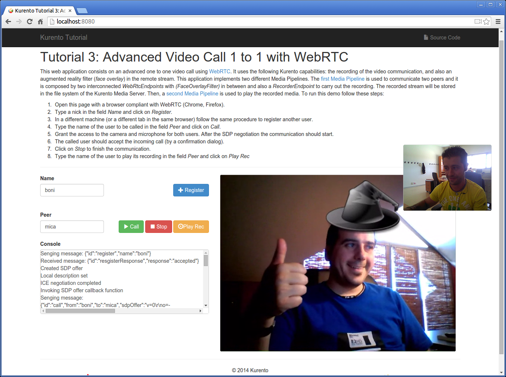

%%%%%%%%%%%%%%%%%%%%%%%%%%%%%%%%%%%%%%%%%%%
Tutorial 3 - Advanced One to one video call
%%%%%%%%%%%%%%%%%%%%%%%%%%%%%%%%%%%%%%%%%%%

This web application consists on an advanced one to one video call using
`WebRTC`:term: technology. It is an improved version of the tutorial 2
(:doc:`one to one video call </tutorials/java/tutorial-2-one2one>`). This
enhanced application incorporates also the recording capability provided by the
Kurento Media Server. In addition, a filter element (*FaceOverlayFilter*) in
placed between the *WebRtcEndpoints* of the Media Pipeline. The following
picture shows an screenshot of this demo running in a web browser:

The interface of the application (an HTML web page) is composed by two HTML5
video tags: one for the local video camera stream (the caller stream, the
smaller video in the picture) and other for the remote peer in the call (the
callee stream, the bigger video in the picture). If two users, A and B, are
using the application, the media flows in the following way: The video camera
stream of user A is sent to the Kurento Media Server and sent again to the user
B. On the other hand, user B sends its video camera stream to Kurento and then
it is sent to user A.

This application is implemented by means of two `Media Pipeline`:term: 's.
First, the rich real-time WebRTC communication is performed two
*WebRtcEndpoints* interconnected, and with a *FaceOverlayFilter* in between
them. In addition and a *RecorderEndpoint* is used to store both streams in the
file system of the Kurento Media Server. This media pipeline is illustrated in
the following picture:

.. figure:: ../../images/kurento-java-tutorial-3-one2one-adv-pipeline_1.png
   :align:   center
   :alt:     Advanced one to one video call media pipeline (1)

A second media pipeline is needed to play the previously recorded media. This
pipeline is composed by a *PlayerEndpoint* which reads the files stored in the
Kurento Media Server. This media element injects the media in a
*WebRtcEndpoint* which is charge to transport the media to the HTML5 video tag
in the browser:

.. figure:: ../../images/kurento-java-tutorial-3-one2one-adv-pipeline_2.png
   :align:   center
   :alt:     Advanced one to one video call media pipeline (2)

.. note::

   The playback of a static file can be done in several ways. In addition to this
   media pipeline (*PlayerEndpoint* -> *WebRtcEndpoint*), other possibilities can
   be implemented. For example, a Media Pipeline composed by *PlayerEndpoint* ->
   *HttpGetEndpoint* could be another possible alternative. Also, the recorded file
   could be served directly by an HTTP server.

To communicate the client with the server to manage calls we have designed a
signaling protocol based on `JSON`:term: messages over `WebSocket`:term: 's.
The normal sequence between client and server would be as follows:

1. User A is registered in the server with his name

2. User B is registered in the server with her name

3. User A wants to call to User B

4. User B accepts the incoming call

5. The communication is established and media is flowing between User A and
   User B

6. One of the users finishes the video communication

7. One of the users play the recorded media

This is very simple protocol designed to show a simple one to one call
application implemented with Kurento. In a professional application it can be
improved, for example implementing seeking user, ordered finish, among other
functions.

Assuming that User A is using Client A and User B is using Client B, we can draw
the following sequence diagram with detailed messages between clients and
server. The following diagram shows the two parts of the signaling protocol:
first the enhanced real-time communication is performed, and then the playback
of the recorded file is carried out.

.. figure:: ../../images/kurento-java-tutorial-3-one2one-adv-signaling.png
   :align:   center
   :alt:     Advanced one to one video call signaling protocol
   :width: 600px

As you can see in the diagram, `SDP`:term: needs to be interchanged between
client and server to establish the `WebRTC`:term: connection between the
browser and Kurento. Specifically, the SDP negotiation connects the WebRtcPeer
in the browser with the WebRtcEndpoint in the server.

The following sections describe in detail the server-side, the client-side, and
how to run the demo.

The complete source code of this demo can be found in
`GitHub <https://github.com/Kurento/kurento-tutorial-java/tree/develop/kurento-one2one-call-advanced>`_.

Server-Side
===========

As in the :doc:`tutorial 1</tutorials/java/tutorial-1-magicmirror>`, this demo
has been developed using **Java** and `Spring Boot`:term:.

.. note::

   You can use whatever Java server side technology you prefer to build web
   applications with Kurento. For example, a pure Java EE application, SIP
   Servlets, Play, Vertex, etc. We have choose Spring Boot for convenience.

In the following figure you can see a class diagram of the server side code:

.. digraph:: One2OneCallAdvApp
   :caption: Server-side class diagram of the advanced one to one video call app

   size="12,8";
   fontname = "Bitstream Vera Sans"
   fontsize = 8

   node [
        fontname = "Bitstream Vera Sans"
        fontsize = 8
        shape = "record"
        style=filled
        fillcolor = "#E7F2FA"
   ]

   edge [
        fontname = "Bitstream Vera Sans"
        fontsize = 8
        arrowhead = "vee"
   ]

   One2OneCallAdvApp -> UserRegistry;
   One2OneCallAdvApp -> CallHandler;
   One2OneCallAdvApp -> KurentoClient;
   CallHandler -> CallMediaPipeline
   CallHandler -> PlayMediaPipeline
   CallHandler -> KurentoClient [constraint = false]
   UserRegistry -> UserSession [headlabel="*",  labelangle=60]

The main class of this demo is named
`One2OneCallAdvApp <https://github.com/Kurento/kurento-tutorial-java/blob/develop/kurento-one2one-call/src/main/java/org/kurento/tutorial/one2onecall/One2OneCallApp.java>`_.
As you can see, the ``KurentoClient`` is instantiated in this class as a Spring
Bean.

.. sourcecode:: java

   @Configuration
   @EnableWebSocket
   @EnableAutoConfiguration
   public class One2OneCallAdvApp implements WebSocketConfigurer {

      @Bean
      public CallHandler callHandler() {
         return new CallHandler();
      }

      @Bean
      public UserRegistry registry() {
         return new UserRegistry();
      }

      @Bean
      public KurentoClient kurentoClient() {
         return KurentoClient.create("ws://localhost:8888/kurento");
      }

      public void registerWebSocketHandlers(WebSocketHandlerRegistry registry) {
         registry.addHandler(callHandler(), "/call");
      }

      public static void main(String[] args) throws Exception {
         new SpringApplication(One2OneCallAdvApp.class).run(args);
      }

   }

This web application follows *Single Page Application* architecture
(`SPA`:term:) and uses a `WebSocket`:term: to communicate client with server by
means of requests and responses. Specifically, the main app class implements
the interface ``WebSocketConfigurer`` to register a ``WebSocketHanlder`` to
process WebSocket requests in the path ``/call``.

`CallHandler <https://github.com/Kurento/kurento-tutorial-java/blob/develop/kurento-one2one-call-advanced/src/main/java/org/kurento/tutorial/one2onecalladv/CallHandler.java>`_
class implements ``TextWebSocketHandler`` to handle text WebSocket requests.
The central piece of this class is the method ``handleTextMessage``. This
method implements the actions for requests, returning responses through the
WebSocket. In other words, it implements the server part of the signaling
protocol depicted in the previous sequence diagram.

In the designed protocol there are three different kind of incoming messages to
the *Server* : ``register``, ``call``, ``incommingCallResponse``, and ``play``.
These messages are treated in the *switch* clause, taking the proper steps in
each case.

.. sourcecode:: java
   public class CallHandler extends TextWebSocketHandler {

      private static final Logger log = LoggerFactory.getLogger(CallHandler.class);
      private static final Gson gson = new GsonBuilder().create();

      @Autowired
      private KurentoClient kurento;

      @Autowired
      private UserRegistry registry;

      @Override
      public void handleTextMessage(WebSocketSession session, TextMessage message)
            throws Exception {
         JsonObject jsonMessage = gson.fromJson(message.getPayload(),
               JsonObject.class);
         UserSession user = registry.getBySession(session);

         if (user != null) {
            log.debug("Incoming message from user '{}': {}", user.getName(),
                  jsonMessage);
         } else {
            log.debug("Incoming message from new user: {}", jsonMessage);
         }

         switch (jsonMessage.get("id").getAsString()) {
         case "register":
            register(session, jsonMessage);
            break;
         case "call":
            call(user, jsonMessage);
            break;
         case "incommingCallResponse":
            incommingCallResponse(user, jsonMessage);
            break;
         case "play":
            play(session, jsonMessage);
            break;
         default:
            break;
         }
      }

      private void register(WebSocketSession session, JsonObject jsonMessage)
            throws IOException {
         ...
      }

      private void call(UserSession caller, JsonObject jsonMessage)
            throws IOException {
         ...
      }

      private void incommingCallResponse(UserSession callee,
            JsonObject jsonMessage) throws IOException {
         ...
      }

      private void play(WebSocketSession session, JsonObject jsonMessage)
            throws IOException {
         ...
      }

      @Override
      public void afterConnectionClosed(WebSocketSession session,
            CloseStatus status) throws Exception {
         registry.removeBySession(session);
      }

   }

In the following snippet, we can see the ``register`` method. Basically, it
obtains the ``name`` attribute from ``register`` message and check if there are
a registered user with that name. If not, the new user is registered and an
acceptance message is sent to it.

.. sourcecode :: java

   private void register(WebSocketSession session, JsonObject jsonMessage)
         throws IOException {
      String name = jsonMessage.getAsJsonPrimitive("name").getAsString();

      UserSession caller = new UserSession(session, name);
      String responseMsg = "accepted";
      if (name.isEmpty()) {
         responseMsg = "rejected: empty user name";
      } else if (registry.exists(name)) {
         responseMsg = "rejected: user '" + name + "' already registered";
      } else {
         registry.register(caller);
      }

      JsonObject response = new JsonObject();
      response.addProperty("id", "resgisterResponse");
      response.addProperty("response", responseMsg);
      caller.sendMessage(response);
   }

In the ``call`` method, the server checks if there are a registered user with
the name specified in ``to`` message attribute and send an ``incommingCall``
message to it. Or, if there isn't any user with that name, a ``callResponse``
message is sent to caller rejecting the call.

.. sourcecode :: java

   private void call(UserSession caller, JsonObject jsonMessage) throws IOException {

      String to = jsonMessage.get("to").getAsString();

      if (registry.exists(to)) {

         UserSession callee = registry.getByName(to);
         caller.setSdpOffer(jsonMessage.getAsJsonPrimitive("sdpOffer").getAsString());
         caller.setCallingTo(to);

         JsonObject response = new JsonObject();
         response.addProperty("id", "incommingCall");
         response.addProperty("from", caller.getName());

         callee.sendMessage(response);

      } else {

         JsonObject response = new JsonObject();
         response.addProperty("id", "callResponse");
         response.addProperty("response", "rejected: user '"+to+"' is not registered");

         caller.sendMessage(response);
      }
   }

In the ``incommingCallResponse`` method, if the callee user accepts the call, it
is established and the media elements are created to connect the caller with
the callee. Basically, the server creates a ``CallMediaPipeline`` object, to
encapsulate the media pipeline creation and management. Then, this object is
used to negotiate media interchange with user's browsers.

As explained in :doc:`tutorial 1</tutorials/java/tutorial-1-magicmirror>`, the
negotiation between WebRTC peer in the browser and WebRtcEndpoint in Kurento
Server is made by means of `SDP`:term: generation at the client (offer) and SDP
generation at the server (answer). The SDP answers are generated with the
Kurento Java Client inside the class ``CallMediaPipeline`` (as we see in a
moment). The methods used to generate SDP are
``generateSdpAnswerForCallee(calleeSdpOffer)`` and
``generateSdpAnswerForCaller(callerSdpOffer)``:

.. sourcecode :: java

   private void incommingCallResponse(UserSession callee,
         JsonObject jsonMessage) throws IOException {
      String callResponse = jsonMessage.get("callResponse").getAsString();
      String from = jsonMessage.get("from").getAsString();
      UserSession calleer = registry.getByName(from);
      String to = calleer.getCallingTo();

      if ("accept".equals(callResponse)) {
         log.debug("Accepted call from '{}' to '{}'", from, to);

         CallMediaPipeline pipeline = new CallMediaPipeline(kurento, from,
               to);
         String calleeSdpOffer = jsonMessage.get("sdpOffer").getAsString();
         String calleeSdpAnswer = pipeline
               .generateSdpAnswerForCallee(calleeSdpOffer);

         JsonObject startCommunication = new JsonObject();
         startCommunication.addProperty("id", "startCommunication");
         startCommunication.addProperty("sdpAnswer", calleeSdpAnswer);
         callee.sendMessage(startCommunication);

         String callerSdpOffer = registry.getByName(from).getSdpOffer();
         String callerSdpAnswer = pipeline
               .generateSdpAnswerForCaller(callerSdpOffer);

         JsonObject response = new JsonObject();
         response.addProperty("id", "callResponse");
         response.addProperty("response", "accepted");
         response.addProperty("sdpAnswer", callerSdpAnswer);
         calleer.sendMessage(response);

         pipeline.record();

      } else {
         JsonObject response = new JsonObject();
         response.addProperty("id", "callResponse");
         response.addProperty("response", "rejected");
         calleer.sendMessage(response);
      }
   }

Finally, the ``play`` method instantiates a ``PlayMediaPipeline`` object, which
is used to create Media Pipeline in charge of the playback of the recorded
streams in the Kurento Media Server.

.. sourcecode :: java

   private void play(WebSocketSession session, JsonObject jsonMessage)
         throws IOException {
      String user = jsonMessage.get("user").getAsString();
      log.debug("Playing recorded call of user '{}'", user);

      PlayMediaPipeline pipeline = new PlayMediaPipeline(kurento, user,
            session);
      String sdpOffer = jsonMessage.get("sdpOffer").getAsString();
      String sdpAnswer = pipeline.generateSdpAnswer(sdpOffer);

      JsonObject response = new JsonObject();
      response.addProperty("id", "playResponse");
      response.addProperty("response", "accepted");
      response.addProperty("sdpAnswer", sdpAnswer);
      session.sendMessage(new TextMessage(response.toString()));

      pipeline.play();

   }

The media logic in this demo is implemented in the classes
`CallMediaPipeline <https://github.com/Kurento/kurento-tutorial-java/blob/develop/kurento-one2one-call-advanced/src/main/java/org/kurento/tutorial/one2onecalladv/CallMediaPipeline.java>`_
and
`PlayMediaPipeline <https://github.com/Kurento/kurento-tutorial-java/blob/develop/kurento-one2one-call-advanced/src/main/java/org/kurento/tutorial/one2onecalladv/PlayMediaPipeline.java>`_.
The first media pipeline consists on two ``WebRtcEndpoint`` elements
interconnected with a ``FaceOverlayFilter`` in between, and also with and
``RecorderEndpoint`` to carry out the recording of the WebRTC communication.
Please take note that the WebRtc endpoints needs to be connected twice, one for
each media direction. In this class we can see the implementation of methods
``generateSdpAnswerForCaller`` and ``generateSdpAnswerForCallee``. These
methods delegate to WebRtc endpoints to create the appropriate answer.

.. sourcecode:: java

   public class CallMediaPipeline {

      public static final String RECORDING_PATH = "file:///tmp/";
      public static final String RECORDING_EXT = ".webm";

      private WebRtcEndpoint webRtcCaller;
      private WebRtcEndpoint webRtcCallee;
      private RecorderEndpoint recorderCaller;
      private RecorderEndpoint recorderCallee;

      public CallMediaPipeline(KurentoClient kurento, String from, String to) {
         // Media pipeline
         MediaPipeline pipeline = kurento.createMediaPipeline();

         // Media Elements (WebRtcEndpoint, RecorderEndpoint, FaceOverlayFilter)
         webRtcCaller = new WebRtcEndpoint.Builder(pipeline).build();
         webRtcCallee = new WebRtcEndpoint.Builder(pipeline).build();

         recorderCaller = new RecorderEndpoint.Builder(pipeline, RECORDING_PATH
               + from + RECORDING_EXT).build();
         recorderCallee = new RecorderEndpoint.Builder(pipeline, RECORDING_PATH
               + to + RECORDING_EXT).build();

         FaceOverlayFilter faceOverlayFilterCaller = new FaceOverlayFilter.Builder(
               pipeline).build();
         faceOverlayFilterCaller.setOverlayedImage(
               "http://files.kurento.org/imgs/mario-wings.png", -0.35F, -1.2F,
               1.6F, 1.6F);

         FaceOverlayFilter faceOverlayFilterCallee = new FaceOverlayFilter.Builder(
               pipeline).build();
         faceOverlayFilterCallee.setOverlayedImage(
               "http://files.kurento.org/imgs/Hat.png", -0.2F, -1.35F, 1.5F,
               1.5F);

         // Connections
         webRtcCaller.connect(faceOverlayFilterCaller);
         faceOverlayFilterCaller.connect(webRtcCallee);
         faceOverlayFilterCaller.connect(recorderCaller);

         webRtcCallee.connect(faceOverlayFilterCallee);
         faceOverlayFilterCallee.connect(webRtcCaller);
         faceOverlayFilterCallee.connect(recorderCallee);
      }

      public void record() {
         recorderCaller.record();
         recorderCallee.record();
      }

      public String generateSdpAnswerForCaller(String sdpOffer) {
         return webRtcCaller.processOffer(sdpOffer);
      }

      public String generateSdpAnswerForCallee(String sdpOffer) {
         return webRtcCallee.processOffer(sdpOffer);
      }

   }

The second media pipeline consists on a ``PlayerEndpoint`` connected to a
``WebRtcEndpoint``. The ``PlayerEndpoint`` reads the previously recorded media
in the file system of the Kurento Media Server. The ``WebRtcEndpoint`` is used
in receive-only mode.

.. sourcecode:: java

   public class PlayMediaPipeline {

      private static final Logger log = LoggerFactory
            .getLogger(PlayMediaPipeline.class);

      private WebRtcEndpoint webRtc;
      private PlayerEndpoint player;

      public PlayMediaPipeline(KurentoClient kurento, String user,
            final WebSocketSession session) {
         // Media pipeline
         MediaPipeline pipeline = kurento.createMediaPipeline();

         // Media Elements (WebRtcEndpoint, PlayerEndpoint)
         webRtc = new WebRtcEndpoint.Builder(pipeline).build();
         player = new PlayerEndpoint.Builder(pipeline, RECORDING_PATH + user
               + RECORDING_EXT).build();

         // Connection
         player.connect(webRtc);

         // Player listeners
         player.addErrorListener(new EventListener<ErrorEvent>() {
            @Override
            public void onEvent(ErrorEvent event) {
               log.info("ErrorEvent: {}", event.getDescription());
               sendPlayEnd(session);
            }
         });
         player.addEndOfStreamListener(new EventListener<EndOfStreamEvent>() {
            @Override
            public void onEvent(EndOfStreamEvent event) {
               sendPlayEnd(session);
            }
         });
      }

      public void sendPlayEnd(WebSocketSession session) {
         try {
            JsonObject response = new JsonObject();
            response.addProperty("id", "playEnd");
            session.sendMessage(new TextMessage(response.toString()));
         } catch (IOException e) {
            log.error("Error sending playEndOfStream message", e);
         }
      }

      public void play() {
         player.play();
      }

      public String generateSdpAnswer(String sdpOffer) {
         return webRtc.processOffer(sdpOffer);
      }

   }

Client-Side
===========

Let's move now to the client-side of the application. To call the previously
created WebSocket service in the server-side, we use the JavaScript class
``WebSocket``. We use an specific Kurento JavaScript library called
**kurento-utils.js** to simplify the WebRTC interaction with the server. These
libraries are linked in the
`index.html <https://github.com/Kurento/kurento-tutorial-java/blob/develop/kurento-one2one-call-advanced/src/main/resources/static/index.html>`_
web page, and are used in the
`index.js <https://github.com/Kurento/kurento-tutorial-java/blob/develop/kurento-one2one-call-advanced/src/main/resources/static/js/index.js>`_.

In the following snippet we can see the creation of the WebSocket (variable
``ws``) in the path ``/call``. Then, the ``onmessage`` listener of the
WebSocket is used to implement the JSON signaling protocol in the client-side.
Notice that there are four incoming messages to client: ``resgisterResponse``,
``callResponse``, ``incommingCall``, ``startCommunication``, and ``play``.
Convenient actions are taken to implement each step in the communication. On
the one hand, in functions ``call`` and ``incommingCall`` (for caller and
callee respectively), the function ``WebRtcPeer.startSendRecv`` of
*kurento-utils.js* is used to start a WebRTC communication. On the other hand
in the function ``play``, the function ``WebRtcPeer.startRecvOnly`` is called
since the ``WebRtcEndpoint`` is used in receive-only.

.. sourcecode:: javascript

   var ws = new WebSocket('ws://' + location.host + '/call');

   ws.onmessage = function(message) {
      var parsedMessage = JSON.parse(message.data);
      console.info('Received message: ' + message.data);

      switch (parsedMessage.id) {
      case 'resgisterResponse':
         resgisterResponse(parsedMessage);
         break;
      case 'callResponse':
         callResponse(parsedMessage);
         break;
      case 'incommingCall':
         incommingCall(parsedMessage);
         break;
      case 'startCommunication':
         startCommunication(parsedMessage);
         break;
      case 'playResponse':
         playResponse(parsedMessage);
         break;
      case 'playEnd':
         stop();
         break;
      default:
         console.error('Unrecognized message', parsedMessage);
      }
   }

   function incommingCall(message) {
      if (confirm('User ' + message.from
            + ' is calling you. Do you accept the call?')) {
         showSpinner(videoInput, videoOutput);
         webRtcPeer = kwsUtils.WebRtcPeer.startSendRecv(videoInput, videoOutput,
               function(sdp, wp) {
                  var response = {
                     id : 'incommingCallResponse',
                     from : message.from,
                     callResponse : 'accept',
                     sdpOffer : sdp
                  };
                  sendMessage(response);
               });
      } else {
         var response = {
            id : 'incommingCallResponse',
            from : message.from,
            callResponse : 'reject'
         };
         sendMessage(response);
         stop();
      }
   }

   function call() {
      showSpinner(videoInput, videoOutput);

      kwsUtils.WebRtcPeer.startSendRecv(videoInput, videoOutput, function(
            offerSdp, wp) {
         webRtcPeer = wp;
         console.log('Invoking SDP offer callback function');
         var message = {
            id : 'call',
            from : document.getElementById('name').value,
            to : document.getElementById('peer').value,
            sdpOffer : offerSdp
         };
         sendMessage(message);
      });
   }

   function play() {
      document.getElementById('videoSmall').style.display = 'none';
      showSpinner(videoOutput);

      kwsUtils.WebRtcPeer.startRecvOnly(videoOutput, function(offerSdp, wp) {
         webRtcPeer = wp;
         console.log('Invoking SDP offer callback function');
         var message = {
            id : 'play',
            user : document.getElementById('peer').value,
            sdpOffer : offerSdp
         };
         sendMessage(message);
      });
   }

Dependencies
============

This Java Spring application is implementad using `Maven`:term:. The relevant
part of the *pom.xml* is where Kurento dependencies are declared. As the
following snippet shows, we need two dependencies: the Kurento Client Java
dependency (*kurento-client*) and the JavaScript Kurento utility library
(*kurento-utils*) for the client-side:

.. sourcecode:: xml

   <dependencies>
      <dependency>
         <groupId>org.kurento</groupId>
         <artifactId>kurento-client</artifactId>
         <version>5.0.0</version>
      </dependency>
      <dependency>
         <groupId>org.kurento</groupId>
         <artifactId>kurento-utils-js</artifactId>
         <version>5.0.0</version>
      </dependency>
   </dependencies>

How to run this application
===========================

First of all, you should install Kurento Server to run this demo. Please visit
the `installation guide <../../Installation_Guide.rst>`_ for further
information.

This demo is assuming that you have a Kurento Server installed and running in
your local machine. If so, to launch the app you need to clone the GitHub
project where this demo is hosted, and then run the main class, as follows:

.. sourcecode:: shell

    git clone https://github.com/Kurento/kurento-java-tutorial.git
    cd kurento-one2one-call-advanced
    mvn compile exec:java -Dexec.mainClass="org.kurento.tutorial.one2onecalladv.One2OneCallAdvApp"

The web application starts on port 8080 in the localhost by default. Therefore,
open the URL http://localhost:8080/ in a WebRTC compliant browser (Chrome,
Firefox).
