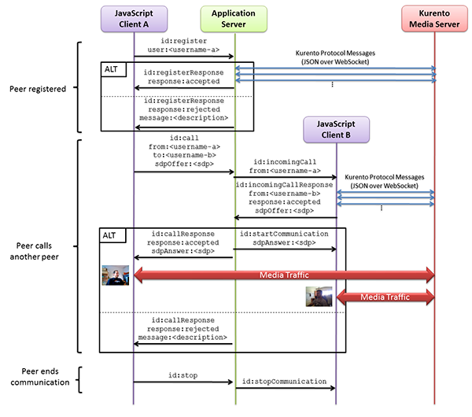

%%%%%%%%%%%%%%%%%%%%%%%%%%%%%%%%%%
Tutorial 4 - One to one video call
%%%%%%%%%%%%%%%%%%%%%%%%%%%%%%%%%%

This web application consists on a one-to-one video call using `WebRTC`:term:
technology. In other words, this application provides a simple video softphone.

For the impatient: running this example
=======================================

First of all, you should install Kurento Media Server to run this demo. Please
visit the :doc:`installation guide <../../installation_guide>` for further
information.

To launch the application you need to clone the GitHub project where this demo
is hosted and then run the main class, as follows:

.. sourcecode:: sh

    git clone https://github.com/Kurento/kurento-tutorial-java.git
    cd kurento-one2one-call
    mvn compile exec:java -Dexec.mainClass="org.kurento.tutorial.one2onecall.One2OneCallApp"

The web application starts on port 8080 in the localhost by default. Therefore,
open the URL http://localhost:8080/ in a WebRTC compliant browser (Chrome,
Firefox).

Understanding this example
==========================

The following picture shows an screenshot of this demo running in a web browser:

.. figure:: ../../images/kurento-java-tutorial-4-one2one-screenshot.png
   :align:   center
   :alt:     One to one video call screenshot
   :width: 600px

   *One to one video call screenshot*

The interface of the application (an HTML web page) is composed by two HTML5
video tags: one for the local stream and other for the remote peer stream). If
two users, A and B, are using the application, the media flows in the following
way: The video camera stream of user A is sent to the Kurento Media Server,
which sends it to user B. In the same way, B send to Kurento Media Server,
which forwards it to A. This means that KMS is providing a B2B (back-to-back)
call service.

To implement this behavior create a `Media Pipeline`:term: composed by two
WebRtC endpoints connected in B2B. The implemented media pipeline is
illustrated in the following picture:

.. figure:: ../../images/kurento-java-tutorial-4-one2one-pipeline.png
   :align:   center
   :alt:     One to one video call media pipeline
   :width: 400px

   *One to one video call Media Pipeline*

The client and the server communicate through a signaling protocol based on
`JSON`:term: messages over `WebSocket`:term: 's. The normal sequence between
client and server would be as follows:

1. User A is registered in the server with his name

2. User B is registered in the server with her name

3. User A wants to call to User B

4. User B accepts the incoming call

5. The communication is established and media is flowing between User A and
   User B

6. One of the users finishes the video communication

The detailed message flow in a call are shown in the picture below:

   *One to many one call signaling protocol*

As you can see in the diagram, `SDP`:term: needs to be interchanged between
client and server to establish the `WebRTC`:term: connection between the
browser and Kurento. Specifically, the SDP negotiation connects the WebRtcPeer
in the browser with the WebRtcEndpoint in the server.

The following sections describe in detail the server-side, the client-side, and
how to run the demo. The complete source code of this demo can be found in
`GitHub <https://github.com/Kurento/kurento-tutorial-java/tree/master/kurento-one2one-call>`_.

Application Server Logic
========================

This demo has been developed using **Java** in the server-side with
`Spring Boot`:term: framework. This technology can be used to embed the Tomcat
web server in the application and thus simplify the development process.

.. note:: 

   You can use whatever Java server side technology you prefer to build web
   applications with Kurento. For example, a pure Java EE application, SIP
   Servlets, Play, Vertex, etc. We have choose Spring Boot for convenience.

In the following figure you can see a class diagram of the server side code:

.. digraph:: One2OneCall
   :caption: Server-side class diagram of the one to one video call app

   size="12,8";
   fontname = "Bitstream Vera Sans"
   fontsize = 8

   node [
        fontname = "Bitstream Vera Sans"
        fontsize = 8
        shape = "record"
        style=filled
        fillcolor = "#E7F2FA"
        
   ]

   edge [
        fontname = "Bitstream Vera Sans"
        fontsize = 8
        arrowhead = "vee"
   ]

   One2OneCallApp -> UserRegistry;
   One2OneCallApp -> CallHandler;
   One2OneCallApp -> KurentoClient; 
   One2OneCallApp -> CallMediaPipeline;
   CallHandler -> KurentoClient [constraint = false]
   UserRegistry -> UserSession [headlabel="*",  labelangle=60]

The main class of this demo is named
`One2OneCallApp <https://github.com/Kurento/kurento-tutorial-java/blob/master/kurento-one2one-call/src/main/java/org/kurento/tutorial/one2onecall/One2OneCallApp.java>`_.
As you can see, the ``KurentoClient`` is instantiated in this class as a Spring
Bean.

.. sourcecode:: java

   @Configuration
   @EnableWebSocket
   @EnableAutoConfiguration
   public class One2OneCallApp implements WebSocketConfigurer {

      @Bean
      public CallHandler callHandler() {
         return new CallHandler();
      }

      @Bean
      public UserRegistry registry() {
         return new UserRegistry();
      }

      @Bean
      public KurentoClient kurentoClient() {
         return KurentoClient.create("ws://localhost:8888/kurento");
      }

      public void registerWebSocketHandlers(WebSocketHandlerRegistry registry) {
         registry.addHandler(callHandler(), "/call");
      }

      public static void main(String[] args) throws Exception {
         new SpringApplication(One2OneCallApp.class).run(args);
      }

   }

This web application follows *Single Page Application* architecture
(`SPA`:term:) and uses a `WebSocket`:term: to communicate client with server by
means of requests and responses. Specifically, the main app class implements
the interface ``WebSocketConfigurer`` to register a ``WebSocketHanlder`` to
process WebSocket requests in the path ``/call``.

`CallHandler <https://github.com/Kurento/kurento-tutorial-java/blob/master/kurento-one2one-call/src/main/java/org/kurento/tutorial/one2onecall/CallHandler.java>`_
class implements ``TextWebSocketHandler`` to handle text WebSocket requests.
The central piece of this class is the method ``handleTextMessage``. This
method implements the actions for requests, returning responses through the
WebSocket. In other words, it implements the server part of the signaling
protocol depicted in the previous sequence diagram.

In the designed protocol there are three different kind of incoming messages to
the application server: ``register``, ``call``, ``incomingCallResponse`` and
``stop``. These messages are treated in the *switch* clause, taking the proper
steps in each case.

.. sourcecode:: java

   public class CallHandler extends TextWebSocketHandler {
   
      private static final Logger log = LoggerFactory
            .getLogger(CallHandler.class);
      private static final Gson gson = new GsonBuilder().create();
   
      private ConcurrentHashMap<String, CallMediaPipeline> pipelines = new ConcurrentHashMap<String, CallMediaPipeline>();
   
      @Autowired
      private KurentoClient kurento;
   
      @Autowired
      private UserRegistry registry;
   
      @Override
      public void handleTextMessage(WebSocketSession session, TextMessage message)
            throws Exception {
         JsonObject jsonMessage = gson.fromJson(message.getPayload(),
               JsonObject.class);
         UserSession user = registry.getBySession(session);
   
         if (user != null) {
            log.debug("Incoming message from user '{}': {}", user.getName(),
                  jsonMessage);
         } else {
            log.debug("Incoming message from new user: {}", jsonMessage);
         }
   
         switch (jsonMessage.get("id").getAsString()) {
         case "register":
            try {
               register(session, jsonMessage);
            } catch (Throwable t) {
               log.error(t.getMessage(), t);
               JsonObject response = new JsonObject();
               response.addProperty("id", "resgisterResponse");
               response.addProperty("response", "rejected");
               response.addProperty("message", t.getMessage());
               session.sendMessage(new TextMessage(response.toString()));
            }
            break;
         case "call":
            try {
               call(user, jsonMessage);
            } catch (Throwable t) {
               log.error(t.getMessage(), t);
               JsonObject response = new JsonObject();
               response.addProperty("id", "callResponse");
               response.addProperty("response", "rejected");
               response.addProperty("message", t.getMessage());
               session.sendMessage(new TextMessage(response.toString()));
            }
            break;
         case "incomingCallResponse":
            incomingCallResponse(user, jsonMessage);
            break;
         case "stop":
            stop(session);
            break;
         default:
            break;
         }
      }
   
      private void register(WebSocketSession session, JsonObject jsonMessage)
            throws IOException {
         ...
      }
   
      private void call(UserSession caller, JsonObject jsonMessage)
            throws IOException {
         ...
      }
   
      private void incomingCallResponse(UserSession callee, JsonObject jsonMessage)
            throws IOException {
         ...
      }
   
      public void stop(WebSocketSession session) throws IOException {
         ...
      }
   
      @Override
      public void afterConnectionClosed(WebSocketSession session,
            CloseStatus status) throws Exception {
         registry.removeBySession(session);
      }
   
   }

In the following snippet, we can see the ``register`` method. Basically, it
obtains the ``name`` attribute from ``register`` message and check if there are
a registered user with that name. If not, the new user is registered and an
acceptance message is sent to it.

.. sourcecode :: java

   private void register(WebSocketSession session, JsonObject jsonMessage)
         throws IOException {
      String name = jsonMessage.getAsJsonPrimitive("name").getAsString();

      UserSession caller = new UserSession(session, name);
      String responseMsg = "accepted";
      if (name.isEmpty()) {
         responseMsg = "rejected: empty user name";
      } else if (registry.exists(name)) {
         responseMsg = "rejected: user '" + name + "' already registered";
      } else {
         registry.register(caller);
      }

      JsonObject response = new JsonObject();
      response.addProperty("id", "resgisterResponse");
      response.addProperty("response", responseMsg);
      caller.sendMessage(response);
   }
           
In the ``call`` method, the server checks if there are a registered user with
the name specified in ``to`` message attribute and send an ``incomingCall``
message to it. Or, if there isn't any user with that name, a ``callResponse``
message is sent to caller rejecting the call.

.. sourcecode :: java

   private void call(UserSession caller, JsonObject jsonMessage)
         throws IOException {
      String to = jsonMessage.get("to").getAsString();
      String from = jsonMessage.get("from").getAsString();
      JsonObject response = new JsonObject();

      if (registry.exists(to)) {
         UserSession callee = registry.getByName(to);
         caller.setSdpOffer(jsonMessage.getAsJsonPrimitive("sdpOffer")
               .getAsString());
         caller.setCallingTo(to);

         response.addProperty("id", "incomingCall");
         response.addProperty("from", from);

         callee.sendMessage(response);
         callee.setCallingFrom(from);
      } else {
         response.addProperty("id", "callResponse");
         response.addProperty("response", "rejected: user '" + to
               + "' is not registered");

         caller.sendMessage(response);
      }
   }

The ``stop`` method finish the video call. This procedure can be called both by
caller and callee in the communication. The result is that both peers release
the Media Pipeline and ends the video communication:

.. sourcecode :: java

   public void stop(WebSocketSession session) throws IOException {
      String sessionId = session.getId();
      if (pipelines.containsKey(sessionId)) {
         pipelines.get(sessionId).release();
         CallMediaPipeline pipeline = pipelines.remove(sessionId);
         pipeline.release();

         // Both users can stop the communication. A 'stopCommunication'
         // message will be sent to the other peer.
         UserSession stopperUser = registry.getBySession(session);
         UserSession stoppedUser = (stopperUser.getCallingFrom() != null) ? registry
               .getByName(stopperUser.getCallingFrom()) : registry
               .getByName(stopperUser.getCallingTo());

         JsonObject message = new JsonObject();
         message.addProperty("id", "stopCommunication");
         stoppedUser.sendMessage(message);
      }
   }

In the ``incomingCallResponse`` method, if the callee user accepts the call, it
is established and the media elements are created to connect the caller with
the callee in a B2B manner. Basically, the server creates a
``CallMediaPipeline`` object, to encapsulate the media pipeline creation and
management. Then, this object is used to negotiate media interchange with
user's browsers.

The negotiation between WebRTC peer in the browser and WebRtcEndpoint in Kurento
Media Server is made by means of `SDP`:term: generation at the client (offer)
and SDP generation at the server (answer). The SDP answers are generated with
the Kurento Java Client inside the class ``CallMediaPipeline`` (as we see in a
moment). The methods used to generate SDP are
``generateSdpAnswerForCallee(calleeSdpOffer)`` and
``generateSdpAnswerForCaller(callerSdpOffer)``:

.. sourcecode :: java

   private void incomingCallResponse(UserSession callee, JsonObject jsonMessage)
         throws IOException {
      String callResponse = jsonMessage.get("callResponse").getAsString();
      String from = jsonMessage.get("from").getAsString();
      UserSession calleer = registry.getByName(from);
      String to = calleer.getCallingTo();

      if ("accept".equals(callResponse)) {
         log.debug("Accepted call from '{}' to '{}'", from, to);

         CallMediaPipeline pipeline = null;
         try {
            pipeline = new CallMediaPipeline(kurento);

            pipelines.put(calleer.getSessionId(), pipeline);
            pipelines.put(callee.getSessionId(), pipeline);

            String calleeSdpOffer = jsonMessage.get("sdpOffer")
                  .getAsString();
            String calleeSdpAnswer = pipeline
                  .generateSdpAnswerForCallee(calleeSdpOffer);

            String callerSdpOffer = registry.getByName(from).getSdpOffer();
            String callerSdpAnswer = pipeline
                  .generateSdpAnswerForCaller(callerSdpOffer);

            JsonObject startCommunication = new JsonObject();
            startCommunication.addProperty("id", "startCommunication");
            startCommunication.addProperty("sdpAnswer", calleeSdpAnswer);
            callee.sendMessage(startCommunication);

            JsonObject response = new JsonObject();
            response.addProperty("id", "callResponse");
            response.addProperty("response", "accepted");
            response.addProperty("sdpAnswer", callerSdpAnswer);
            calleer.sendMessage(response);

         } catch (Throwable t) {
            log.error(t.getMessage(), t);

            if (pipeline != null) {
               pipeline.release();
            }

            pipelines.remove(calleer.getSessionId());
            pipelines.remove(callee.getSessionId());

            JsonObject response = new JsonObject();
            response.addProperty("id", "callResponse");
            response.addProperty("response", "rejected");
            calleer.sendMessage(response);

            response = new JsonObject();
            response.addProperty("id", "stopCommunication");
            callee.sendMessage(response);
         }

      } else {
         JsonObject response = new JsonObject();
         response.addProperty("id", "callResponse");
         response.addProperty("response", "rejected");
         calleer.sendMessage(response);
      }
   }
           
The media logic in this demo is implemented in the class
`CallMediaPipeline <https://github.com/Kurento/kurento-tutorial-java/blob/master/kurento-one2one-call/src/main/java/org/kurento/tutorial/one2onecall/CallMediaPipeline.java>`_.
As you can see, the media pipeline of this demo is quite simple: two
``WebRtcEndpoint`` elements directly interconnected. Please take note that the
WebRtcEndpoints need to be connected twice, one for each media direction.

.. sourcecode:: java

   public class CallMediaPipeline {
   
      private MediaPipeline pipeline;
      private WebRtcEndpoint callerWebRtcEP;
      private WebRtcEndpoint calleeWebRtcEP;
   
      public CallMediaPipeline(KurentoClient kurento) {
         try {
            this.pipeline = kurento.createMediaPipeline();
            this.callerWebRtcEP = new WebRtcEndpoint.Builder(pipeline).build();
            this.calleeWebRtcEP = new WebRtcEndpoint.Builder(pipeline).build();
   
            this.callerWebRtcEP.connect(this.calleeWebRtcEP);
            this.calleeWebRtcEP.connect(this.callerWebRtcEP);
         } catch (Throwable t) {
            if(this.pipeline != null){
               pipeline.release();
            }
         }
      }
   
      public String generateSdpAnswerForCaller(String sdpOffer) {
         return callerWebRtcEP.processOffer(sdpOffer);
      }
   
      public String generateSdpAnswerForCallee(String sdpOffer) {
         return calleeWebRtcEP.processOffer(sdpOffer);
      }
   
      public void release() {
         if (pipeline != null) {
            pipeline.release();
         }
      }
   
   }

In this class we can see the implementation of methods
``generateSdpAnswerForCaller`` and ``generateSdpAnswerForCallee``. These
methods delegate to WebRtc endpoints to create the appropriate answer.

Client-Side
===========

Let's move now to the client-side of the application. To call the previously
created WebSocket service in the server-side, we use the JavaScript class
``WebSocket``. We use an specific Kurento JavaScript library called
**kurento-utils.js** to simplify the WebRTC interaction with the server. These
libraries are linked in the
`index.html <https://github.com/Kurento/kurento-tutorial-java/blob/master/kurento-one2one-call/src/main/resources/static/index.html>`_
web page, and are used in the
`index.js <https://github.com/Kurento/kurento-tutorial-java/blob/master/kurento-one2one-call/src/main/resources/static/js/index.js>`_.

In the following snippet we can see the creation of the WebSocket (variable
``ws``) in the path ``/call``. Then, the ``onmessage`` listener of the
WebSocket is used to implement the JSON signaling protocol in the client-side.
Notice that there are four incoming messages to client: ``resgisterResponse``,
``callResponse``, ``incomingCall``, and ``startCommunication``. Convenient
actions are taken to implement each step in the communication. For example, in
functions ``call`` and ``incomingCall`` (for caller and callee respectively),
the function ``WebRtcPeer.startSendRecv`` of *kurento-utils.js* is used to
start a WebRTC communication.

.. sourcecode:: javascript

    var ws = new WebSocket('ws://' + location.host + '/call');

   ws.onmessage = function(message) {
      var parsedMessage = JSON.parse(message.data);
      console.info('Received message: ' + message.data);
   
      switch (parsedMessage.id) {
      case 'resgisterResponse':
         resgisterResponse(parsedMessage);
         break;
      case 'callResponse':
         callResponse(parsedMessage);
         break;
      case 'incomingCall':
         incomingCall(parsedMessage);
         break;
      case 'startCommunication':
         startCommunication(parsedMessage);
         break;
      case 'stopCommunication':
         console.info("Communication ended by remote peer");
         stop(true);
         break;
      default:
         console.error('Unrecognized message', parsedMessage);
      }
   }

   function incomingCall(message) {
      //If bussy just reject without disturbing user
      if(callState != NO_CALL){
         var response = {
            id : 'incomingCallResponse',
            from : message.from,
            callResponse : 'reject',
            message : 'bussy'
         };
         return sendMessage(response);
      }
      
      setCallState(PROCESSING_CALL);
      if (confirm('User ' + message.from  + ' is calling you. Do you accept the call?')) {
         showSpinner(videoInput, videoOutput);
         webRtcPeer = kurentoUtils.WebRtcPeer.startSendRecv(videoInput, videoOutput, function(sdp, wp) {
            var response = {
               id : 'incomingCallResponse',
               from : message.from,
               callResponse : 'accept',
               sdpOffer : sdp
            };
            sendMessage(response);
         }, function(error){
            setCallState(NO_CALL);
         });
      } else {
         var response = {
            id : 'incomingCallResponse',
            from : message.from,
            callResponse : 'reject',
            message : 'user declined'
         };
         sendMessage(response);
         stop();
      }
   }

   function call() {
      if(document.getElementById('peer').value == ''){
         window.alert("You must specify the peer name");
         return;
      }
      setCallState(PROCESSING_CALL);
      
      showSpinner(videoInput, videoOutput);
   
      kurentoUtils.WebRtcPeer.startSendRecv(videoInput, videoOutput, function(offerSdp, wp) {
         webRtcPeer = wp;
         console.log('Invoking SDP offer callback function');
         var message = {
            id : 'call',
            from : document.getElementById('name').value,
            to : document.getElementById('peer').value,
            sdpOffer : offerSdp
         };
         sendMessage(message);
      }, function(error){
         console.log(error);
         setCallState(NO_CALL);
      });
   }

.. note::

   We are in active development. Be sure that you have the latest version of Kurento
   Java Client your POM. You can find it at Maven Central searching for
   ``kurento-client``.

Kurento Java Client has a minimum requirement of **Java 7**. To configure the
application to use Java 7, we have to include the following properties in the
properties section:

.. sourcecode:: xml

   <maven.compiler.target>1.7</maven.compiler.target>
   <maven.compiler.source>1.7</maven.compiler.source>

Dependencies
============

This Java Spring application is implementad using `Maven`:term:. The relevant
part of the *pom.xml* is where Kurento dependencies are declared. As the
following snippet shows, we need two dependencies: the Kurento Client Java
dependency (*kurento-client*) and the JavaScript Kurento utility library
(*kurento-utils*) for the client-side:

.. sourcecode:: xml 

   <dependencies>
      <dependency>
         <groupId>org.kurento</groupId>
         <artifactId>kurento-client</artifactId>
         <version>[5.0.0,6.0.0)</version>
      </dependency>
      <dependency>
         <groupId>org.kurento</groupId>
         <artifactId>kurento-utils-js</artifactId>
         <version>[5.0.0,6.0.0)</version>
      </dependency>
   </dependencies>

.. note::

   We are in active development. Be sure that you have the latest version of
   Kurento Java Client in your pom.xml. You can find it at `Maven Central <http://search.maven.org/#search%7Cga%7C1%7Ckurento-client>`_
   searching for ``kurento-client``.

Kurento Java Client has a minimum requirement of **Java 7**. To configure the
application to use Java 7, we have to include the following properties in the
properties section:

.. sourcecode:: xml

   <maven.compiler.target>1.7</maven.compiler.target>
   <maven.compiler.source>1.7</maven.compiler.source>

