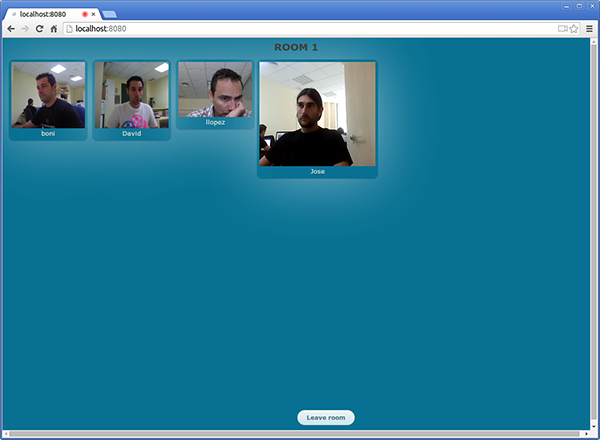
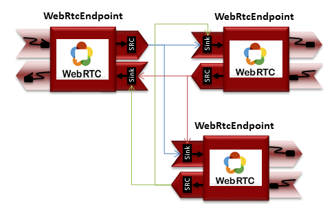
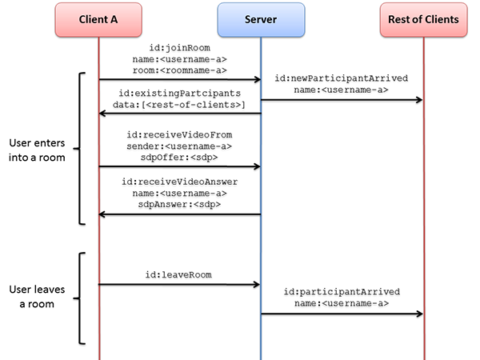

%%%%%%%%%%%%%%%%%%%%%%%%%%%%%%%%%%%%
Tutorial 6 - Many to many video call
%%%%%%%%%%%%%%%%%%%%%%%%%%%%%%%%%%%%

This web application consists on a many to many video call using `WebRTC`:term:.
In other words, this application is a video group communication service. The
following picture shows an screenshot of this demo running in a web browser:

This web application follows *Single Page Application* architecture
(`SPA`:term:). The interface of the application is composed by two parts. In
the first one, the user insert a nick name and a room name. In the second one
the communication takes places since there are several HTML5 video tags (one
per user in the room). These video tags are dynamically added/removed when
users enter/leave the room.

To implement this behavior we have to create a `Media Pipeline`:term: in which
new WebRtc endpoints are added when new users enter the room. Each WebRtc
endpoint in interconnected to the existing ones. This media pipeline is
illustrated in the following picture:

To communicate the clients with the server we designed a signaling protocol
based on `JSON`:term: messages which are sent over `WebSocket`:term: 's. This
protocol has to two parts: when a user enters the room and when a user leaves
that room. The following sequence diagram illustrates the interchange of
`JSON`:term: messages for both stages:

As you can see in the diagram, `SDP`:term: needs to be interchanged between
client and server to establish the `WebRTC`:term: connection between the
browser and Kurento. Specifically, the SDP negotiation connects the WebRtcPeer
in the browser with the WebRtcEndpoint in the server.

The following sections describe in detail the server-side, the client-side, and
how to run the demo.

The complete source code of this demo can be found in
`GitHub <https://github.com/Kurento/kurento-tutorial-java/tree/master/kurento-group-call>`_.

Server-Side
===========

As in the :doc:`tutorial 2</tutorials/java/tutorial-2-magicmirror>`, this demo
has been developed using **Java** and
`Spring Boot <http://projects.spring.io/spring-boot/>`_.

.. note:: 

   You can use whatever Java server side technology you prefer to build web
   applications with Kurento. For example, a pure Java EE application, SIP
   Servlets, Play, Vertex, etc. We have choose Spring Boot for convenience.

In the following figure you can see a class diagram of the server side code:

.. digraph:: Many2ManyCall
   :caption: Server-side class diagram of the many to many video call app

   size="12,8";
   fontname = "Bitstream Vera Sans"
   fontsize = 8

   node [
        fontname = "Bitstream Vera Sans"
        fontsize = 8
        shape = "record"
        style=filled
        fillcolor = "#E7F2FA"
        
   ]

   edge [
        fontname = "Bitstream Vera Sans"
        fontsize = 8
        arrowhead = "vee"
   ]

   GroupCallApp -> UserRegistry;
   GroupCallApp -> RoomManager;
   GroupCallApp -> CallHandler;
   GroupCallApp -> KurentoClient; 
   CallHandler -> KurentoClient;
   CallHandler -> UserRegistry;
   UserRegistry -> UserSession [headlabel="*"]
   RoomManager -> Room [headlabel="*"]

The main class of this demo is named
`GroupCallApp <https://github.com/Kurento/kurento-tutorial-java/blob/master/kurento-group-call/src/main/java/org/kurento/tutorial/groupcall/GroupCallApp.java>`_.
The classes ``KurentoClient``, ``UserRegistry``, ``RoomManager`` and
``CallHandler`` are instantiated as a Spring Beans.

.. sourcecode:: java

   @Configuration
   @EnableWebSocket
   @EnableAutoConfiguration
   public class GroupCallApp implements WebSocketConfigurer {
   
      @Bean
      public UserRegistry registry() {
         return new UserRegistry();
      }
   
      @Bean
      public RoomManager roomManager() {
         return new RoomManager();
      }
   
      @Bean
      public CallHandler groupCallHandler() {
         return new CallHandler();
      }
   
      @Bean
      public KurentoClient kurentoClient() {
         return KurentoClient.create("ws://localhost:8888/kurento");
      }
   
      public static void main(String[] args) throws Exception {
         SpringApplication.run(GroupCallApp.class, args);
      }
   
      @Override
      public void registerWebSocketHandlers(WebSocketHandlerRegistry registry) {
         registry.addHandler(groupCallHandler(), "/groupcall");
      }
   }

As mentioned before, this web application uses a `WebSocket`:term: to
communicate client with server by means of requests and responses.
Specifically, the
`GroupCallApp <https://github.com/Kurento/kurento-tutorial-java/blob/master/kurento-group-call/src/main/java/org/kurento/tutorial/groupcall/GroupCallApp.java>`_
class implements the interface ``WebSocketConfigurer`` to register a
``WebSocketHanlder`` to process web socket requests in the path ``/groupcall``.

We should now take a look to the
`CallHandler <https://github.com/Kurento/kurento-tutorial-java/blob/master/kurento-group-call/src/main/java/org/kurento/tutorial/groupcall/CallHandler.java>`_
class, which implements ``TextWebSocketHandler`` to handle text WebSocket
requests. In our signaling protocol there are three different kind of incoming
messages to the *Server* : ``joinRoom``, ``receiveVideoFrom``, and
``leaveRoom``. These messages are treated in the *switch* clause of the
``handleTextMessage`` method, taking the proper steps in each case.

.. sourcecode:: java

   public class CallHandler extends TextWebSocketHandler {
   
      private static final Logger log = LoggerFactory.getLogger(CallHandler.class);
   
      private static final Gson gson = new GsonBuilder().create();
   
      @Autowired
      private RoomManager roomManager;
   
      @Autowired
      private UserRegistry registry;
   
      @Override
      public void handleTextMessage(WebSocketSession session, TextMessage message)
            throws Exception {
         final JsonObject jsonMessage = gson.fromJson(message.getPayload(),
               JsonObject.class);
   
         final UserSession user = registry.getBySession(session);
   
         if (user != null) {
            log.debug("Incoming message from user '{}': {}", user.getName(),
                  jsonMessage);
         } else {
            log.debug("Incoming message from new user: {}", jsonMessage);
         }
   
         switch (jsonMessage.get("id").getAsString()) {
         case "joinRoom":
            joinRoom(jsonMessage, session);
            break;
         case "receiveVideoFrom":
            final String senderName = jsonMessage.get("sender").getAsString();
            final UserSession sender = registry.getByName(senderName);
            final String sdpOffer = jsonMessage.get("sdpOffer").getAsString();
            user.receiveVideoFrom(sender, sdpOffer);
            break;
         case "leaveRoom":
            leaveRoom(user);
            break;
         default:
            break;
         }
      }
   
      @Override
      public void afterConnectionClosed(WebSocketSession session,
            CloseStatus status) throws Exception {
         UserSession user = registry.removeBySession(session);
         roomManager.getRoom(user.getRoomName()).leave(user);
      }
   
      private void joinRoom(JsonObject params, WebSocketSession session)
            throws IOException {
         final String roomName = params.get("room").getAsString();
         final String name = params.get("name").getAsString();
         log.info("PARTICIPANT {}: trying to join room {}", name, roomName);
   
         final Room room = roomManager.getRoom(roomName);
         final UserSession user = room.join(name, session);
         registry.register(user);
      }
   
      private void leaveRoom(UserSession user) throws IOException {
         ...
      }
   }

In this tutorial we are going to see in detail the first part of the signaling
protocol, i.e., when a new user enters a room. The ``joinRoom`` method of the
``CallHandler`` class obtains the ``name`` and ``roomName`` attribute from the
message. Then the ``RoomManager`` is used to get the room (creating a new one
if necessary). The method ``join`` of class
`Room <https://github.com/Kurento/kurento-tutorial-java/blob/master/kurento-group-call/src/main/java/org/kurento/tutorial/groupcall/Room.java>`_
is used to notify to the rest of participant that a new user has entered
(``newParticipantArrived`` message), and also to inform the the incoming user
the list of existing users in the room (``existingParticipants`` message):

.. sourcecode :: java

   public class Room implements Closeable {
      ...
   
      public UserSession join(String userName, WebSocketSession session)
            throws IOException {
         log.info("ROOM {}: adding participant {}", userName, userName);
         final UserSession participant = new UserSession(userName, this.name,
               session, this.pipeline);
         joinRoom(participant);
         participants.put(participant.getName(), participant);
         sendParticipantNames(participant);
         return participant;
      }
   
      private Collection<String> joinRoom(UserSession newParticipant)
            throws IOException {
         final JsonObject newParticipantMsg = new JsonObject();
         newParticipantMsg.addProperty("id", "newParticipantArrived");
         newParticipantMsg.addProperty("name", newParticipant.getName());
   
         final List<String> participantsList = new ArrayList<>(participants
               .values().size());
         log.debug(
               "ROOM {}: notifying other participants of new participant {}",
               name, newParticipant.getName());
   
         for (final UserSession participant : participants.values()) {
            try {
               participant.sendMessage(newParticipantMsg);
            } catch (final IOException e) {
               log.debug("ROOM {}: participant {} could not be notified",
                     name, participant.getName(), e);
            }
            participantsList.add(participant.getName());
         }
   
         return participantsList;
      }
   
      public void sendParticipantNames(UserSession user) throws IOException {
   
         final JsonArray participantsArray = new JsonArray();
         for (final UserSession participant : this.getParticipants()) {
            if (!participant.equals(user)) {
               final JsonElement participantName = new JsonPrimitive(
                     participant.getName());
               participantsArray.add(participantName);
            }
         }
   
         final JsonObject existingParticipantsMsg = new JsonObject();
         existingParticipantsMsg.addProperty("id", "existingParticipants");
         existingParticipantsMsg.add("data", participantsArray);
         log.debug("PARTICIPANT {}: sending a list of {} participants",
               user.getName(), participantsArray.size());
         user.sendMessage(existingParticipantsMsg);
      }
   
      ...

   }
       

Client-Side
===========

Let's move now to the client-side of the application. To connect with the
previously created WebSocket in the server-side, we use the JavaScript class
``WebSocket``. In addition, we use an specific Kurento JavaScript library
called **kurento-utils.js** to simplify the WebRTC interaction with the server.
These libraries are linked in the
`index.html <https://github.com/Kurento/kurento-tutorial-java/blob/master/kurento-group-call/src/main/resources/static/index.html>`_
web page, and are used in
`conferenceroom.js <https://github.com/Kurento/kurento-tutorial-java/blob/master/kurento-group-call/src/main/resources/static/js/conferenceroom.js>`_.

In the following snippet we can see the creation of the WebSocket (variable
``ws``) in the path ``/groupcall``. Then, the ``onmessage`` listener of the
WebSocket is used to implement the `JSON`:term: signaling protocol in the
client-side. Notice that there are four incoming messages to client:
``existingParticipants``, ``newParticipantArrived``, ``participantLeft``, and
``receiveVideoAnswer``. Convenient actions are taken to implement each step in
the communication.

.. sourcecode:: javascript

   var ws = new WebSocket('ws://' + location.host + '/groupcall');
   
   window.onbeforeunload = function() {
      ws.close();
   };
   
   ws.onmessage = function(message) {
      var parsedMessage = JSON.parse(message.data);
      console.info('Received message: ' + message.data);
   
      switch (parsedMessage.id) {
      case 'existingParticipants':
         onExistingParticipants(parsedMessage);
         break;
      case 'newParticipantArrived':
         onNewParticipant(parsedMessage);
         break;
      case 'participantLeft':
         onParticipantLeft(parsedMessage);
         break;
      case 'receiveVideoAnswer':
         receiveVideoResponse(parsedMessage);
         break;
      default:
         console.error('Unrecognized message', parsedMessage);
      }
   }

The negotiation of SDP is started in the client-side after receiving the message
``existingParticipants`` from the server:

.. sourcecode:: javascript 

   function onExistingParticipants(msg) {
      var constraints = {
         audio : true,
         video : {
            mandatory : {
               maxWidth : 320,
               maxFrameRate : 15,
               minFrameRate : 15
            }
         }
      };
      console.log(name + " registered in room " + room);
      var participant = new Participant(name);
      participants[name] = participant;
      var video = participant.getVideoElement();
      participant.rtcPeer = kwsUtils.WebRtcPeer.startSendOnly(video,
            participant.offerToReceiveVideo.bind(participant), null,
            constraints);
      msg.data.forEach(receiveVideo);
   }
   
   function receiveVideo(sender) {
      var participant = new Participant(sender);
      participants[sender] = participant;
      var video = participant.getVideoElement();
      participant.rtcPeer = kwsUtils.WebRtcPeer.startRecvOnly(video,
            participant.offerToReceiveVideo.bind(participant));
   }

   
The function ``WebRtcPeer.startSendOnly`` and ``WebRtcPeer.startRecvOnly`` of
*kurento-utils.js* are used to start a WebRTC communication. In the method
``offerToReceiveVideo`` of the JavaScript class
`participant.js <https://github.com/Kurento/kurento-tutorial-java/blob/master/kurento-group-call/src/main/resources/static/js/participant.js>`_
we can see how the ``receiveVideoFrom`` message is sent to the server with the
generated SDP offer:

.. sourcecode:: javascript 

   this.offerToReceiveVideo = function(offerSdp, wp){
      console.log('Invoking SDP offer callback function');
      var msg =  { id : "receiveVideoFrom",
            sender : name,
            sdpOffer : offerSdp
         };
      sendMessage(msg);
   }

Server then uses that offer to generate a SDP answer which is deliverd to the
client using the ``receiveVideoAnswer`` message:

.. sourcecode:: javascript
 
   function receiveVideoResponse(result) {
      participants[result.name].rtcPeer.processSdpAnswer(result.sdpAnswer);
   }

Dependencies
============

This Java Spring application is implemented using `Maven`:term:. The relevant
part of the *pom.xml* is where Kurento dependencies are declared. As the
following snippet shows, we need two dependencies: the Kurento Client Java
dependency (*kurento-client*) and the JavaScript Kurento utility library
(*kurento-utils*) for the client-side:

.. sourcecode:: xml 

   <dependencies> 
      <dependency>
         <groupId>org.kurento</groupId>
         <artifactId>kurento-client</artifactId>
         <version>[5.0.0,6.0.0)</version>
      </dependency> 
      <dependency> 
         <groupId>org.kurento</groupId>
         <artifactId>kurento-utils-js</artifactId> 
         <version>[5.0.0,6.0.0)</version>
      </dependency> 
   </dependencies>

.. note::

   We are in active development. Be sure that you have the latest version of
   Kurento Java Client in your pom.xml. You can find it at `Maven Central <http://search.maven.org/#search%7Cga%7C1%7Ckurento-client>`_
   searching for ``kurento-client``.

How to run this application
===========================

First of all, you should install Kurento Media Server to run this demo. Please
visit the `installation guide <../../Installation_Guide.rst>`_ for further
information.

This demo is assuming that you have a Kurento Media Server installed and running
in your local machine. If so, to launch the app you need to clone the GitHub
project where this demo is hosted, and then run the main class, as follows:

.. sourcecode:: sh

    git clone https://github.com/Kurento/kurento-tutorial-java.git
    cd kurento-group-call
    mvn compile exec:java -Dexec.mainClass="org.kurento.tutorial.groupcall.GroupCallApp"

The web application starts on port 8080 in the localhost by default. Therefore,
open the URL http://localhost:8080/ in a WebRTC compliant browser (Chrome,
Firefox).
