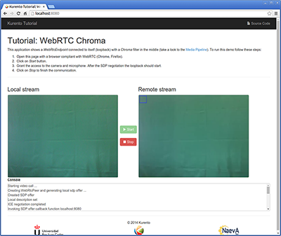
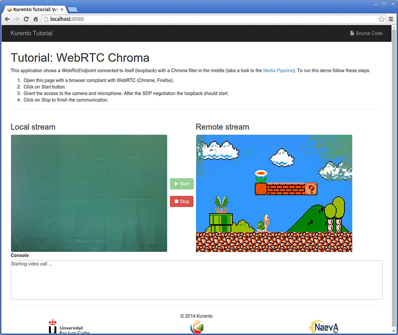

%%%%%%%%%%%%%%%%%%%%%%%%%%%%%%%%%%%%%%%%%%%%
JavaScript Module Tutorial 2 - Chroma Filter
%%%%%%%%%%%%%%%%%%%%%%%%%%%%%%%%%%%%%%%%%%%%

This web application consists on a `WebRTC`:term: video communication in mirror
(*loopback*) with a chroma filter element.

For the impatient: running this example
=======================================

First of all, you should install Kurento Media Server to run this demo. Please
visit the :doc:`installation guide <../../installation_guide>` for further
information. In addition, the built-in module ``kms-chroma`` should be also
installed:

.. sourcecode:: sh

    sudo apt-get install kms-chroma

Be sure to have installed `Node.js`:term: and `Bower`:term: in your system. In
an Ubuntu machine, you can install both as follows:

.. sourcecode:: sh

   curl -sL https://deb.nodesource.com/setup | sudo bash -
   sudo apt-get install -y nodejs
   sudo npm install -g bower

Due to `Same-origin policy`:term:, this demo has to be served by an HTTP server.
A very simple way of doing this is by means of a HTTP Node.js server which can
be installed using `npm`:term: :

.. sourcecode:: sh

   sudo npm install http-server -g

You also need the source code of this demo. You can clone it from GitHub. Then
start the HTTP server:

.. sourcecode:: sh

    git clone https://github.com/Kurento/kurento-tutorial-js.git
    cd kurento-tutorial-js/kurento-chroma
    bower install
    http-server

Finally access the application connecting to the URL http://localhost:8080/
through a WebRTC capable browser (Chrome, Firefox).

Understanding this example
==========================

This application uses computer vision and augmented reality techniques to detect
a chroma in a WebRTC stream based on color tracking.

The interface of the application (an HTML web page) is composed by two HTML5
video tags: one for the video camera stream (the local client-side stream) and
other for the mirror (the remote stream). The video camera stream is sent to
Kurento Media Server, which processes and sends it back to the client as a
remote stream. To implement this, we need to create a `Media Pipeline`:term:
composed by the following `Media Element`:term: s:

.. figure:: ../../images/kurento-module-tutorial-chroma-pipeline.png
   :align:   center
   :alt:     WebRTC with Chroma filter Media Pipeline

   *WebRTC with Chroma filter Media Pipeline*

The complete source code of this demo can be found in
`GitHub <https://github.com/Kurento/kurento-tutorial-java/tree/master/kurento-chroma>`_.

This example is a modified version of the
:doc:`Magic Mirror <./tutorial-1-magicmirror>` tutorial. In this case, this
demo uses a **Chroma** instead of **FaceOverlay** filter.

In order to perform chroma detection, there must be a color calibration stage.
To accomplish this step, at the beginning of the demo, a little square appears
in upper left of the video, as follows:

   *Chroma calibration stage*

In the first second of the demo, a calibration process is done, by detecting the
color inside that square. When the calibration is finished, the square
disappears and the chroma is substituted with the configured image. Take into
account that this process requires lighting condition. Otherwise the chroma
substitution will not be perfect. This behavior can be seen in the upper right
corner of the following screenshot:

   *Chroma filter in action*

The media pipeline of this demo is is implemented in the JavaScript logic as
follows:

.. sourcecode:: javascript

   client.create('MediaPipeline', function(error, p) {
      if (error) return onError(error);

      pipeline = p;

      pipeline.create('WebRtcEndpoint', function(error, webRtc) {
         if (error) return onError(error);

         pipeline.create('ChromaFilter', {window: {topRightCornerX:5 , topRightCornerY:5 , width:30 , height:30 }}, function(error, filter) {
            if (error) return onError(error);
            
            webRtc.connect(filter, function(error) {
               if (error) return onError(error);

               filter.connect(webRtc, function(error) {
                  if (error) return onError(error);

                  console.log("filter --> WebRtcEndpoint");
               });

               filter.setBackground (bg_uri, function(error) {
                  if (error) return onError(error);

                  console.log("Set Image");
               });
            });

            webRtc.processOffer(sdpOffer, function(error, sdpAnswer) {
               if (error) return onError(error);

               webRtcPeer.processSdpAnswer(sdpAnswer);
            });
         });
      });
   });

Dependencies
============

The dependencies of this demo has to be obtained using `Bower`:term:. The
definition of these dependencies are defined in the
`bower.json <https://github.com/Kurento/kurento-tutorial-js/blob/master/kurento-chroma/bower.json>`_
file, as follows:

.. sourcecode:: js

   "dependencies": {
      "kurento-client": "^5.0.0",
      "kurento-utils": "^5.0.0",
      "kurento-module-chroma": "^1.0.0"
   }

Kurento framework uses `Semantic Versioning`:term: for releases. Notice that
ranges (``^5.0.0`` for *kurento-client* and *kurento-utils-js*,  and ``^1.0.0``
for *chroma*) downloads the latest version of Kurento artifacts from Bower.
