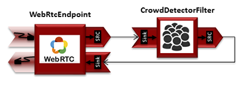
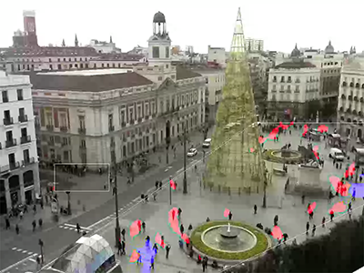

%%%%%%%%%%%%%%%%%%%%%%%%%%%%%%%%%%%%%%%%%%%%%%%%%%%%
JavaScript Module Tutorial 3 - Crowd Detector Filter
%%%%%%%%%%%%%%%%%%%%%%%%%%%%%%%%%%%%%%%%%%%%%%%%%%%%

This web application consists on a `WebRTC`:term: video communication in mirror
(*loopback*) with a crowd detector filter. This filter detects people
agglomeration in video streams.

For the impatient: running this example
=======================================

First of all, you should install Kurento Media Server to run this demo. Please
visit the :doc:`installation guide <../../installation_guide>` for further
information. In addition, the built-in module ``kms-crowddetector-6.0`` should
be also installed:

.. sourcecode:: sh

    sudo apt-get install kms-crowddetector-6.0

Be sure to have installed `Node.js`:term: and `Bower`:term: in your system. In
an Ubuntu machine, you can install both as follows:

.. sourcecode:: sh

   curl -sL https://deb.nodesource.com/setup | sudo bash -
   sudo apt-get install -y nodejs
   sudo npm install -g bower

Due to `Same-origin policy`:term:, this demo has to be served by an HTTP server.
A very simple way of doing this is by means of a HTTP Node.js server which can
be installed using `npm`:term: :

.. sourcecode:: sh

   sudo npm install http-server -g

You also need the source code of this demo. You can clone it from GitHub. Then
start the HTTP server:

.. sourcecode:: sh

    git clone https://github.com/Kurento/kurento-tutorial-js.git
    cd kurento-tutorial-js/kurento-crowddetector
    bower install
    http-server

Finally access the application connecting to the URL http://localhost:8080/
through a WebRTC capable browser (Chrome, Firefox).

.. note::

   These instructions work only if Kurento Media Server is up and running in the same machine
   than the tutorial. However, it is possible to locate the KMS in other machine simple adding
   the parameter ``ws_uri`` to the URL, as follows:

   .. sourcecode:: sh

      http://localhost:8080/index.html?ws_uri=ws://kms_host:kms_port/kurento

Understanding this example
==========================

This application uses computer vision and augmented reality techniques to detect
a crowd in a WebRTC stream.

The interface of the application (an HTML web page) is composed by two HTML5
video tags: one for the video camera stream (the local client-side stream) and
other for the mirror (the remote stream). The video camera stream is sent to
Kurento Media Server, which processes and sends it back to the client as a
remote stream. To implement this, we need to create a `Media Pipeline`:term:
composed by the following `Media Element`:term: s:

   *WebRTC with crowdDetector filter Media Pipeline*

The complete source code of this demo can be found in
`GitHub <https://github.com/Kurento/kurento-tutorial-java/tree/master/kurento-crowddetector>`_.

This example is a modified version of the
:doc:`Magic Mirror <./tutorial-2-magicmirror>` tutorial. In this case, this
demo uses a **CrowdDetector** instead of **FaceOverlay** filter.

To setup a ``CrowdDetectorFilter``, first we need to define one or more
*region of interests* (ROIs). A ROI delimits the zone within the video stream
in which crowd are going to be tracked. To define a ROI, we need to configure
at least three points. These points are defined in relative terms (0 to 1) to
the video width and height.

``CrowdDetectorFilter`` performs two actions in the defined ROIs. On the one
hand, the detected crowd are colored over the stream. On the other hand,
different events are raised to the client.

To understand crowd coloring, we can take a look to an screenshot of a running
example of ``CrowdDetectorFilter``. In the picture below, we can see that there
are two ROIs (bounded with white lines in the video). On these ROIs, we can see
two different colors over the original video stream: red zones are drawn over
detected static crowds (or moving slowly). Blue zones are drawn over the
detected crowds moving fast.

   *Crowd detection sample*

Regarding crowd events, there are three types of events, namely:

* CrowdDetectorFluidityEvent. Event raised when a certain level of fluidity is
  detected in a ROI. Fluidity can be seen as the level of general movement in a
  crowd.

* CrowdDetectorOccupancyEvent. Event raised when a level of occupancy is
  detected in a ROI. Occupancy can be seen as the level of agglomeration in
  stream.

* CrowdDetectorDirectionEvent. Event raised when a movement direction is
  detected in a ROI by a crowd.

Both fluidity as occupancy are quantified in a relative metric from 0 to 100%.
Then, both attributes are qualified into three categories: i) Minimum (min);
ii) Medium (med); iii) Maximum (max).

Regarding direction, it is quantified as an angle (0-360º), where 0 is the
direction from the central point of the video to the top (i.e., north), 90
correspond to the direction to the right (east), 180 is the south, and finally
270 is the west.

With all these concepts, now we can check out the Java server-side code of this
demo. As depicted in the snippet below, we create a ROI by adding
``RelativePoint`` instances to a list. Each ROI is then stored into a list of
``RegionOfInterest`` instances.

Then, each ROI should be configured. To do that, we have the following methods:

 * ``fluidityLevelMin``: Fluidity level (0-100%) for the category *minimum*.
 * ``fluidityLevelMed``: Fluidity level (0-100%) for the category *medium*.
 * ``fluidityLevelMax``: Fluidity level (0-100%) for the category *maximum*.
 * ``fluidityNumFramesToEvent``: Number of consecutive frames detecting a
   fluidity level to rise a  event.
 * ``occupancyLevelMin``:  Occupancy level (0-100%) for the category
   *minimum*.
 * ``occupancyLevelMed``: Occupancy level (0-100%) for the category *medium*.
 * ``occupancyLevelMax``: Occupancy level (0-100%) for the category *maximum*.
 * ``occupancyNumFramesToEvent``: Number of consecutive frames detecting a
   occupancy level to rise a event.
 * ``sendOpticalFlowEvent``: Boolean value that indicates whether or not
   directions events are going to be tracked by the filter. Be careful with
   this feature, since it is very demanding in terms of resource usage (CPU,
   memory) in the media server. Set to true this parameter only when you are
   going to need directions events in your client-side.
 * ``opticalFlowNumFramesToEvent``: Number of consecutive frames detecting a
   direction level to rise a event.
 * ``opticalFlowNumFramesToReset``: Number of consecutive frames detecting a
   occupancy level in which the counter is reset.
 * ``opticalFlowAngleOffset``: Counterclockwise offset of the angle. This
   parameters is useful to move the default axis for directions (0º=north,
   90º=east, 180º=south, 270º=west).

All in all, the media pipeline of this demo is is implemented as follows:

.. sourcecode:: javascript

    kurentoClient(args.ws_uri, function(error, client) {
      if (error) return onError(error);

      client.create('MediaPipeline', function(error, p) {
        if (error) return onError(error);

        pipeline = p;

        console.log("Got MediaPipeline");

        pipeline.create('WebRtcEndpoint', function(error, webRtc) {
          if (error) return onError(error);

          console.log("Got WebRtcEndpoint");

          setIceCandidateCallbacks(webRtcPeer, webRtc, onError)

          webRtc.processOffer(sdpOffer, function(error, sdpAnswer) {
            if (error) return onError(error);

            console.log("SDP answer obtained. Processing ...");

            webRtc.gatherCandidates(onError);

            webRtcPeer.processAnswer(sdpAnswer);
          });

          var options =
          {
            rois:
            [
              RegionOfInterest({
                id: 'roi1',
                points:
                [
                  RelativePoint({x: 0,   y: 0}),
                  RelativePoint({x: 0.5, y: 0}),
                  RelativePoint({x: 0.5, y: 0.5}),
                  RelativePoint({x: 0,   y: 0.5})
                ],
                regionOfInterestConfig: RegionOfInterestConfig({
                  occupancyLevelMin: 10,
                  occupancyLevelMed: 35,
                  occupancyLevelMax: 65,
                  occupancyNumFramesToEvent: 5,
                  fluidityLevelMin: 10,
                  fluidityLevelMed: 35,
                  fluidityLevelMax: 65,
                  fluidityNumFramesToEvent: 5,
                  sendOpticalFlowEvent: false,
                  opticalFlowNumFramesToEvent: 3,
                  opticalFlowNumFramesToReset: 3,
                  opticalFlowAngleOffset: 0
                })
              })
            ]
          }

          pipeline.create('CrowdDetectorFilter', options, function(error, filter)
          {
            if (error) return onError(error);

            console.log("Connecting...");

            filter.on('CrowdDetectorDirection', function (data){
              console.log("Direction event received in roi " + data.roiID +
                 " with direction " + data.directionAngle);
            });

            filter.on('CrowdDetectorFluidity', function (data){
              console.log("Fluidity event received in roi " + data.roiID +
               ". Fluidity level " + data.fluidityPercentage +
               " and fluidity percentage " + data.fluidityLevel);
            });

            filter.on('CrowdDetectorOccupancy', function (data){
              console.log("Occupancy event received in roi " + data.roiID +
               ". Occupancy level " + data.occupancyPercentage +
               " and occupancy percentage " + data.occupancyLevel);
            });

            client.connect(webRtc, filter, webRtc, function(error){
              if (error) return onError(error);

              console.log("WebRtcEndpoint --> Filter --> WebRtcEndpoint");
            });
          });
        });
      });
    });

Dependencies
============

The dependencies of this demo has to be obtained using `Bower`:term:. The
definition of these dependencies are defined in the
`bower.json <https://github.com/Kurento/kurento-tutorial-js/blob/master/kurento-crowddetector/bower.json>`_
file, as follows:

.. sourcecode:: js

   "dependencies": {
      "kurento-client": "|CLIENT_JS_VERSION|",
      "kurento-utils": "|UTILS_JS_VERSION|"
      "kurento-module-pointerdetector": "|CLIENT_JS_VERSION|"
   }

To get these dependencies, just run the following shell command:

.. sourcecode:: sh

   bower install

.. note::

   We are in active development. You can find the latest versions at `Bower <http://bower.io/search/>`_.
