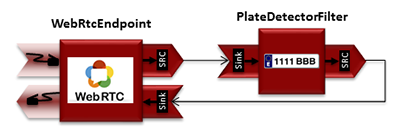
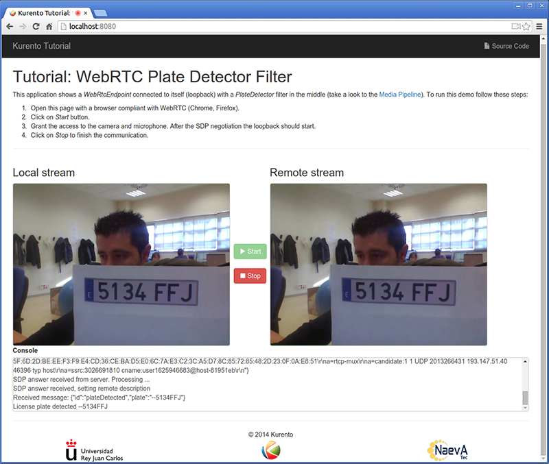

%%%%%%%%%%%%%%%%%%%%%%%%%%%%%%%%%%%%%%%%%%%%%%%%%%%%
JavaScript Module Tutorial 4 - Plate Detector Filter
%%%%%%%%%%%%%%%%%%%%%%%%%%%%%%%%%%%%%%%%%%%%%%%%%%%%

This web application consists on a `WebRTC`:term: video communication in mirror
(*loopback*) with a plate detector filter element.

For the impatient: running this example
=======================================

First of all, you should install Kurento Media Server to run this demo. Please
visit the :doc:`installation guide <../../installation_guide>` for further
information. In addition, the built-in module ``kms-platedetector-6.0`` should
be also installed:

.. sourcecode:: sh

    sudo apt-get install kms-platedetector-6.0

Be sure to have installed `Node.js`:term: and `Bower`:term: in your system. In
an Ubuntu machine, you can install both as follows:

.. sourcecode:: sh

   curl -sL https://deb.nodesource.com/setup | sudo bash -
   sudo apt-get install -y nodejs
   sudo npm install -g bower

Due to `Same-origin policy`:term:, this demo has to be served by an HTTP server.
A very simple way of doing this is by means of a HTTP Node.js server which can
be installed using `npm`:term: :

.. sourcecode:: sh

   sudo npm install http-server -g

You also need the source code of this demo. You can clone it from GitHub. Then
start the HTTP server:

.. sourcecode:: sh

    git clone https://github.com/Kurento/kurento-tutorial-js.git
    cd kurento-tutorial-js/kurento-platedetector
    bower install
    http-server

Finally access the application connecting to the URL http://localhost:8080/
through a WebRTC capable browser (Chrome, Firefox).

.. note::

   These instructions work only if Kurento Media Server is up and running in the same machine
   than the tutorial. However, it is possible to locate the KMS in other machine simple adding
   the parameter ``ws_uri`` to the URL, as follows:

   .. sourcecode:: sh

      http://localhost:8080/index.html?ws_uri=ws://kms_host:kms_port/kurento

Understanding this example
==========================

This application uses computer vision and augmented reality techniques to detect
a plate in a WebRTC stream on optical character recognition (OCR).

The interface of the application (an HTML web page) is composed by two HTML5
video tags: one for the video camera stream (the local client-side stream) and
other for the mirror (the remote stream). The video camera stream is sent to
Kurento Media Server, which processes and sends it back to the client as a
remote stream. To implement this, we need to create a `Media Pipeline`:term:
composed by the following `Media Element`:term: s:

   *WebRTC with plateDetector filter Media Pipeline*

The complete source code of this demo can be found in
`GitHub <https://github.com/Kurento/kurento-tutorial-java/tree/master/kurento-platedetector>`_.

This example is a modified version of the
:doc:`Magic Mirror <./tutorial-2-magicmirror>` tutorial. In this case, this
demo uses a **PlateDetector** instead of **FaceOverlay** filter. An screenshot
of the running example is shown in the following picture:

   *Plate detector demo in action*

The following snippet shows how the media pipeline is implemented in the Java
server-side code of the demo. An important issue in this code is that a
listener is added to the ``PlateDetectorFilter`` object
(``addPlateDetectedListener``). This way, each time a plate is detected in the
stream, a message is sent to the client side. As shown in the screenshot below,
this event is printed in the console of the GUI.

.. sourcecode:: javascript

    kurentoClient(args.ws_uri, function(error, client) {
      if (error) return onError(error);

      client.create('MediaPipeline', function(error, _pipeline) {
        if (error) return onError(error);

        pipeline = _pipeline;

        console.log("Got MediaPipeline");

        pipeline.create('WebRtcEndpoint', function(error, webRtc) {
          if (error) return onError(error);

          console.log("Got WebRtcEndpoint");

          setIceCandidateCallbacks(webRtcPeer, webRtc, onError)

          webRtc.processOffer(sdpOffer, function(error, sdpAnswer) {
            if (error) return onError(error);

            console.log("SDP answer obtained. Processing...");

            webRtc.gatherCandidates(onError);
            webRtcPeer.processAnswer(sdpAnswer);
          });

          pipeline.create('PlateDetectorFilter', function(error, filter) {
            if (error) return onError(error);

            console.log("Got Filter");

            filter.on('PlateDetected', function (data){
              console.log("License plate detected " + data.plate);
            });

            client.connect(webRtc, filter, webRtc, function(error) {
              if (error) return onError(error);

              console.log("WebRtcEndpoint --> filter --> WebRtcEndpoint");
            });
          });
        });
      });
    });

.. note::

   The :term:`TURN` and :term:`STUN` servers to be used can be configured simple adding
   the parameter ``ice_servers`` to the application URL, as follows:

   .. sourcecode:: sh

      http://localhost:8080/index.html?ice_servers=[{"urls":"stun:stun1.example.net"},{"urls":"stun:stun2.example.net"}]
      http://localhost:8080/index.html?ice_servers=[{"urls":"turn:turn.example.org","username":"user","credential":"myPassword"}]

Dependencies
============

The dependencies of this demo has to be obtained using `Bower`:term:. The
definition of these dependencies are defined in the
`bower.json <https://github.com/Kurento/kurento-tutorial-js/blob/master/kurento-platedetector/bower.json>`_
file, as follows:

.. sourcecode:: js

   "dependencies": {
      "kurento-client": "|CLIENT_JS_VERSION|",
      "kurento-utils": "|UTILS_JS_VERSION|"
      "kurento-module-pointerdetector": "|CLIENT_JS_VERSION|"
   }

To get these dependencies, just run the following shell command:

.. sourcecode:: sh

   bower install

.. note::

   We are in active development. You can find the latest versions at `Bower <http://bower.io/search/>`_.
