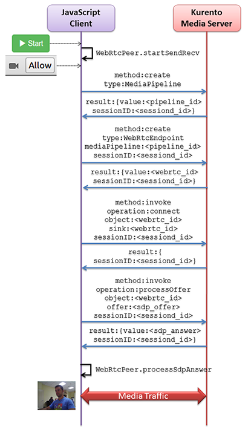

%%%%%%%%%%%%%%%%%%%%%%%%%%%%%%%%%%%
JavaScript Tutorial 1 - Hello world
%%%%%%%%%%%%%%%%%%%%%%%%%%%%%%%%%%%

This web application has been designed to introduce the principles of
programming with Kurento for JavaScript developers. It consists on a
`WebRTC`:term: video communication in mirror (*loopback*). This tutorial
assumes you have basic knowledge on JavaScript, HTML and WebRTC. We also
recommend reading the :doc:`Introducing Kurento <../../introducing_kurento>`
section before starting this tutorial.

For the impatient: running this example
=======================================

You need to have installed the Kurento Media Server before running this example
read the :doc:`installation guide <../../installation_guide>` for further
information.

Be sure to have installed `Node.js`:term: and `Bower`:term: in your system. In
an Ubuntu machine, you can install both as follows:

.. sourcecode:: sh

   sudo add-apt-repository ppa:chris-lea/node.js
   sudo apt-get update
   sudo apt-get install nodejs
   sudo npm install -g bower

Due to `Same-origin policy`:term:, this demo has to be served by an HTTP server.
A very simple way of doing this is by means of a HTTP Node.js server which can
be installed using `npm`:term: :

.. sourcecode:: sh

   sudo npm install http-server -g

You also need the source code of this demo. You can clone it from GitHub. Then
start the HTTP server:

.. sourcecode:: sh

    git clone https://github.com/Kurento/kurento-tutorial-js.git
    cd kurento-tutorial-js/kurento-hello-world
    bower install
    http-server

Finally access the application connecting to the URL http://localhost:8080/
through a WebRTC capable browser (Chrome, Firefox).

Understanding this example
==========================

Kurento provides developers a **Kurento JavaScript Client** to control
**Kurento Media Server**.  This client library can be used in any kind of
JavaScript application including desktop and mobile browsers.

This *hello world* demo is one of the simplest web application you can create
with Kurento. The following picture shows an screenshot of this demo running:

.. figure:: ../../images/kurento-java-tutorial-1-helloworld-screenshot.png 
   :align:   center
   :alt:     Kurento Hello World Screenshot: WebRTC in loopback
   :width: 600px

   *Kurento Hello World Screenshot: WebRTC in loopback*

The interface of the application (an HTML web page) is composed by two HTML5
video tags: one showing the local stream (as captured by the device webcam) and
the other showing the remote stream sent by the media server back to the client.

The logic of the application is quite simple: the local stream is sent to the
Kurento Media Server, which returns it back to the client without
modifications. To implement this behavior we need to create a
`Media Pipeline`:term: composed by a single `Media Element`:term:, i.e. a
**WebRtcEndpoint**, which holds the capability of exchanging full-duplex
(bidirectional) WebRTC media flows. This media element is connected to itself
so that the media it receives (from browser) is send back (to browser). This
media pipeline is illustrated in the following picture:

.. figure:: ../../images/kurento-java-tutorial-1-helloworld-pipeline.png
   :align:   center
   :alt:     Kurento Hello World Media Pipeline in context
   :width: 600px

   *Kurento Hello World Media Pipeline in context*

This is a web application, and therefore it follows a client-server
architecture. Nevertheless, due to the fact that we are using the Kurento
JavaScript client, there is not need to use an application server since all the
application logic is held by the browser. The Kurento JavaScript Client is used
directly to control Kurento Media Server by means of a WebSocket bidirectional
connection:

The following sections analyze in deep the client-side (JavaScript) code of this
application, the dependencies, and how to run the demo. The complete source
code can be found in
`GitHub <https://github.com/Kurento/kurento-tutorial-js/tree/master/kurento-hello-world>`_.

Client-Side Logic
=================

The Kurento *hello-world* demo follows a *Single Page Application* architecture
(`SPA`:term:). The interface is the following HTML page:
`index.html <https://github.com/Kurento/kurento-tutorial-js/blob/master/kurento-hello-world/index.html>`_.
This web page links two Kurento JavaScript libraries:

* **kurento-client.js** : Implementation of the Kurento JavaScript Client.

* **kurento-utils.js** : Kurento utility library aimed to simplify the WebRTC
  management in the browser.

The specific logic of the *Hello World* JavaScript demo is coded in the
following JavaScript file:
`index.js <https://github.com/Kurento/kurento-tutorial-js/blob/master/kurento-hello-world/js/index.js>`_.
In this file, there is a ``start`` function which is called when the green
button labeled as *Start* in the GUI is clicked.

.. sourcecode:: js

   function start() {
      [...]
      webRtcPeer = kurentoUtils.WebRtcPeer.startSendRecv(videoInput, videoOutput, onOffer, onError);
   }

The function *WebRtcPeer.startSendRecv* abstracts the WebRTC internal details
(i.e. PeerConnection and getUserStream) and makes possible to start a
full-duplex WebRTC communication, using the HTML video tag with id *videoInput*
to show the video camera (local stream) and the video tag *videoOutput* to show
the remote stream provided by the Kurento Media Server. Two callback functions
are used for managing application logic:

* ``onOffer`` : Callback executed if the local SDP offer is generated
  succesfully.

* ``onError`` : Callback executed if something wrong happens when obtaining
  the SDP offer.

In the ``onOffer`` callback we create an instance of the *KurentoClient* class
that will manage communications with the Kurento Media Server. So, we need to
provide the URI of its WebSocket endpoint. In this example, we assume it's
listening in port 8888 at the same host than the HTTP serving the application.

.. sourcecode:: js

   const ws_uri = 'ws://' + location.hostname + ':8888/kurento';

   kurentoClient(ws_uri, function(error, kurentoClient) {
     ...
   }; 
   
Once we have an instance of ``kurentoClient``, we need to create a
*Media Pipeline*, as follows:

.. sourcecode:: js

   kurentoClient.create("MediaPipeline", function(error, pipeline) {
      ...
   });

If everything works correctly, we will have an instance of a media pipeline
(variable ``pipeline`` in this example). With it, we are able to create
*Media Elements*. In this example we just need a single *WebRtcEndpoint*.

In WebRTC, an `SDP`:term: (Session Description protocol) is used for negotiating
media exchanges between apps. Such negotiation happens based on the SDP offer
and answer exchange mechanism. In this example we assume the SDP offer and
answer contain all WebRTC ICE candidates. This negotiation is implemented in
the second part of the method * processSdpAnswer*, using the SDP offer obtained
from the browser client and returning a SDP answer generated by WebRtcEndpoint.

.. sourcecode:: js

   pipeline.create("WebRtcEndpoint", function(error, webRtc){
      if(error) return onError(error);

      webRtc.processOffer(sdpOffer, function(error, sdpAnswer){
         if(error) return onError(error);

         webRtcPeer.processSdpAnswer(sdpAnswer);
      });

      ...

   });

Finally, the *WebRtcEndpoint* is connected to itself (i.e., in loopback):

.. sourcecode:: js

   webRtc.connect(webRtc, function(error){
      if(error) return onError(error);

      console.log("Loopback established");
   });

Dependencies
============

All dependencies of this demo can to be obtained using `Bower`:term:. The list
of these dependencies are defined in the
`bower.json <https://github.com/Kurento/kurento-tutorial-js/blob/master/kurento-hello-world/bower.json>`_
file, as follows:

.. sourcecode:: js

   "dependencies": {
      "kurento-client": "^5.0.0",
      "kurento-utils": "^5.0.0"
   }

To get these dependencies, just run the following shell command:

.. sourcecode:: sh

   bower install

Kurento framework uses `Semantic Versioning`:term: for releases. Notice that
range ``^5.0.0`` downloads the latest version of Kurento artefacts from Bower
in version 5 (i.e. 5.x.x). Major versions are released when incompatible
changes are made.

.. note::

   We are in active development. You can find the latest version of
   Kurento JavaScript Client at `Bower <http://bower.io/search/?q=kurento-client>`_.
