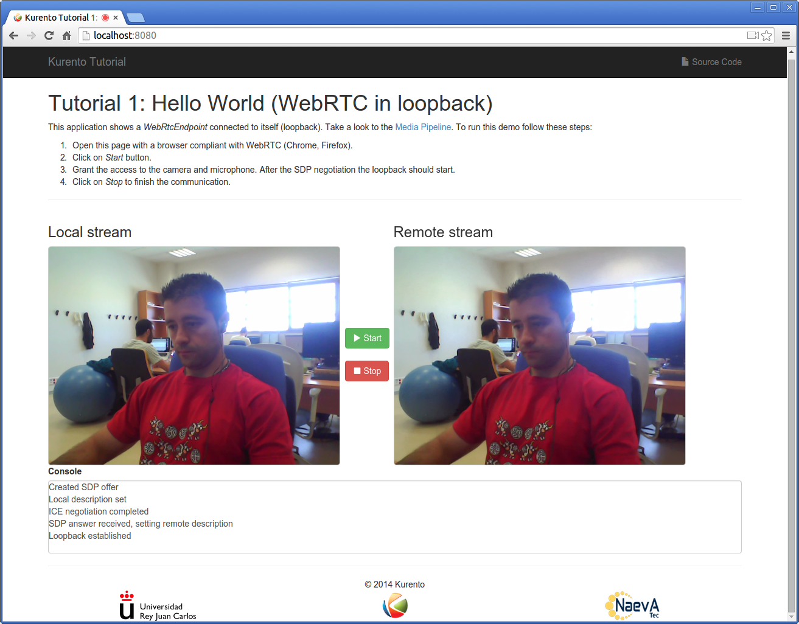
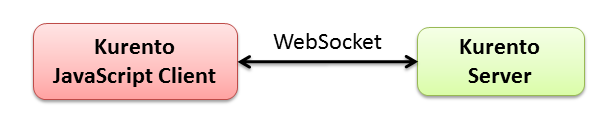

%%%%%%%%%%%%%%%%%%%%%%%%%%%%%%%%%%%
JavaScript Tutorial 1 - Hello world
%%%%%%%%%%%%%%%%%%%%%%%%%%%%%%%%%%%

This web application has been designed to introduce the principles of
programming with Kurento for JavaScript developers. It consists on a
`WebRTC`:term: video communication in mirror (*loopback*).

Kurento in a nutshell
=====================

At the heart of the Kurento architecture there is a piece of software called
**Kurento Server**, based on pluggable media processing capabilities. Those
capabilities are exposed by the **Kurento Clients** to application developers
as black boxes called **Media Elements**. Each Media Element holds a specific
media capability, whose details are fully hidden to application developers.
From the application developer perspective, Media Elements are like *Lego*
pieces: one just needs to take the elements needed for an application and
connect them following the desired topology. In Kurento jargon, a graph of
connected media elements is called a **Media Pipeline**.

To better understand theses concepts it is recommended to take a look to
:doc:`Kurento API section <../../mastering/kurento_API>` section.

Let's get started
=================

**Kurento JavaScript Client** provides the capabilities to control Kurento
Server from JavaScript. We are going to learn how to use the Kurento JavaScript
Client by means of tutorials. The *hello world* demo is one of the simplest web
application you can create with Kurento. It is a `WebRTC`:term: communication
in mirror. The following picture shows an screenshot of this demo running in a
web browser:

The interface of the application (an HTML web page) is composed by two HTML5
video tags: one for the video camera stream (the local client-side stream) and
other for the mirror (the remote stream). The video camera stream is sent to
the Kurento Server, processed and then is returned to the client as a remote
stream.

To implement this behavior we have to create a `Media Pipeline`:term: composed
by a single `Media Element`:term:, i.e. a **WebRtcEndpoint**, which is
bidirectional media element to receive a media stream (audio and video) from
the browser and send another media stream back to it. As suggested by its name,
this endpoint is capable to communicate with the browser by means of
`WebRTC`:term: technology. All in all, the media pipeline to be implemented in
this demo is illustrated in the following picture:

.. figure:: ../../images/kurento-java-tutorial-1-helloworld-pipeline.png
   :align:   center
   :alt:     Loopback video call media pipeline
   
This is a web application, and therefore it follows a client-server
architecture. Nevertheless, due to the fact that we are using the Kurento
JavaScript client, there is not need to implement any server-side code since
all the application logic is coded in JavaScript in the client-side. Kurento
JavaScript Client is used directly to control Kurento Server by means of a
WebSocket bidirectional connection:

The following sections analyze in deep the client-side (JavaScript) code of this
application, the dependencies, and how to run the demo. The complete source
code can be found in
`GitHub <https://github.com/Kurento/kurento-tutorial-js/tree/develop/kurento-hello-world>`_.

Client-Side
-----------

The Kurento *hello-world* demo follows a *Single Page Application* architecture
(`SPA`:term:). The interface is the following HTML page:
`index.html <https://github.com/Kurento/kurento-tutorial-js/blob/develop/kurento-hello-world/index.html>`_.
This web page links two Kurento JavaScript libraries:

* **kurento-client.js** : Implementation of the Kurento JavaScript Client.

* **kurento-utils.js** : Kurento utily library aimed to to simplify the WebRTC
  management in the browser.

The specific logic of the *Hello World* JavaScript demo is coded in the
following JavaScript page:
`index.js <https://github.com/Kurento/kurento-tutorial-js/blob/develop/kurento-hello-world/js/index.js>`_.
In this file, there is an ``start`` function which is called when the green
button labeled as *Start* in the GUI is clicked.

.. sourcecode:: js

   function start() {
      showSpinner(videoInput, videoOutput);
      webRtcPeer = kurentoUtils.WebRtcPeer.startSendRecv(videoInput, videoOutput, onOffer, onError);
   }

As you can seen, the function *WebRtcPeer.startSendRecv* of *kurento-utils* is
used to start a WebRTC communication, using the HTML video tag with id
*videoInput* to show the video camera (local stream) and the video tag
*videoOutput* to show the video processed by Kurento server (remote stream).
Two callback functions are used here:

* ``onOffer`` : Callback executed if the SDP negotiation is carried out
  correctly.

* ``onError`` : Callback executed if something wrong happens.

In ``onOffer`` we can found the most interesting code from a Kurento JavaScript
Client point of view. First, we have create an instance of the *KurentoClient*
class that will manage the connection with the Kurento Server. So, we need to
provide the URI of its WebSocket endpoint:

.. sourcecode:: js

   const ws_uri = 'ws://' + location.hostname + ':8888/kurento';

   kurentoClient(ws_uri, function(error, kurentoClient) {
     ...
   }; 
   
Once we have an instance of ``kurentoClient``, the following step is to create a
*Media Pipeline*, as follows:

.. sourcecode:: js

   kurentoClient.create("MediaPipeline", function(error, pipeline) {
      ...
   });

If everything works correctly, we will have an instance of a media pipeline
(variable ``pipeline`` in this example). With this instance, we are able to
create *Media Elements*. In this example we just need a single *WebRtcEndpoint*.

In WebRTC, `SDP`:term: (Session Description protocol) is used for negotiating
media interchange between apps. Such negotiation happens based on the SDP offer
and answer exchange mechanism. This negotiation is implemented in the second
part of the method *processSdpAnswer*, using the SDP offer obtained from the
browser client (using *kurentoUtils.WebRtcPeer*), and returning a SDP answer
returned by *WebRtcEndpoint*.

.. sourcecode:: js

   pipeline.create("WebRtcEndpoint", function(error, webRtc){
      if(error) return onError(error);

      webRtc.processOffer(sdpOffer, function(error, sdpAnswer){
         if(error) return onError(error);

         webRtcPeer.processSdpAnswer(sdpAnswer);
      });

      ...

   });

Finally, the *WebRtcEndpoint* is connected to itself (i.e., in loopback) and the
application will be done:

.. sourcecode:: js

   webRtc.connect(webRtc, function(error){
      if(error) return onError(error);

      console.log("Loopback established");
   });

Dependencies
============

The dependencies of this demo has to be obtained using `Bower`:term:. The
definition of these dependencies are defined in the
`bower.json <https://github.com/Kurento/kurento-tutorial-js/blob/develop/kurento-hello-world/bower.json>`_
file, as follows:

.. sourcecode:: json

   "dependencies": {
      "kurento-client": "develop",
      "kurento-utils": "develop"
   }

To get these dependencies, just run the following command in the shell:

.. sourcecode:: sh

   bower install

How to run this application
===========================

First of all, you should install Kurento Server to run this demo. Please visit
the `installation guide <../../Installation_Guide.rst>`_ for further
information.

Be sure to have installed `Node.js`:term: in your system. In an Ubuntu machine,
install it with the following commands:

.. sourcecode:: sh

   sudo add-apt-repository ppa:chris-lea/node.js
   sudo apt-get update
   sudo apt-get install nodejs

Also be sure to have installed `Bower`:term: in your system:

.. sourcecode:: sh

   sudo npm install -g bower

An HTTP server is required for these demos. A very simple way of doing this is
by means of a Node.js server. This server can be installed as follows:

.. sourcecode:: sh

   sudo npm install http-server -g

Finally we need the GitHub project where this demo is hosted. At this moment we
can fit all pieces together:

.. sourcecode:: shell

    git clone https://github.com/Kurento/kurento-js-tutorial.git
    cd kurento-hello-world
    bower install
    http-server

The web application starts on port 8080 in the localhost by default. Open the
URL http://localhost:8080/ in a WebRTC compliant browser (Chrome, Firefox).
