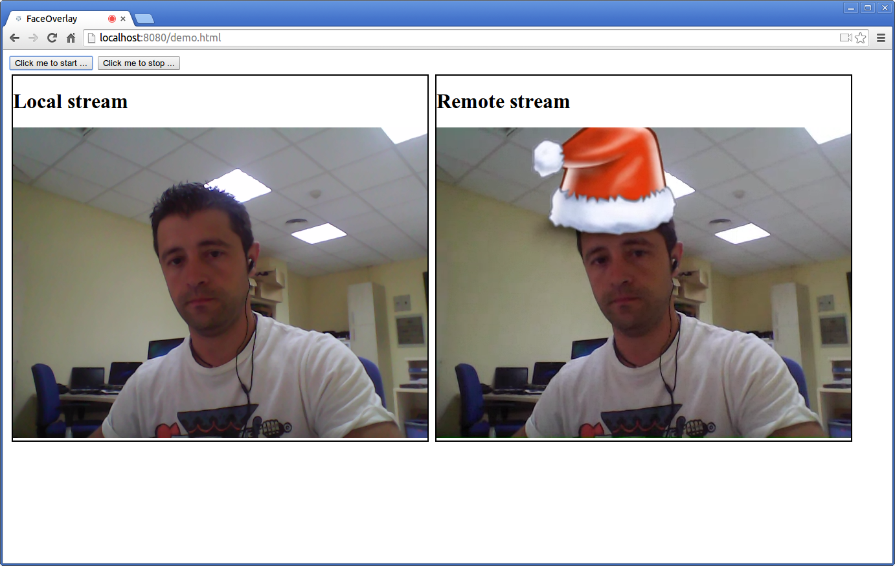
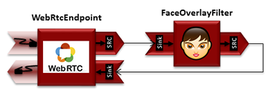

%%%%%%%%%%%%%%%%%%%%%%%%%%%%%%%%%%%%
JavaScript Tutorial 2 - Magic Mirror
%%%%%%%%%%%%%%%%%%%%%%%%%%%%%%%%%%%%

.. todo:: This section has been early documented using kws-tutorial.
 This project has to be refactored to kurento-tutorial-js. So, corrections in
 this document has to be done accordingly (links, terms, and so on).

This web application extends Tutorial 1 adding media processing to a basic
`WebRTC`:term: loopback. This processing uses computer vision and augmented reality
techniques to add a funny hat on top of faces. The following picture shows a 
screenshot of the demo running in a web browser:

The interface of the application (an HTML web page) is composed by two HTML5
video tags: one for the video camera stream (the local client-side stream) and
other for the mirror (the remote stream). The video camera stream is sent to
the Kurento Media Server, processed and then is returned to the client as a
remote stream.

To implement this, we need to create a `Media Pipeline`:term: composed
by the following `Media Element`:term: s:

- **WebRtcEndpoint**: Provides full-duplex (bidirectional) `WebRTC`:term:
capabilities.

- **FaceOverlay filter**: Computer vision filter that detects faces in the
  video stream and puts an image on top of them. In this demo 
  the filter is configured to put a
  `Super Mario hat <http://files.kurento.org/imgs/mario-wings.png>`_).

The media pipeline implemented is illustrated in the following picture:

This demo is an example of a quite simple application developed with Kurento.
You can see it as the *Hello World* application for Kurento. The following
sections describe in detail the logic and how to run the demo.

The complete source code of this demo can be found in
`GitHub <https://github.com/Kurento/kws-tutorial/tree/develop/FaceOverlay>`_.

.. todo:: Change GitHub URLs (in the entire document)

JavaScript Logic
================

As introduced before, the interface of this demo is implemented in an HTML web
page:
`demo.html <https://github.com/Kurento/kws-tutorial/blob/develop/FaceOverlay/demo.html>`_.
As you can see, this page uses several JavaScript libraries:

- `adpater.js <https://rawgit.com/GoogleChrome/webrtc/master/samples/web/js/adapter.js>`_:
  JavaScript library by Google to provide WebRTC interoperation between
  different browsers.

- *kws-media-api.js*: Kurento client for JavaScript applications.

- *kws-utils.js*: Reusable components useful for Kurento development in the
  client-side.

- `demo.js <https://github.com/Kurento/kws-tutorial/blob/develop/FaceOverlay/demo.js>`_:
  Specific JavaScript logic for this demo.

.. todo:: Update dependencies (KWS cannot be present anymore) in the entire document

The most relevant part of
`demo.js <https://github.com/Kurento/kws-tutorial/blob/develop/FaceOverlay/demo.js>`_
is the *startVideo* function. In this function we can see how the function
*WebRtcPeer.startSendRecv* of *kws-utils.js* is used to start a WebRTC
communication, using the HTML video tag with id *videoInput* to show the video
camera (local stream) and the video tag *videoOutput* to show the video
processed by Kurento server (remote stream). Then, in the *onOffer* function
the media pipeline is created by connecting the *WebRtcEndpoint* to the
*FaceOverlayFilter*.

.. sourcecode:: javascript

   function startVideo() {
      ...
      var webRtcPeer = kwsUtils.WebRtcPeer.startSendRecv(videoInput, videoOutput, onOffer, onError);
      function onOffer(offer) {
         KwsMedia(ws_uri, function(error, kwsMedia) {
            ...
            kwsMedia.create("MediaPipeline", function(error, pipeline) {
               ...
               pipeline.create("WebRtcEndpoint", function(error, webRtc) {
                  ...
                  pipeline.create("FaceOverlayFilter", function(error, filter) {
                     ...
                     webRtc.connect(filter, function(error) {
                        ...
                        filter.connect(webRtc, function(error) {
                           ...
                        });
                     });
                     webRtc.processOffer(offer, function(error, answer) {
                        ...
                        webRtcPeer.processSdpAnswer(answer);
                     });
                  });
               });
            });
         });
      };
   };

Kurento Server
==============

This demo is using a remote Kurento Server located on ``demo01.kurento.org``. If
you want to use another instance of Kurento Server, please visit first the
`installation guide <../../Installation_Guide.rst>`_ for further information.
Then, you should change the following line of
`demo.js <https://github.com/Kurento/kws-tutorial/blob/develop/FaceOverlay/demo.js>`_:

.. sourcecode:: javascript

   const ws_uri = 'ws://demo01.kurento.org:8888/thrift/ws/websocket'; //requires Internet connectivity

Dependencies
============

This application is implemented using `Bower`:term:. The relevant part of the
*bower.json* is where Kurento dependencies are declared. As the following
snippet shows, we need two dependencies: the Kurento Client JavaScript
dependency (*kws-media-api*) and the Kurento JavaScript utility library
(*kws-utils*):

.. sourcecode:: json

     "dependencies": {
       "kws-utils": "~4.3.17",
       "kws-media-api": "~4.3.17"
     }

How to run this application
===========================

To run this application, first you need to install Bower, and so you also need
to install `npm`:term:. The following snippet shows how to install npm (by
installing `Node.js`:term: package) and Bower in an Ubuntu machine:

.. sourcecode:: shell

   sudo add-apt-repository ppa:chris-lea/node.js
   sudo apt-get update
   sudo apt-get install nodejs
   sudo npm install -g bower

Once Bower is installed, you need to clone the GitHub project where this demo is
hosted. Then you have to resolve the dependencies using Bower, as follows:

.. sourcecode:: shell

    git clone https://github.com/Kurento/kws-tutorial.git
    cd FaceOverlay
    bower install

Due to `Same-origin policy`:term:, this demo has to be served by an HTTP server.
A very simple way of doing this is by means of a HTTP Node.js server which can
be installed using npm. Then, this HTTP has to be started in the folder where
the demo is located:

.. sourcecode:: shell

   sudo npm install http-server -g
   http-server

The web application starts on port 8080 in the localhost. Therefore, to run the
demo, open the URL http://localhost:8080/demo.html in a WebRTC compliant
browser (Chrome, Firefox).
