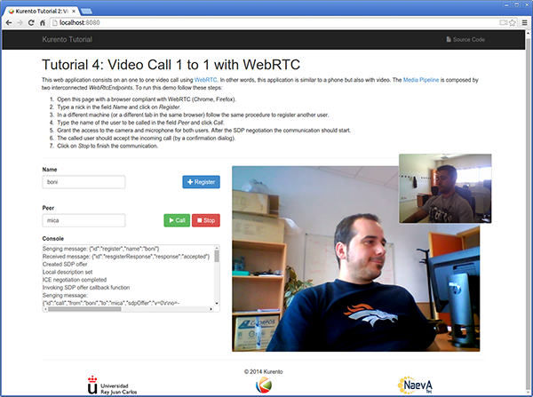

%%%%%%%%%%%%%%%%%%%%%%%%%%%%%%%%%%%%%%%%%%%%%
JavaScript Tutorial 4 - One to one video call
%%%%%%%%%%%%%%%%%%%%%%%%%%%%%%%%%%%%%%%%%%%%%

.. todo:: This section has been early documented using kws-tutorial. This
 project has to be refactored to kurento-tutorial-js. So, corrections in this
 document has to be done accordingly (links, terms, and so on).

This web application consists on a one to one video call using `WebRTC`:term:
technology. In other words, this application is similar to a phone but also
with video. The following picture shows an screenshot of this demo running in a
web browser:

The interface of the application (an HTML web page) is composed by two HTML5
video tags: one for the video camera stream (the local stream) and other for
the other peer in the call (the remote stream). If two users, A and B, are
using the application, the media flows in the following way: The video camera
stream of user A is sent to the Kurento Server and sent again to the user B. On
the other hand, user B sends its video camera stream to Kurento and then it is
sent to user A.

To implement this behavior we have to create a `Media Pipeline`:term: composed
by two WebRtc endpoints connected between them. The media pipeline implemented
is illustrated in the following picture:

.. figure:: ../../images/kurento-java-tutorial-4-one2one-pipeline.png
   :align:   center
   :alt:     One to one video call media pipeline

This demo has been fully implemented in JavaScript. Therefore we need a
mechanism to persist the users registered in the system. We use `PubNub`:term:
to that aim. PubNub is a publish/subscribe cloud service for sending and
routing data.

To communicate the client with the server to manage calls we have designed a
signaling protocol based on `JSON`:term: messages over `WebSocket`:term: 's.
The normal sequence between client and server would be as follows:

1. User A is registered in PubNub with his name

2. User B is registered in PubNub with her name

3. User A wants to call to User B

4. User B accepts the incoming call

5. The communication is established and media is flowing between User A and
   User B

6. One of the users finishes the video communication

This is very simple protocol designed to show a simple one to one call
application implemented with Kurento. In a professional application it can be
improved, for example implementing seeking user, ordered finish, among other
functions.

Assuming that User A is using Client A and User B is using Client B, we can draw
the following sequence diagram with detailed messages between clients and
server:

.. figure:: ../../images/kurento-js-tutorial-4-one2one-signaling.png
   :align:   center
   :alt:     One to one video call signaling protocol
   :width: 600px

.. todo:: Review this diagram. What about SDP negotiation?

The following sections describe in detail the logic and how to run the demo.

The complete source code of this demo can be found in
`GitHub <https://github.com/Kurento/kws-tutorial/tree/master/PubNub>`_.

.. todo:: Change GitHub URLs (in the entire document)

JavaScript Logic
================

As introduced before, the interface of this demo is implemented in an HTML web
page:
`demo.html <https://github.com/Kurento/kws-tutorial/blob/master/PubNub/demo.html>`_.
As you can see, this page uses several JavaScript libraries:

- `adpater.js <https://rawgit.com/GoogleChrome/webrtc/master/samples/web/js/adapter.js>`_:
  JavaScript library by Google to provide WebRTC interoperation between
  different browsers.

- *kws-media-api.js*: Kurento client for JavaScript applications.

- *kws-rpc-builder.js*: `JSON-RPC`:term: library for browser and
  `Node.js`:term:.

- *kws-utils.js*: Reusable components useful for Kurento development in the
  client-side.

- `softphonePubnub.js <https://github.com/Kurento/kws-tutorial/blob/master/PubNub/softphonePubnub.js>`_:
  Specific JavaScript logic for this demo.

.. todo:: Update dependencies (KWS cannot be present anymore) in the entire document

The most relevant part of this demo can be foun on
`softphonePubnub.js <https://github.com/Kurento/kws-tutorial/blob/master/PubNub/softphonePubnub.js>`_.
In this library we can found the PubNub publish/subscribe procedure
(``SoftphonePubnub`` class), the incoming call logic (``onIncommingCall``
method), the SDP negotiation and start of WebRTC communication (``createPeer``
method), and the media pipeline connection (``connectEndpoints`` method).

.. sourcecode:: javascript

   var startSendRecv = kwsUtils.WebRtcPeer.startSendRecv;
   var JsonRPC = RpcBuilder.packers.JsonRPC;
   const ws_uri = 'ws://demo01.kurento.org:8888/thrift/ws/websocket';
   
   function onIncommingCall(request) {
     ...
   
     createPeer(function(error, kwsMedia, src) {

       var response = {
         dest: from,
         endpoint: src.id
       };
   
       request.reply(null, response);
   
       // Send our video to the caller
       connectEndpoints(kwsMedia, src, sinkId);
     });
   };
   
   function createPeer(callback) {
     var webRtcPeer = startSendRecv(videoInput, videoOutput, function(offer)  {
       KwsMedia(ws_uri, function(error, kwsMedia) {
         // Create pipeline
         kwsMedia.create('MediaPipeline', function(error, pipeline) {
           // Create pipeline media elements
           pipeline.create('WebRtcEndpoint', function(error, webRtc)  {
             // Connect the pipeline to the WebRtcPeer client
             webRtc.processOffer(offer, function(error, answer) {
               webRtcPeer.processSdpAnswer(answer);
             });
             callback(null, kwsMedia, webRtc);
           });
         });
       },
       onerror);
     });
   };
   
   function connectEndpoints(kwsMedia, src, sinkId) {
     kwsMedia.getMediaobjectById(sinkId, function(error, sink) {
       src.connect(sink, function(error) {
         ...
       });
     })
   };
   
   
   function SoftphonePubnub(videoInput, videoOutput, options)  {
     ...
   
     this.register = function(peerID, options) {
       function onRequest(request) {
         if(request.params.dest != peerID) return
   
         switch(request.method) {
           case 'call':
             onIncommingCall(request);
           break;
   
           default:
             console.error('Unrecognized request', request);
         }
       };
   
       ...
   
       rpc = new RpcBuilder(JsonRPC, rpcOptions);
       var pubnub = PUBNUB.init(options);
   
       pubnub.subscribe(
       {
         channel: channel,
         message: function(message)
         {
           var request = rpc.decode(message);
           if(request)
             onRequest(request);
         }
       });
   
       rpc.transport = function(message)
       {
         pubnub.publish(
         {
           channel: channel,
           message: message
         });
       }
     };
   
     this.call = function(dest) {
       createPeer(function(error, kwsMedia, src) {
   
         var params =
         {
           dest: dest,
           endpoint: src.id
         };
   
         rpc.encode('call', params, function(error, result) {
           var sinkId = result.endpoint;
   
           // Send our video to the callee
           connectEndpoints(kwsMedia, src, sinkId);
         });
       });
     };
   }

Kurento Server
==============

This demo is using a remote Kurento Server located on ``demo01.kurento.org``. If
you want to use another instance of Kurento Server, please visit first the
`installation guide <../../Installation_Guide.rst>`_ for further information.
Then, you should change the following line of
`softphonePubnub.js <https://github.com/Kurento/kws-tutorial/blob/master/PubNub/softphonePubnub.js>`_:

.. sourcecode:: javascript

   const ws_uri = 'ws://localhost:8888/thrift/ws/websocket';

Dependencies
============

This application is implemented using `Bower`:term:. The relevant part of the
*bower.json* is where Kurento dependencies are declared. As the following
snippet shows, we need four dependencies: PubNub JavaScript API (*pubnub*), the
Kurento Client JavaScript dependency (*kws-media-api*), the Kurento JSON-RPC
builder (*kws-rpc-builder*), and the Kurento JavaScript utility library
(*kws-utils*):

.. sourcecode:: json

     "dependencies": {
       "pubnub": "~3.6.4",
       "kws-media-api": "~4.3.18",
       "kws-rpc-builder": "~4.3.18",
       "kws-utils": "~4.3.18"
     }

How to run this application
===========================

To run this application, first you need to install Bower, and so you also need
to install `npm`:term:. The following snippet shows how to install npm (by
installing `Node.js`:term: package) and Bower in an Ubuntu machine:

.. sourcecode:: shell

   sudo add-apt-repository ppa:chris-lea/node.js
   sudo apt-get update
   sudo apt-get install nodejs
   sudo npm install -g bower

Once Bower is installed, you need to clone the GitHub project where this demo is
hosted. Then you have to resolve the dependencies using Bower, as follows:

.. sourcecode:: shell

    git clone https://github.com/Kurento/kws-tutorial.git
    cd PubNub
    bower install

Due to `Same-origin policy`:term:, this demo has to be served by an HTTP server.
A very simple way of doing this is by means of a HTTP Node.js server which can
be installed using npm. Then, this HTTP has to be started in the folder where
the demo is located:

.. sourcecode:: shell

   sudo npm install http-server -g
   http-server

The web application starts on port 8080 in the localhost. Therefore, to run the
demo, open the URL http://localhost:8080/demo.html in a WebRTC compliant
browser (Chrome, Firefox).

