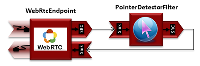
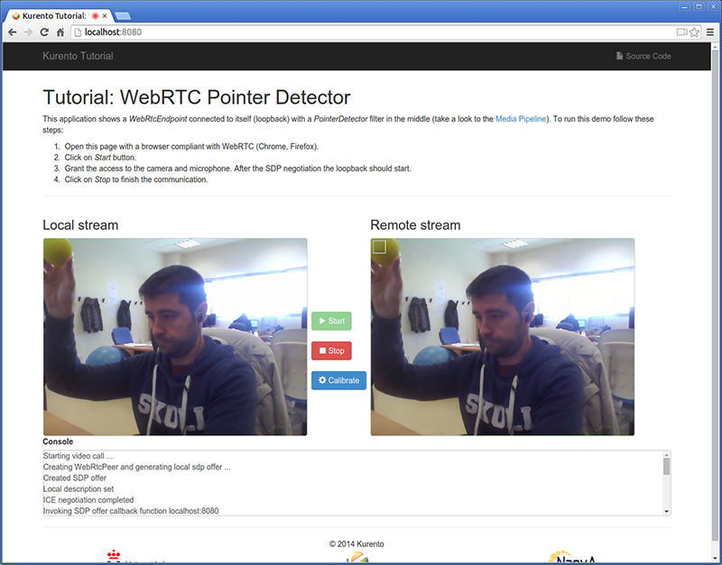
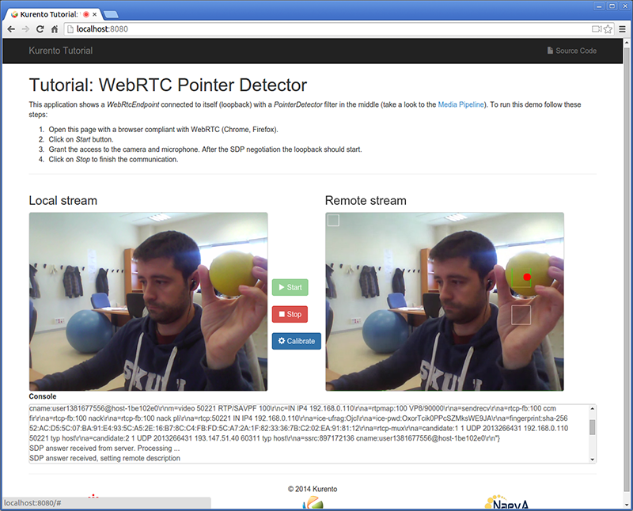

%%%%%%%%%%%%%%%%%%%%%%%%%%%%%%%%%%%%%%%%%%%%%%%%%%%
Node.js Module Tutorial 1 - Pointer Detector Filter
%%%%%%%%%%%%%%%%%%%%%%%%%%%%%%%%%%%%%%%%%%%%%%%%%%%

This web application consists on a `WebRTC`:term: video communication in mirror
(*loopback*) with a pointer tracking filter element.

For the impatient: running this example
=======================================

First of all, you should install Kurento Media Server to run this demo. Please
visit the :doc:`installation guide <../../installation_guide>` for further
information. In addition, the built-in module ``kms-pointerdetector`` should be
also installed:

.. sourcecode:: sh

    sudo apt-get install kms-pointerdetector

Be sure to have installed `Node.js`:term: in your system. In an Ubuntu machine,
you can install both as follows:

.. sourcecode:: sh

   curl -sL https://deb.nodesource.com/setup | sudo bash -
   sudo apt-get install -y nodejs

To launch the application you need to clone the GitHub project where this demo
is hosted and then install and run it, as follows:

.. sourcecode:: sh

    git clone https://github.com/Kurento/kurento-tutorial-node.git
    cd kurento-tutorial-node/kurento-pointerdetector
    npm install

If you have problems installing any of the dependencies, please remove them and
clean the npm cache, and try to install them again:

.. sourcecode:: sh

    rm -r node_modules
    npm cache clean

Finally access the application connecting to the URL http://localhost:8080/
through a WebRTC capable browser (Chrome, Firefox).

Understanding this example
==========================

This application uses computer vision and augmented reality techniques to detect
a pointer in a WebRTC stream based on color tracking.

The interface of the application (an HTML web page) is composed by two HTML5
video tags: one for the video camera stream (the local client-side stream) and
other for the mirror (the remote stream). The video camera stream is sent to
Kurento Media Server, which processes and sends it back to the client as a
remote stream. To implement this, we need to create a `Media Pipeline`:term:
composed by the following `Media Element`:term: s:

   *WebRTC with PointerDetector filter in loopback Media Pipeline*

The complete source code of this demo can be found in
`GitHub <https://github.com/Kurento/kurento-tutorial-js/tree/master/kurento-pointerdetector>`_.

This example is a modified version of the
:doc:`Magic Mirror <./tutorial-2-magicmirror>` tutorial. In this case, this
demo uses a **PointerDetector** instead of **FaceOverlay** filter.

In order to perform pointer detection, there must be a calibration stage, in
which the color of the pointer is registered by the filter. To accomplish this
step, the pointer should be placed in a square in the upper left corner of the
video, as follows:

   *Pointer calibration stage*

In that precise moment, a calibration operation should be carried out. This is
done by clicking on the *Calibrate* blue button of the GUI.

After that, the color of the pointer is tracked in real time by Kurento Media
Server. ``PointerDetectorFilter`` can also define regions in the screen called
*windows* in which some actions are performed when the pointer is detected when
the pointer enters (``WindowInEvent`` event) and exits (``WindowOutEvent``
event) the windows. This is implemented in the JavaScript logic as follows:

.. sourcecode:: javascript

   pipeline.create('PointerDetectorFilter', {'calibrationRegion' : {topRightCornerX: 5,
      topRightCornerY:5, width:30, height: 30}}, function(error, _filter) {
      if (error) return onError(error);

      filter = _filter;

      webRtc.connect(filter, function(error) {
         if (error) return onError(error);

         filter.connect(webRtc, function(error) {
            if (error) return onError(error);

            filter.addWindow({id: 'window0', height: 50, width:50,
               upperRightX: 500, upperRightY: 150}, function(error) {
                  if (error) return onError(error);
            });

            filter.addWindow({id: 'window1', height: 50, width:50,
               upperRightX: 500, upperRightY: 250}, function(error) {
                  if (error) return onError(error);
            });

            filter.on ('WindowIn', function (data){
               console.log ("Event window in detected in window " + data.windowId);
            });

            filter.on ('WindowOut', function (data){
               console.log ("Event window out detected in window " + data.windowId);
            });
         });
      });

The following picture illustrates the pointer tracking in one of the defined
windows:

   *Pointer tracking over a window*

In order to carry out the calibration process, this JavaScript function is used:

.. sourcecode:: javascript

   function calibrate() {
      if (filter != null) {
         filter.trackColorFromCalibrationRegion (function(error) {
            if (error) {
               return onError(error);
            }
         });
      }
   }

Dependencies
============

Dependencies of this demo are managed using NPM. Our main dependency is the
Kurento Client JavaScript (*kurento-client*). The relevant part of the
`package.json <https://github.com/Kurento/kurento-tutorial-node/blob/master/kurento-pointerdetector/package.json>`_
file for managing this dependency is:

.. sourcecode:: js

   "dependencies": {
      "kurento-client": "^5.0.0",
   }

At the client side, dependencies are managed using Bower. Take a look to the
`bower.json <https://github.com/Kurento/kurento-tutorial-node/blob/master/kurento-pointerdetector/static/bower.json>`_
file and pay attention to the following section:

.. sourcecode:: js

   "dependencies": {
      "kurento-utils": "^5.0.0",
      "kurento-module-pointerdetector": "^1.0.0"
   }

Kurento framework uses `Semantic Versioning`:term: for releases. Notice that
ranges (``^5.0.0`` for *kurento-client* and *kurento-utils-js*,  and ``^1.0.0``
for *pointerdetector*) downloads the latest version of Kurento artifacts from
NPM and Bower.
