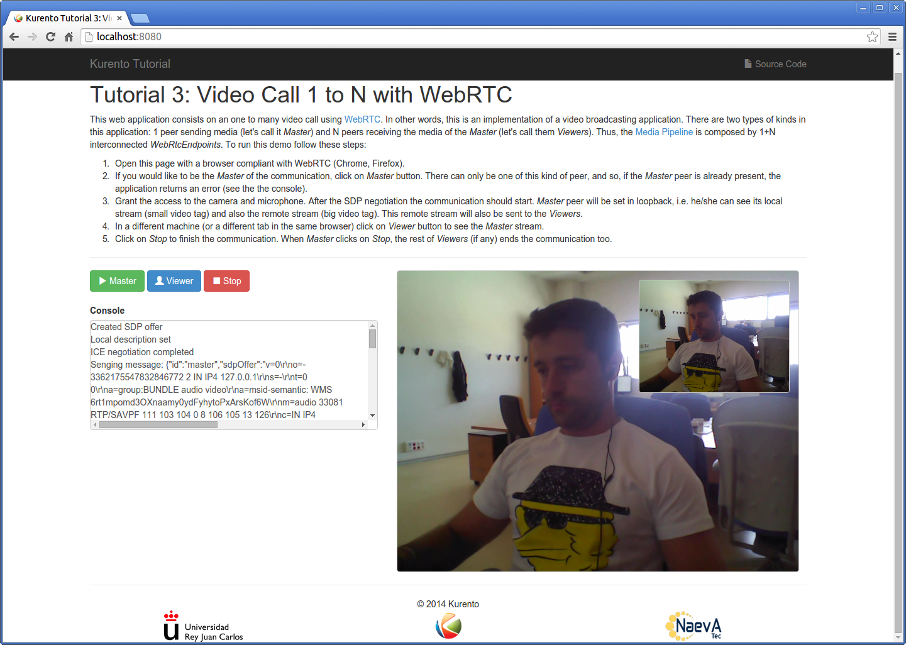
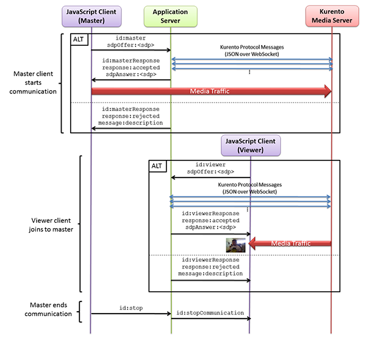

%%%%%%%%%%%%%%%%%%%%%%%%%%%%%%%%%%%
Tutorial 3 - One to many video call
%%%%%%%%%%%%%%%%%%%%%%%%%%%%%%%%%%%

This web application consists on an one to one video call using `WebRTC`:term:
technology. In other words, it is an implementation of a video broadcasting web
application.

For the impatient: running this example
=======================================

First of all, you should install Kurento Media Server to run this demo. Please
visit the :doc:`installation guide <../../installation_guide>` for further
information.

Be sure to have installed `Node.js`:term: and `Bower`:term: in your system. In
an Ubuntu machine, you can install both as follows:

.. sourcecode:: sh

   sudo add-apt-repository ppa:chris-lea/node.js
   sudo apt-get update
   sudo apt-get install nodejs
   sudo npm install -g bower

To launch the application you need to clone the GitHub project where this demo
is hosted and then install and run it, as follows:

.. sourcecode:: sh

    git clone https://github.com/Kurento/kurento-tutorial-node.git
    cd kurento-tutorial-node/kurento-one2many-call
    npm install
    cd static
    bower install
    cd ..
    node app.js

Access the application connecting to the URL http://localhost:8080/ through a
WebRTC capable browser (Chrome, Firefox).

Understanding this example
==========================

There will be two types of users in this application: 1 peer sending media
(let's call it *Master*) and N peers receiving the media from the *Master*
(let's call them *Viewers*). Thus, the Media Pipeline is composed by 1+N
interconnected *WebRtcEndpoints*. The following picture shows an screenshot of
the Master's web GUI:

   *One to many video call screenshot*

To implement this behavior we have to create a `Media Pipeline`:term: composed
by 1+N **WebRtcEndpoints**. The *Master* peer sends its stream to the rest of
the *Viewers*. *Viewers* are configured in receive-only mode. The implemented
media pipeline is illustrated in the following picture:

.. figure:: ../../images/kurento-java-tutorial-3-one2many-pipeline.png
   :align:   center
   :alt:     One to many video call Media Pipeline
   :width: 400px

   *One to many video call Media Pipeline*

This is a web application, and therefore it follows a client-server
architecture. At the client-side, the logic is implemented in **JavaScript**.
At the server-side we use the **Kurento JavaScript Client** in order to reach
the **Kurento Media Server**. All in all, the high level architecture of this
demo is three-tier. To communicate these entities two WebSockets are used. The
first is created between the client browser and a Node.js application server to
transport signaling messages. The second is used to communicate the Kurento
JavaScript Client executing at Node.js and the Kurento Media Server. This
communication is implemented by the **Kurento Protocol**. For further
information, please see this :doc:`page <../../mastering/kurento_protocol>`.

Client and application server communicate using a signaling protocol based on
`JSON`:term: messages over `WebSocket`:term: 's. The normal sequence between
client and server is as follows:

1. A *Master* enters in the system. There must be one and only one *Master* at
any time. For that, if a *Master* has already present, an error message is sent
if another user tries to become *Master*.

2. N *Viewers* connect to the master. If no *Master* is present, then an error
is sent to the corresponding *Viewer*.

3. *Viewers* can leave the communication at any time.

4. When the *Master* finishes the session each connected *Viewer* receives an
*stopCommunication* message and also terminates its session.

We can draw the following sequence diagram with detailed messages between
clients and server:

   *One to many video call signaling protocol*

As you can see in the diagram, `SDP`:term: needs to be exchanged between client
and server to establish the `WebRTC`:term: connection between the browser and
Kurento. Specifically, the SDP negotiation connects the WebRtcPeer in the
browser with the WebRtcEndpoint in the server. The complete source code of this
demo can be found in
`GitHub <https://github.com/Kurento/kurento-tutorial-node/tree/master/kurento-one2many-call>`_.

Application Server Logic
========================

This demo has been developed using the **express** framework for Node.js, but
express is not a requirement for Kurento.

The main script of this demo is
`app.js <https://github.com/Kurento/kurento-tutorial-node/blob/master/kurento-one2many-call/app.js>`_.

Once the *Kurento Client* has been instantiated, you are ready for communicating
with Kurento Media Server and controlling its multimedia capabilities.

.. sourcecode:: js

   var kurento = require('kurento-client');

   //...

   const ws_uri = "ws://localhost:8888/kurento";

   //...

   kurento(ws_uri, function(error, _kurentoClient) {
      if (error) {
         console.log("Could not find media server at address " + ws_uri);
         return callback("Could not find media server at address" + ws_uri
            + ". Exiting with error " + error);
      }

      kurentoClient = _kurentoClient;
      callback(null, kurentoClient);
   });

This web application follows *Single Page Application* architecture
(`SPA`:term:) and uses a `WebSocket` in the path ``/call`` to communicate
client with applications server by beans of requests and responses.

The following code snippet implements the server part of the signaling protocol
depicted in the previous sequence diagram.

.. sourcecode:: js

   ws.on('message', function(_message) {
        var message = JSON.parse(_message);
        console.log('Connection ' + sessionId + ' received message ', message);

        switch (message.id) {
            case 'master':
                 startMaster(sessionId, message.sdpOffer, function(error, sdpAnswer) {
		          //...
                          ws.send(JSON.stringify({
                                   id : 'masterResponse',
                                   response : 'accepted',
                                   sdpAnswer : sdpAnswer
                                   }));
                 });
                 break;

            case 'viewer':
                 startViewer(sessionId, message.sdpOffer, ws, function(error, sdpAnswer) {
                          //...
                          ws.send(JSON.stringify({
                                   id : 'viewerResponse',
                                   response : 'accepted',
                                   sdpAnswer : sdpAnswer
                          }));
                 });
                 break;

            case 'stop':
                 stop(sessionId);
                 break;

	    //...
        }
   });

In the following snippet, we can see the ``master`` method. It creates a Media
Pipeline and the ``WebRtcEndpoint`` for master:

.. sourcecode:: js

   startMaster(sessionId, sdpOffer, callback){

      //...

      getKurentoClient(function(error, kurentoClient) {
         //...
         kurentoClient.create('MediaPipeline', function(error, pipeline) {
            //...
            pipeline.create('WebRtcEndpoint', function(error, webRtcEndpoint) {
                master.webRtcEndpoint = webRtcEndpoint;
                webRtcEndpoint.processOffer(sdp, function(error, sdpAnswer) {
                	callback(null, sdpAnswer);
                });
             });
         });
      });
   }

The ``viewer`` method is similar, but not he *Master* WebRtcEndpoint is
connected to each of the viewers WebRtcEndpoints, otherwise an error is sent
back to the client.

.. sourcecode:: js

   function startViewer(id, sdp, ws, callback) {
      if (master === null || master.webRtcEndpoint === null) {
                return callback("No active sender now. Become sender or . Try again later ...");
       }

      //...

      pipeline.create('WebRtcEndpoint', function(error, webRtcEndpoint) {
         webRtcEndpoint.processOffer(sdp, function(error, sdpAnswer) {
            master.webRtcEndpoint.connect(webRtcEndpoint, function(error) {
               var viewer = {
                  id : id,
                  ws : ws,
                  webRtcEndpoint : webRtcEndpoint
               };
               viewers[viewer.id] = viewer;

               return callback(null, sdpAnswer);
            });
         });
      });
   }

Finally, the ``stop`` message finishes the communication. If this message is
sent by the *Master*, a ``stopCommunication`` message is sent to each connected
*Viewer*:

.. sourcecode:: js

   function stop(id, ws) {
      if (master !== null && master.id == id) {
         for ( var ix in viewers) {
            var viewer = viewers[ix];
            if (viewer.ws) {
               viewer.ws.send(JSON.stringify({
                  id : 'stopCommunication'
               }));
            }
         }
         viewers = {};
         pipeline.release();
         pipeline = null;
         master = null;
      } else if (viewers[id]) {
         var viewer = viewers[id];
         if (viewer.webRtcEndpoint)
            viewer.webRtcEndpoint.release();
         delete viewers[id];
      }
   }

Client-Side
===========

Let's move now to the client-side of the application. To call the previously
created WebSocket service in the server-side, we use the JavaScript class
``WebSocket``. We use an specific Kurento JavaScript library called
**kurento-utils.js** to simplify the WebRTC interaction with the server. These
libraries are linked in the
`index.html <https://github.com/Kurento/kurento-tutorial-node/blob/master/kurento-one2many-call/src/main/resources/static/index.html>`_
web page, and are used in the
`index.js <https://github.com/Kurento/kurento-tutorial-node/blob/master/kurento-one2many-call/src/main/resources/static/js/index.js>`_.
In the following snippet we can see the creation of the WebSocket (variable
``ws``) in the path ``/call``. Then, the ``onmessage`` listener of the
WebSocket is used to implement the JSON signaling protocol in the client-side.
Notice that there are four incoming messages to client: ``masterResponse``,
``viewerResponse``, and ``stopCommunication``. Convenient actions are taken to
implement each step in the communication. For example, in the function
``master`` the function ``WebRtcPeer.startSendRecv`` of *kurento-utils.js* is
used to start a WebRTC communication. Then, ``WebRtcPeer.startRecvOnly`` is
used in the ``viewer`` function.

.. sourcecode:: javascript

   var ws = new WebSocket('ws://' + location.host + '/call');

   ws.onmessage = function(message) {
      var parsedMessage = JSON.parse(message.data);
      console.info('Received message: ' + message.data);

      switch (parsedMessage.id) {
      case 'masterResponse':
         masterResponse(parsedMessage);
         break;
      case 'viewerResponse':
         viewerResponse(parsedMessage);
         break;
      case 'stopCommunication':
         dispose();
         break;
      default:
         console.error('Unrecognized message', parsedMessage);
      }
   }

   function master() {
      if (!webRtcPeer) {
         showSpinner(videoInput, videoOutput);

         webRtcPeer = kurentoUtils.WebRtcPeer.startSendRecv(videoInput, videoOutput, function(offerSdp) {
            var message = {
               id : 'master',
               sdpOffer : offerSdp
            };
            sendMessage(message);
         });
      }
   }

   function viewer() {
      if (!webRtcPeer) {
         document.getElementById('videoSmall').style.display = 'none';
         showSpinner(videoOutput);

         webRtcPeer = kurentoUtils.WebRtcPeer.startRecvOnly(videoOutput, function(offerSdp) {
            var message = {
               id : 'viewer',
               sdpOffer : offerSdp
            };
            sendMessage(message);
         });
      }
   }

Dependencies
============

Dependencies of this demo are managed using npm. Our main dependency is the
Kurento Client JavaScript (*kurento-client*). The relevant part of the
`package.json <https://github.com/Kurento/kurento-tutorial-node/blob/master/kurento-one2many-call/package.json>`_
file for managing this dependency is:

.. sourcecode:: js

   "dependencies": {
     ...
     "kurento-client" : "^5.0.0"
   }

At the client side, dependencies are managed using Bower. Take a look to the
`bower.json <https://github.com/Kurento/kurento-tutorial-node/blob/master/kurento-one2many-call/static/bower.json>`_
file and pay attention to the following section:

.. sourcecode:: js

   "dependencies": {
     "kurento-utils" : "^5.0.0"
   }

.. note::

   We are in active development. Be sure that you have the latest version of
   Kurento Java Client in your bower.json. You can find it at `Bower <http://bower.io/search/?q=kurento-client>`_
   searching for ``kurento-client``.
