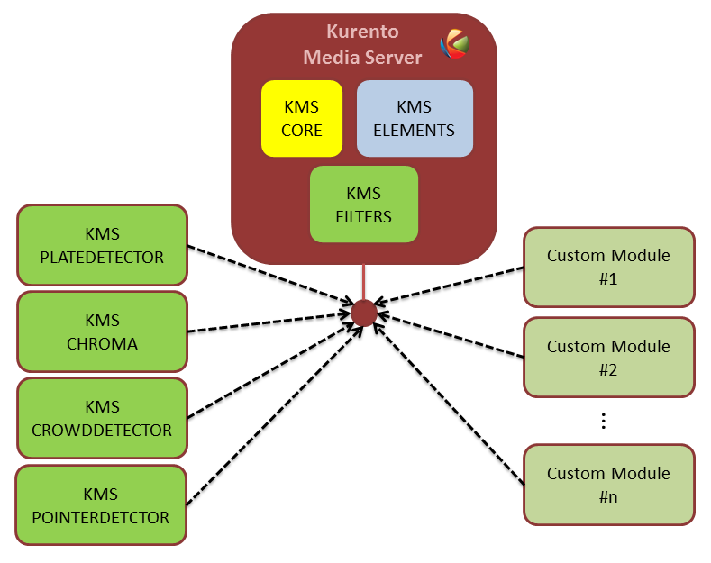

========
Features
========

This page summarizes the features that Kurento provides, with links to their own documentation page for the most important ones.

Kurento API, Clients, and Protocol
==================================

Kurento Media Server exposes all its functionality through an RPC API called :doc:`Kurento API </features/kurento_api>`. This API can be queried directly by any kind of JSON-compatible client, but the recommended way to work with it is by means of a :doc:`Kurento Client </features/kurento_client>` library; these are currently provided for *Java*, *Browser Javascript*, and *Node.js*.

If you prefer a different programming language, it's possible to write a custom client library by following the specification of the :doc:`Kurento Protocol </features/kurento_protocol>`, based on *WebSocket* and *JSON-RPC*.

The picture below shows how to use Kurento Clients in three scenarios:

- Using the Kurento JavaScript Client directly in a compliant WebRTC browser.
- Using the Kurento Java Client in a Java EE Application Server.
- Using the Kurento JavaScript Client in a Node.js server.

.. figure:: /images/kurento-clients-connection.png
   :align: center
   :alt: Connection of Kurento Clients (Java and JavaScript) to Kuento Media Server

   *Connection of Kurento Clients (Java and JavaScript) to Kuento Media Server*

Complete examples for these three technologies is described in the :doc:`Tutorials section </user/tutorials>`.

The Kurento Client API is based on the concept of **Media Elements**. A Media Element holds a specific media capability. For example, the media element called *WebRtcEndpoint* holds the capability of sending and receiving WebRTC media streams; the media element called *RecorderEndpoint* has the capability of recording into the file system any media streams it receives; the *FaceOverlayFilter* detects faces on the exchanged video streams and adds a specific overlaid image on top of them, etc. Kurento exposes a rich toolbox of media elements as part of its APIs.

.. figure:: /images/kurento-basic-toolbox.png
   :align: center
   :alt: Some Media Elements provided out of the box by Kurento

   *Some Media Elements provided out of the box by Kurento*

To better understand theses concepts it is recommended to take a look to the sections :doc:`/features/kurento_api` and :doc:`/features/kurento_protocol`. You can also take a look at the Reference Documentation of the API implementations that are currently provided: :doc:`/features/kurento_client`.

Kurento Modules
===============

Kurento has been designed as a pluggable framework. Kurento Media Server uses several modules by default, named *kms-core*, *kms-elements* and *kms-filters*.

In addition, there are others built-in modules to enhance the
capabilities provided by the Kurento Media Server. These modules are named *kms-crowddetector*, *kms-pointerdetector*, *kms-chroma*, and *kms-platedetector*.

Finally, Kurento Media Server can be expanded with new custom modules.

   *Kurento modules architecture. Kurento Media Server can be extended with built-in modules (crowddetector, pointerdetector, chroma, platedetector) and also with other custom modules.*

For more information, read the section :doc:`/features/kurento_modules`.

RTP Streaming
=============

Besides WebRTC connections, Kurento Media Server is able to manage standard RTP streams, allowing to connect an instance of KMS to a wide variety of devices.

There are two topics to note when dealing with RTP connections: the automatic congestion control algorithms that KMS implements (see :ref:`features-remb`), and the :term:`NAT Traversal` capabilities (see :doc:`/features/nat_traversal`).

.. _features-remb:

Congestion Control / REMB
=========================

Kurento implements the *Google Congestion Control* algorithm, so it is able to generate and parse both *abs-send-time* RTP headers and :term:`REMB` RTCP messages.

It is enabled by by passing the media-level attribute *goog-remb* in the SDP Offer. For example:

.. code-block:: text
   :emphasize-lines: 8

   v=0
   o=- 0 0 IN IP4 127.0.0.1
   s=-
   c=IN IP4 127.0.0.1
   t=0 0
   m=video 5004 RTP/AVPF 103
   a=rtpmap:103 H264/90000
   a=rtcp-fb:103 goog-remb
   a=sendonly
   a=ssrc:112233 cname:user@example.com

``a=rtcp-fb`` is the *RTCP Feedback* capability attribute, as defined in :rfc:`4585`.

KMS implements REMB propagation between the sender and receiver legs of a connection. This means that when KMS is used as a proxy between a video sender and one or more video receivers, the smallest REMB value from the receivers will be relayed to the sender. This allows the sender to choose a lower bitrate that will accommodate all of the receivers connected to KMS at the other side.

For more context about what is REMB and how it fits in the greater project of RMCAT, please read our Knowledge Base document: :doc:`/knowledge/congestion_rmcat`.
